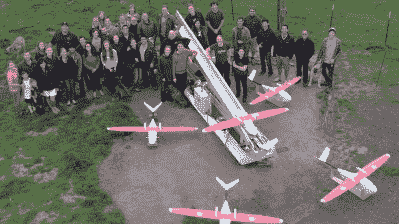

# 自动化货运:无人机医疗递送

> 原文：<https://hackaday.com/2017/05/12/automate-the-freight-medical-deliveries-by-drone/>

当警察的孩子会给你留下很多生动的记忆。我的父亲在康涅狄格州当了 20 多年的州警察，因为这个州很小，所以他基本上一直在执勤。他的巡逻车在很大程度上是一辆家庭用车，像所有的警车一样，它装载着商业工具。其中最主要的是甚高频双向无线电，我会在长途汽车旅行中听它，听被派往事故现场的警察或在交通站打电话。

一个非常常见的电话是血液接力——格林威治医院可能急需 B+型血，但最近的供应可能在耶鲁-纽黑文医院。州警察会被叫来，一名骑警会拿起冷藏箱里的血液，拼命地沿着 I-95 号公路行驶，然后把血液交给等候的工作人员。天气好的时候，一个有足够动力和技术的骑警可以在大约半小时内走完 45 英里的路程。在糟糕的一天，骑警可能会在事故中丧生，自己也需要输血。

那是大约 40 年前的事了，血液分配网络肯定从计算机革命中受益匪浅，毫无疑问，这大大提高了对何时何地需要血液的预测。因此，血液接力可能不像以前那样普遍了。

但是在发展中国家，以及像美国这样人口密度较低的国家，医疗资源被分散了。当一个小时可以决定生死的时候，就一定会有创新。这就是为什么无人机送货初创公司 [Zipline](http://flyzipline.com/product/) 将无人机快速医疗送货作为商业化领域的目标。在这样做的时候，他们可能已经找到了一个很好的自主空中交付的用例。

忘掉令人眼花缭乱的亚马逊、T2、谷歌和 T3 无人机送货演示吧。这不是买一个 Kindle Fire 和一袋爆米花，然后让一架四轴飞行器在 30 分钟后降落在你宽敞舒适的无障碍后院。Zipline 的创新在于固定翼无人机的使用，这种无人机与像[C-119 飞行货车车厢](https://en.wikipedia.org/wiki/Fairchild_C-119_Flying_Boxcar)或[C-82 包裹](https://en.wikipedia.org/wiki/Fairchild_C-82_Packet)这样的货机有些许相似之处。该无人机有一个宽大的货舱，全 GPS 和自动驾驶仪，可以在弹射器的帮助下从简陋的设施上发射。

 卸载无人机的货物是——非常规的。Zipline 没有采用亚马逊为货物四轴飞行器指定着陆区的模式，而是从接收者上方的游荡模式将货物降落到地面。这显然有局限性——没有来自易贝的法贝热彩蛋。但对于某些包装得当的货物，如医疗用品，这是一个可行的模式。

该方案可能不适用于城市或甚至郊区，因为需要没有障碍物的相当大的目标区域。这样，Zipline 就像亚马逊的无人机一样受到地理限制。但是不需要将无人机降落在接收地点是一个很大的优势——没有灰尘，没有噪音，发生事故的机会更少，周转更快。

The Zipline team, with fleet and launcher.

这听起来可能有点异想天开，但现在，Zipline 实际上正在定期这样做。他们从十月开始在非洲国家卢旺达工作，减少他们的系统来练习。从 Muhanga 的一个基地，一个由八架高空滑索无人机组成的机群一直在向偏远的医疗中心空投物资，如果有可能的话，用卡车到达这些医疗中心需要几个小时。到今年夏天，他们打算用 15 架无人机支持一个由 20 家医院组成的网络，定期空投药品、血液和物资，从而改善数百万卢旺达人的健康状况。

对我来说，Zipline 的模式比亚马逊或其他任何拟议中的空中送货服务更有意义。暂且把向与会者分发一堆防晒霜与向一个垂死的病人提供一升血液相比的琐事放在一边，让一架强大的四轴飞行器安全降落在郊区甚至农村社区的需要似乎是一个需要克服的巨大障碍。观看任何旋翼无人机送货视频，你都会注意到“超过目标时间”是巨大的，至少相对于总旅行时间而言是如此。滑索运送很快——飞行、炸弹和疾走。随着无人机的发展，我们甚至可能会在一架无人机上看到多个有效载荷，每个都被投放到不同的地点。正如 Zipline 首席技术官所指出的，“着陆不可扩展。”空投确实有规模，可能会让 Zipline 一天完成数百次递送。

此外，固定翼飞机可以更快，在给定的燃料负载下携带更大的有效载荷，并且比旋翼无人机更容易制造和维护，我认为 Zipline 可能在这方面有所进展。看看他们今年夏天在卢旺达的经历如何改变他们的模式将会很有趣，但最终这可能会给发展中国家的农村医学带来真正的好处。如果运送救生物资最终成为无人机空中送货的杀手级应用，这将是多么讽刺？

 [https://www.youtube.com/embed/OnDpE8uSb7M?version=3&rel=1&showsearch=0&showinfo=1&iv_load_policy=1&fs=1&hl=en-US&autohide=2&wmode=transparent](https://www.youtube.com/embed/OnDpE8uSb7M?version=3&rel=1&showsearch=0&showinfo=1&iv_load_policy=1&fs=1&hl=en-US&autohide=2&wmode=transparent)

