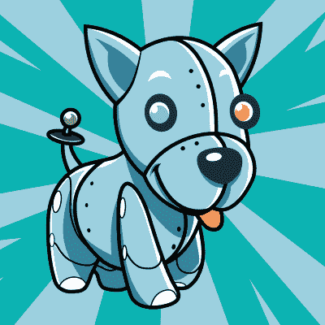

# 周五黑客聊天:黑客日大奖

> 原文：<https://hackaday.com/2017/04/27/friday-hack-chat-the-hackaday-prize/>

你知道 Hackaday 正在举办一场精彩的硬件和软件竞赛吗？是真的！[Hackaday 奖](https://hackaday.io/prize)将奖励 hack aday 社区成员数十万美元，奖励他们打造最酷的硬件来改变世界。

Hackaday 奖有多种参赛方式，今年集中在几个主题上。我们将对此进行讨论，并允许提问。明天，也就是 4 月 28 日星期五，太平洋时间中午，我们将在 Hackaday.io 上为 Hackaday 奖举办[黑客聊天。](https://hackaday.io/event/21438-hackaday-prize-hack-chat)

我们这次聊天的嘉宾主持人是[Alberto]，他是去年赢得 Hackaday 奖的项目的创建者。他会在黑客聊天中告诉大家他从去年的黑客日大奖中学到了什么。如果我们幸运的话，他甚至可能会告诉我们一些关于在供应框架设计实验室中构建他的项目的情况。一切都很好，明天中午，太平洋时间。

### 以下是参与方式:

 我们的 Hack Chat 是 Hackaday.io 上的实时社区活动 [Hack Chat](https://hackaday.io/project/5373-hacker-channel) 群发消息。

登录 Hackaday.io，访问该页面，并寻找“加入这个项目”按钮。一旦你成为这个项目的一部分，这个按钮就会变成“团队信息”，直接带你进入黑客聊天。

你不必等到明天；随时加入，你可以看到社区在谈论什么。

## 还有汀蒂！

 下周二，我们将针对 [Tindie](https://www.tindie.com/) 上的卖家进行另一次聊天，这是一个任何人都可以买卖 DIY 硬件的在线市场。

这一次，我们谈论的是 Kickstarter。我们把扎克·邓纳姆拉进了这个案子。他是 Kickstarter 的设计&技术推广负责人，无论从哪方面来看，他都是一个非常酷的人。

[Zach]将讨论将硬件项目转变为 Kickstarter 活动的来龙去脉。令人惊讶的是，Tindie 卖家和 Kickstarter 之间有很大的重叠——一些卖家在 Tindie 上测试他们的想法，并准备开展众筹活动。其他人完成一个活动，然后来到 Tindie 出售多余的库存或二次运行。无论哪种方式，都有一个很好的机会进行市场验证，或者只是把你的设备送到那些想用它的人手中。

如果你想加入 Kickstarter 聊天活动，请前往 [Tindie Dog Park](https://hackaday.io/project/19393-tindie-dog-park) 。请求加入该项目，并在太平洋时间 5 月 2 日星期二下午 1 点之前出现在聊天中。

The [HackadayPrize2017](https://hackaday.io/prize) is Sponsored by:   