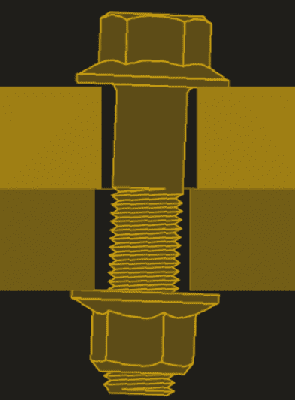
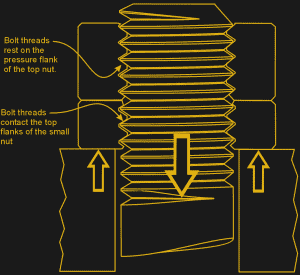

# 螺母和螺栓:保持紧固

> 原文：<https://hackaday.com/2017/06/08/nuts-and-bolts-keeping-it-tight/>

毫不夸张地说，没有螺母和螺栓，世界就会分崩离析。螺栓连接无处不在，从你的 DIY 3D 打印机的框架到固定汽车轮子的螺母。尽管后者对失败的惩罚肯定高于前者，但螺母和螺栓的自动松动很少是一件好事。工程师们想出了几十种方法来确保世界不会分崩离析，有些方法比其他方法更有效。让我们来探索其中的一些方法，找出哪些有效，哪些无效，在这个过程中，我们可能会了解到这些迷人的紧固件是如何工作的。

### 什么不起作用

Transverse vibration leads to self-loosening. Source: [BoltScience.com](http://www.boltscience.com/pages/junkertestvideo.htm)

螺栓连接失效的方式有很多，但振动引起的自松可能是最阴险的。任何曾经敲打过卡住的螺栓或使用过冲击扳手移除生锈螺母的人都知道，振动真的很有帮助。将同一个接头投入使用，并对其施加适当振动，接头很可能会自行松开，导致接头失效。

20 世纪 60 年代，德国工程师格哈德·勇克研究了自松现象，并得出结论:横向振动是螺栓连接失效的原因。他设计了一种简单的测试装置，可以提供快速的横向振动，同时用测压元件监测紧固件的预紧力。将预载荷绘制成振动周期数的函数，这为各种锁定方法的有效性提供了线索。该测试被称为[勇克测试](https://en.wikipedia.org/wiki/Junker_test)，并且作为标准 DIN 65151，它仍然是测试自动松脱的黄金标准。

有一些精彩的视频展示了勇克测试的运行情况，有些则非常恐怖。通常，我们会在螺柱或螺栓上放置一个简单的螺旋弹簧锁紧垫圈，拧紧螺母，然后收工，感觉我们已经完成了一个安全的连接。但是没有什么比这更偏离事实了。事实上，下面的视频显示，不仅锁紧垫圈给螺栓连接增加了很少的安全性，其他常用方法——平垫圈、尼龙嵌入螺母和堆叠螺母——也没有提供多少帮助。

 [https://www.youtube.com/embed/IKwWu2w1gGk?version=3&rel=1&showsearch=0&showinfo=1&iv_load_policy=1&fs=1&hl=en-US&autohide=2&wmode=transparent](https://www.youtube.com/embed/IKwWu2w1gGk?version=3&rel=1&showsearch=0&showinfo=1&iv_load_policy=1&fs=1&hl=en-US&autohide=2&wmode=transparent)

### 什么有用

Jam nut in action. Source: [BoltScience.com](http://www.boltscience.com/pages/twonuts.htm)

显然，上面的视频旨在营销该公司的花式楔锁垫圈，很明显，它们工作得很好。但是为什么当一个简单的锁紧垫圈失效时它们还能工作呢？要回答这个问题，看看还有什么是有用的，视频中没有测试的东西——一个正确安装的防松螺母。

一个[锁紧螺母](https://en.wikipedia.org/wiki/Jam_nut)是一个低型螺母，通常大约是标准螺母的一半高度，安装在较大螺母下面的*上。当安装锁紧螺母时，它只拧紧到最终扭矩的四分之一到一半。接下来安装厚螺母，并拧紧到最终值，同时用扳手将防松螺母固定到位。这有效地拉动螺栓穿过锁紧螺母。然后，螺栓的螺纹与锁紧螺母内螺纹的顶部螺纹面接触，同时接触顶部螺母的上部或压力螺纹面。由于顶部和底部螺母在螺栓上提供相反的力，螺母不太可能自动松开。*

类似的机制也在楔形锁紧垫圈中起作用。垫圈的两半有互锁的楔子，其角度超过螺栓螺纹的螺距。当螺栓被拧紧时，垫圈的较大螺距将螺栓向上拉回，提供了一个相反的力来卡住螺纹并防止紧固件自动松开。

如果我们看看所有失败的锁定方法，它们都有一个共同点:它们都依赖于摩擦力。锁紧螺母和楔形锁紧垫圈通过提供张力来抵抗导致自动松开的横向振动，因此更加有效。

当然，还有其他锁定螺纹紧固件的方法。我想到了粘合剂螺纹锁,还有更复杂的方法，如钢丝螺母和带标签的垫圈，它们可能是非常有效的方法。但是为了低成本和易于安装，很难击败一个简单的锁紧螺母来防止世界崩溃。

特色图片来源: [Nord-LockGroup](http://www.nord-lock.com/)