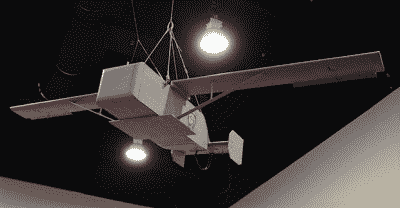

# 自动化货运:通过无人机进行前线交付

> 原文：<https://hackaday.com/2017/07/03/automate-the-freight-front-line-deliveries-by-drone/>

USMC 的罗伯特·H·巴罗将军曾经说过，“外行谈论战术，但专业人士研究后勤。”许多企业都是如此，但在战争中，忽视物流的一方很可能是输家。让士兵有饭吃、有衣穿、有武器装备是有效进行战争的本质，从后方补给站到前方行动的漫长后勤链使之成为可能。

军队有几千年的时间来优化后勤，他们总是最大限度地利用新技术来将物资放置在需要的地方。几个世纪以来，人和动物的强壮的脊背已经足够了，19 世纪火车补充了它，20 世纪汽车取代了它。后来，飞机对供应链产生了不可估量的影响，允许快速动员供应并支持 20 世纪战争的工业规模死亡和破坏。

但是无论补给品如何从工厂运送到战区内的补给站，最终它们还是要到达前线部队。这可能会造成巨大的问题，特别是对于那些被敌人行动切断支援的部队，或者那些在敌方领土内故意行动的特种部队。把它们放在弹药和 MRE 里可能是后勤上的噩梦。

因此，毫不奇怪，美国海军陆战队正在考虑将无人机作为保持前线部队补给的一种方式。在这个先进的重型多直升机和远程半自动无人机(如“捕食者”或“全球鹰”)的时代，你会认为这样的计划应该具备向一些国防承包商运送猪肉的所有功能。但事实证明，USMC 的战术空中投送(TACAD)是如此简单，以至于你几乎想知道为什么以前没有人做过。

Scale model of the TACAD drone glider. Source: [American Military Forum](http://www.americanmilitaryforum.com/forums/threads/us-marines-testing-disposable-drone.2049/)

TACAD 无人机计划成为一架滑翔机，可以携带多达 500 磅的物资。从前线后方 35，000 英尺高的货运飞机上安全降落，15:1 的滑翔比使它能够在 GPS 的引导下，由常规的业余爱好伺服系统控制，覆盖大约 85 英里的目标。

关键在于:它完全是一次性的。这款滑翔机由胶合板制成，专为一种用途而设计，可以直接飞到着陆区和坠毁地。有人认为会有某种“可控飞行进入地形”的规定，以便供应品不必过度包装或仅限于最坚固的物品，但即使如此，也没有打算重复使用无人机。

与竞争系统相比，一次性使用是 TACAD 的一个巨大优势，如美国陆军的联合精确空投系统，该系统使用 GPS 制导的滑翔伞，价格昂贵，需要前沿部队回收以供最终重复使用。JPADS 增加了士兵的负担，因为他们必须将 30 磅重的单位背出战场，而 TACAD 在完成任务后什么也不要求，甚至提供可能对士兵有用的材料。

这些系统中的任何一个是否能够投入使用还有待观察。我敢打赌，他们中至少有一个人会采取行动——对于那些以后勤工作为生的专业人士来说，从远距离快速补给挖好的部队是一个绝好的主意。我内心的愤世嫉俗者说，就像任何军事项目一样，它很可能会变得不必要的复杂，因此国会的居民可以被视为将培根带回家。TACAD 是一个从其简单性中获得力量的想法，但是即使它变得过于复杂，它也是自动化交付的另一个很好的用例。