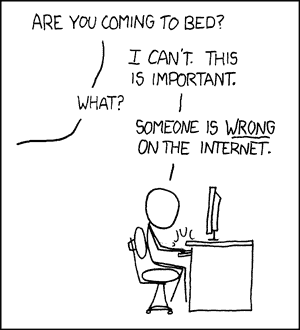
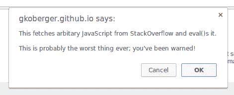

# 不要做代码暴君，要做导师

> 原文：<https://hackaday.com/2017/05/16/dont-be-a-code-tyrant-be-a-mentor/>

硬件黑客是 Hackaday 的一种生活方式。我们每天都用热熔胶、胶带、升级零件和其他东西来庆祝项目。现在是黑硬件的开放季。在外面的世界，由于某种原因，软件没有得到同样的自由放任的待遇。文件中有太多行“坏习惯”“坏变量名”注释经常如雨点般落下。即使是最不安全最愚蠢的项目也不安全。造一个机器人把激光射进一个人的眼睛？[最好确保每个文件的代码少于 500 行！](https://www.reddit.com/r/shittyrobots/comments/65ysh9/my_robot_shoots_a_laser_in_your_eye_thats_it/dgebgw4/)

这是为什么呢？是什么让读者和评论者把软件放在比运行它的硬件更高的标准上呢？原因是多种多样的，这是我希望看到停止的趋势。

软件工程是一门相对年轻且发展迅速的科学。每隔几个月就会有一种新的热门语言出现，论坛、用户组和文章层出不穷。甚至软件工程师的工作方式也在不断变化。瀑布到敏捷，V 模型，螺旋模型。甚至软件设计方法也在改变——从伪代码到 UML，再到测试驱动开发，这个列表一直在变。

像“干净的代码”这样的术语被抛来抛去。光有能用的软件还不够好。软件必须具有良好的注释性、可维护性、优雅性，当然，还要遵循最佳的编码实践。这些大多数都是好主意……在工作环境中。很多事情归结起来就是工作。软件工程师必须跟上新趋势才能被雇用。

专业软件开发人员中存在一定程度的“重生”心理。编码人员通常不喜欢被迫改变。但是当他们发现一个他们喜欢的工具或系统时，他们会在职业上和个人项目中拥抱它。然后他们出去传播这种新方法或工具；在 Reddit 上，在论坛上，给任何愿意听的人。这方面的经典例子当然是编辑们喜欢的 vi vs emacs 辩论。

### 代码暴君

[](https://xkcd.com/386/)

XKCD is always relevant

这种福音主义是许多评论的来源。许多有经验的程序员真的相信，如果你不按照他们的方式做事，你就是在用错误的方式做事。当然，如果有人在网上说错了，他们必须被纠正。我喜欢称这些人为代码暴君。不管你的技能水平、背景如何，不管你是为了工作还是为了一个有趣的项目而编程。他们会向你展示他们的方式，并愿意与任何加入的人就这个话题争论几个小时。

不要做代码霸。互联网上有很多地方可以讨论工具和技术。

刚开始学习编程的人可能不需要知道所有最酷的技巧。事实上，最新的东西可能是有害的。学习在嵌入式系统上编写 C/C++程序的新程序员可能不会因为学习 C++11 的智能指针而受益。我曾见过程序员抱怨有人在可以使用 ternarys 的时候却没有使用。三元运算符是我最讨厌的。

# 这

```

 if (foo > bar)
 {
    output = fizz;
 }
 else
 {
    output = buzz;
 }

```

# vs 这个

```

output = foo > bar ? fizz : buzz;

```

任何人都可以阅读第一个片段。实际上是英语。虽然第二段代码更短，但对新的编码人员来说是不可读的。编译器一点也不在乎，不管怎样，你都会得到相同的汇编输出。

### 学习编码

许多有成就的程序员已经忘记了学习编程是什么感觉。不太有意义的教程，含糊不清的错误信息，以及永远得不到回答的问题论坛帖子。

Arduino 试图让事情变得简单一点。但从本质上来说，它只是 C 和一点 C++(最难掌握的语言之一)的混合。你的程序有错误吗？Arduino 的 IDE 只会抛出 avr-gcc 的错误文本。这可不太适合新手。



A rousing game of [How Badly Does it Sort?](https://gkoberger.github.io/stacksort/)

新手程序员遇到困难时会怎么做？和专业人士做的一样。跳上谷歌，开始搜索。这是事情变得更糟的地方。出于这样或那样的原因，StackOverflow 总是出现在编码搜索结果的前 10 名。作为一种资源，有点双刃剑的意思。那里有很多好的信息。然而，代码暴君一直很忙，争论，吹毛求疵，答案可能包含过时的，普通的旧的不良信息。不少博主对此表示了哀叹。当 Randal Munroe 做出 [StackOverflow 回答 XKCD 漫画的例子 a 时，你知道你有麻烦了](https://xkcd.com/1185/)。栈排序已经实现，你可以[在这里](https://gkoberger.github.io/stacksort/)查看。有经验的编码员能把信号从噪音中分离出来。但是新来的人会过得很艰难。

### 做导师

那么这一切的解决方案是什么呢？我认为业余无线电爱好者已经有了一个很好的系统。被称为“埃尔默斯”的志愿者导师帮助爱好者从新手到熟练工的旅程。根据 ARRL 的说法，指导从当地俱乐部开始。对我们来说，这些俱乐部是黑客空间和创客空间。在这些地方志愿服务的人们已经在帮助人们学习软件和硬件方面做了很好的工作。我建议他们更进一步。试着找到一个愿意成为导师的核心团队——为一些学生负责。这意味着回答他们的问题，并在他们学习编码遇到困难时给予指导。不仅仅是一周一两次的开放黑客之夜。当他们进来时，给他们你的电子邮件和领域问题。

做导师并不意味着从头开始教。外面有成百上千的教程、视频和书籍。有些很好，有些不太好。一个好的导师应该能拨开杂草，推荐几个好的。然而，并不是每个人都在黑客空间附近。对他们来说，唯一的选择就是在线资源。有 subreddits、论坛和我们自己的 Hackaday.io，它在黑客聊天频道有一群优秀的人。

从导师那里学习编码对学生和导师本人来说都是一次有益的经历。希望学生们能继续成为代码导师，帮助下一代从代码新手变成硬件黑客代码大师。