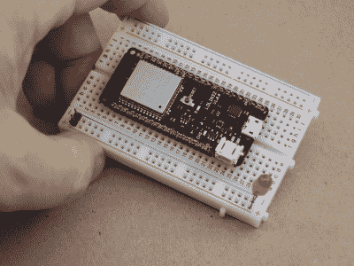
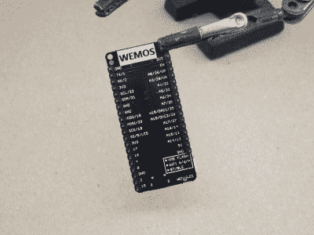

# 亲身体验热门的新 WeMos ESP-32 突破

> 原文：<https://hackaday.com/2017/05/03/hands-on-hot-new-wemos-esp-32-breakout/>

[](https://hackaday.com/wp-content/uploads/2017/05/dscf9479.jpg) 就在两周前我们最喜欢的廉价 ESP8266 板供应商 WeMos，[发布了期待已久的 LOLIN32 ESP-32 板](https://forum.wemos.cc/topic/334/lolin32-v1-0-0-is-release/2)，而且几乎是杀手锏。Hackaday regular [deshipu]给我们通风报信，我们在几分钟内就下了订单；如果 WeMos 正在制造一个非常便宜的 ESP32 开发板，我们就加入！昨天邮寄过来的。(它们现在[缺货](https://de.aliexpress.com/store/product/WEMOS-LOLIN32-V1-0-0-wifi-bluetooth-board-based-ESP-32-4MB-FLASH/1331105_32808551116.html)，预计很快会有更多。)

如果你一直关注芯片的发展，你会知道 ESP-32s 的第一次旋转有一些硅错误 (PDF)，如果你正在深度睡眠模式下工作，在特定时钟频率之间切换，或使用掉电复位功能，这些可能对你很重要。时髦的新 8 美元开发板包括硅版本 0 或 1 吗？请继续阅读，寻找答案！

## 好消息是

[](https://hackaday.com/wp-content/uploads/2017/05/dscf9480.jpg) 棋盘设计基本完善。它的灵感来自 Adafruit 的[羽毛系列](https://www.adafruit.com/feather)。模仿是最真诚的奉承。它有 4 个 MiB 闪存，一个 USB 串行适配器(cp210x)，以及一个 LiPo 电池充电器和连接器。所有相关的引脚都已断开并贴好标签，尤其是在底部。它有一个漂亮的中央复位按钮，甚至还有一个用户 LED 灯，让你尽情闪烁。

默认固件似乎陷入了扫描我们的 WiFi 网络的循环中，它似乎也不像某些 ESP8266 固件那样运行软 AP。我们不知道如何把它联系起来。这很酷，反正我们很快就会更新自己的固件了。

就价格而言，它比我们要求的多了一个特征(脂肪)。它甚至(勉强)适合一个标准的试验板。不能用棍子打它。难怪他们第一周就进货了。

## 坏消息是

你知道这意味着 WeMos LOLIN32 是由 ESP32 rev 0 硅填充的，对吗？是啊。为了测试它，你可以下载整个 SDK ( [这里是](https://github.com/espressif/esp-idf))，建立编译工具链，写一个小程序来[测试扩展熔丝存储器](https://www.esp32.com/viewtopic.php?f=2&t=1358&start=10)中的特定位，并刷新它。

但后来我们想起[我们在 ESP32](http://hackaday.com/2016/10/27/basic-interpreter-hidden-in-esp32-silicon/) 中发现了一个“秘密”的 BASIC 解释器，在[Sprite_tm]的一点语法帮助下，甚至让 PEEK 和 POKE 在小动物上工作。所以我们测试的时候就像 1988 年一样！

将引脚 12 拉高至 3.3 V，然后点击 reset，即可调出复活节彩蛋 BASIC 解释程序。以 115，200 波特连接到 ESP32，您就可以开始工作了。

```
# Check a fuse register that should contain data
a = peek(&H3FF5A008)
print(a)
15213578

# Check the fuse register with the version information 
a = peek(&H3FF5A00C)
print(a)
0

```

叹气。伙计们，这就是最悲伤的 32 个黑白点:WeMos LOLIN32 中的旧硅。我们不能 100%确定这些错误对一般用例的影响有多大，我们将在接下来的一周左右弄清楚。敬请关注。