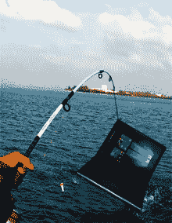
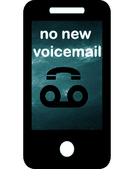

# 社会工程正在兴起:现在就保护自己

> 原文：<https://hackaday.com/2017/05/18/social-engineering-is-on-the-rise-protect-yourself-now/>

随着互联网安全的发展，锁定您的系统变得越来越容易。许多开箱即用的产品都预先配置了适当的安全措施，而且大多数流行的在线服务都了解加密和密码存储。这并不是说事情是完美的，但随着计算机系统变得更难破解，坏人将更多地关注混合中无法匹配的系统——人的因素。

### 历史会重演

从古希腊时代开始，或许在那之前，社会工程就已经是绕过敌人防线的一种选择。我们都知道一个古老的故事，尤利西斯用一匹巨大的木马欺骗特洛伊人，让一支小部队进入特洛伊城。经过五年失败的围攻，他们把马留在了城墙外，特洛伊人把它带了进来。一次，一小队士兵在深夜爬出城墙，占领了这座城市。

将一个装有恶意软件的 u 盘放在一家大公司的停车场，等待人类的好奇心接管，等待一名员工将该设备插入连接到公司网络的计算机，这有什么不同？木马和 u 盘都有一个共同点，人类并不完美，会做出不合理的决定。

### 著名的社会工程师

维克多·拉斯体格是历史上著名的擅长诈骗的社会工程师之一，他自己也承认是个骗子。他最出名的是卖掉了埃菲尔铁塔。第一次世界大战后，资金紧张，法国努力支付埃菲尔铁塔的维护费用，它年久失修。在了解了这座塔的问题后，[Lustig]想出了他的计划:他会欺骗人们相信这座塔将作为废品出售，而他是任何交易的促成者。利用伪造的政府文具，他成功地完成了这个把戏:两次！

后来，他说服艾尔·卡朋在一笔股票交易中投资 5 万美元，骗走了他 5000 美元。他声称交易失败了，尽管事实上根本没有交易。几个月后，他把钱还给卡彭，并因他的“正直”得到了 5000 美元的奖励。

查尔斯·庞兹是如此的臭名昭著，以他的名字命名的计划至今仍然有效。庞氏骗局是一种金字塔投资骗局，利用新成员的钱支付老投资者。只要新人不断进来，金字塔顶端的人就有工资。当新的吸盘池干涸时，它就结束了。

有史以来最大的庞氏骗局被当时受人尊敬的雄心勃勃的股票市场投机者伯纳德·麦道夫发现。该计划价值约 650 亿美元，过去是，现在仍然是历史上最大的计划。麦道夫如此多产，以至于银行、政府和养老基金都投资到他的计划中。

[【凯文·米特尼克】](https://en.wikipedia.org/wiki/Kevin_Mitnick)可能是当今仍然健在的最著名的计算机黑客，然而他比你想象的更像一个社会工程师。凯文年轻时就开始了；13 岁时，他说服一名公交司机告诉他在哪里可以买到学校项目的打票机，而事实上，它将用于在公交公司仓库的垃圾箱中找到的垃圾票。

16 岁时，他侵入数字设备公司的计算机系统，复制专有软件，然后继续侵入太平洋贝尔公司的语音邮件计算机以及其他几十个系统。他逃亡了几年，最终因犯罪入狱。出狱后，他成了一名安全顾问，并通过遵守法律为自己做了很多事情。

又名“嘎吱船长”的约翰·德雷珀是电话通讯领域的先驱。他之所以得到这个绰号，是因为在“嘎吱船长”麦片包装中赠送的免费哨子。他意识到这些口哨声发出了 2600 赫兹的声音，这恰好是美国电话电报公司在& T 长途线路上用来表示一条中继线已经准备好，可以发送新的呼叫的声音。这启发了[约翰·德雷珀]去试验并成功建造了[蓝盒子](https://en.wikipedia.org/wiki/Blue_box)。随着电话系统从模拟转换到数字，那些日子已经一去不复返了。

### 社会工程骗局的类型以及如何避免它们

有许多不同类型的社会工程攻击——想象一下计算存在的欺骗人们的方法的数量。尽管如此，了解最流行的骗局还是值得的，因为你需要保护自己。

#### 托辞

这种类型的骗局包括向某人撒谎，以获取特权区域或信息。伪装通常以电话诈骗的形式进行，打电话的人会声称为一些大公司工作，并需要确认他们目标的身份。然后，他们继续收集信息，如社会安全号码，母亲的婚前姓名，帐户细节和出生日期。因为电话或情况通常是由社会工程师发起的，所以保护自己免受这种骗局的一个好方法是回电或确认他们所说的人——使用你收集的关于公司的信息，而不是他们提供的信息。

#### 下料

将充满恶意软件的 u 盘扔在停车场周围，或者将巨大的木马扔在敌人的墙壁附近，这是经典的诱饵。这是一个简单的攻击，有一个简单的缓解措施:记住，如果某个免费且有趣的东西看起来好得不像是真的，那么它很可能是真的。

#### 网络钓鱼

网络钓鱼是一种发送电子邮件的行为，伪装成知名的网络服务或公司，目的是让收件人打开受损文档、访问中毒网站或破坏您自身的安全。几周前，Hackaday 自己的[Pedro Umbelino]写道，利用一个 [IDN 同形异义词攻击](http://hackaday.com/2017/04/19/you-think-you-cant-be-phished/)，利用我们周围最有安全意识的人(包括我)是多么容易。

大多数网络钓鱼都是在一个不太复杂的层次上进行的——通常是制作一个网站的克隆，然后发送电子邮件告诉受害者修改他们的密码。高价值目标可能有完全定制的网络钓鱼体验，称为“鱼叉式网络钓鱼”，骗子会在网站克隆或电子邮件文本中投入更多精力，包括个人信息，使其看起来更真实。网络钓鱼通常很容易被发现——在点击任何链接之前，请检查其地址。如果你被要求通过电子邮件更改密码，关闭电子邮件并通过正常方式登录网站，完全绕过不良链接。

#### 勒索软件

许多勒索软件都是通过网络钓鱼发送的，但由于越来越多的案件广泛传播，它有了自己的主题。然而，用户被骗在他们的电脑上运行恶意软件，它加密有价值的数据或锁定用户的系统，并要求付费恢复正常。付款后，这种情况是否会发生，谁也说不准。

最近发生了一些非常引人注目的勒索软件攻击，包括[勒索软件瘫痪了英国的 NHS](http://hackaday.com/2017/05/12/massive-cyber-attack-cripples-multiple-uk-hospitals/) ，然后蔓延到全球。这一切会结束吗？除了不点击可疑的链接、应用程序或在第一时间更新您的系统之外，针对勒索软件最简单的缓解策略是经常备份您的系统，这样如果您被勒索，您就不必支付费用。当然，保留备份还有其他好处。

#### 交换条件

交换骗局真的全是“交换”，没有“交换”。服务提供商打电话提供修复漏洞或删除恶意软件(不存在)的服务，并收取费用。在 YouTube 上快速搜索一下，就会出现数千个骗子与聪明的青少年一起碰运气的视频。和许多骗局一样，这种骗局可以通过简单地不回应突如其来的提议来避免。另一方面，这个骗局似乎足够成功，它仍然在运行。了解它是最好的防御。

#### 尾随

进入一个被关闭的门保护的禁区的一个方法是等待一个员工或有权限的人，然后跟着他们进去。这些攻击通常针对企业或公寓楼，解决方案就是不让任何人进入你的房间。

#### 翻垃圾箱

要冒充合法承包商，了解相关公司的名称甚至公司内部的联系方式会有所帮助。所有这些数据以及更多数据都可以在公司后面垃圾箱里的收据上找到。购买一台碎纸机，不要碰运气。

#### 社会化媒体

人们在社交媒体上分享惊人数量的个人信息，因此它是社会工程师的新工具也就不足为奇了。浏览某人的账户就像看某人生活的快照。为什么你会向全世界宣布你的家在接下来的两个星期将会空无一人？你的家只是要求被盗。或者想想你给一个潜在的钓鱼者的弹药。思考一下公开分享个人信息的利弊。

### 著名的社会工程案例研究

现在，让我们来看几个野外社会工程技巧的例子。

#### 新闻国际电话窃听丑闻

在英国，媒体大亨鲁珀特·默多克(Rupert Murdoch)旗下的新闻国际(News International)被发现利用社交工程“侵入”知名人士、政治家、皇室成员和记者的语音信箱服务，引发了一场巨大的公众风暴。[电话窃听名单](https://en.wikipedia.org/wiki/List_of_alleged_victims_of_the_News_International_phone_hacking_scandal)特别长。他们经常通过伪造授权访问电话语音邮件收件箱的来电显示来侵入语音邮件。一些语音邮件有密码保护，密码是四位数，很容易被猜到。在其他情况下，他们只是打电话给电话提供商的服务热线，说他们忘记了密码——这是普通的借口。

#### Celebgate iCloud 裸照“黑”

[ [Ryan Collins](https://en.wikipedia.org/wiki/ICloud_leaks_of_celebrity_photos) ]利用网络钓鱼技术获得了詹妮弗·劳伦斯、凯特·阿普顿和金·卡戴珊的 iCloud 账户。他创建了来自谷歌和苹果的虚假通知，并将它们发送到目标的电子邮件地址。当时，有人猜测苹果的 iCloud 大规模入侵了谷歌。相反，柯林斯在一次采访中承认，他使用网络钓鱼技术来获取受害者的个人数据。

### 我们将何去何从

如果破解计算机系统太难，可以肯定的是，犯罪分子会试图破解人类系统。无论你称之为“社会工程”、“缺点”还是“骗局”，它们都有可能呈上升趋势。保护自己的最好方法是告诉任何可以访问你的数据或详细信息的人攻击是如何进行的，以及如何避免攻击。

网上有很多资源可以帮助你保护自己免受这些攻击媒介的侵害。[保护自己免受八种社会工程攻击](http://www.makeuseof.com/tag/protect-8-social-engineering-attacks/)是一个很好的起点，美国国土安全部也提供了关于[防止社会工程黑客攻击](https://www.dhs.gov/blog/2011/07/12/protect-yourself-against-social-engineering-attacks)的大量信息，您可以指向人们。

最后，大部分归结为识别模式，并在看到它们时保持怀疑。通过其他渠道核实信息，不要盲目点击链接，并警惕你给律师的个人信息。