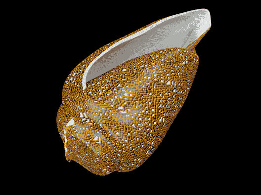
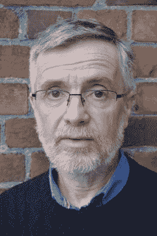
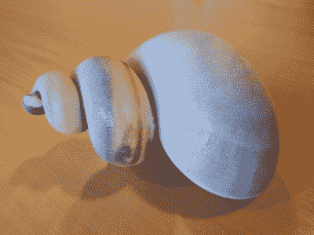
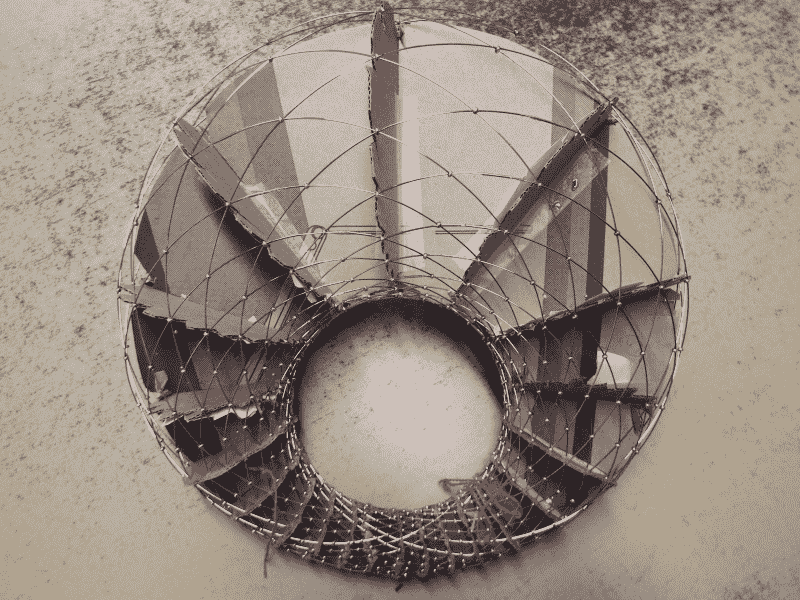

# 采访:Francesco De Comité让数学在视觉上令人敬畏

> 原文：<https://hackaday.com/2017/05/31/interview-francesco-de-comite-makes-math-visually-awesome/>

Francesco de Comité是法国里尔科学大学计算机科学的副教授，他在那里研究数学概念和对象的 2D 和 3D 表示。他提交了各种主题的论文，包括变形、圆形包装实验和 Dupin cyclides [。](http://archive.bridgesmathart.org/2015/bridges2015-253.html)他目前的项目包括建模和 3D 打印海贝壳。他将在 7 月的桥梁会议上发表一篇关于这个主题的论文。你可以在 Flickr 和 [Shapeways](https://www.shapeways.com/shops/fdecomite) 上找到他的项目。

    

**Hackaday:你最近的一个项目涉及创建分形图案，并将它们扭曲成符合生物特征的贝壳形状，然后打印出来。**

FdC:制作贝壳形状是一个老话题——莫斯利，1838 年，达西·汤普森，20 世纪初。贝壳可以被定义为围绕轴旋转的曲线，同时在该轴的方向上平移(即，在螺旋轨迹上)，并且同时尺寸增大。这是 60 年代大卫·劳普为计算机设计的模型。

Hans Meinhardt 用一个化学反应模型(催化剂-抑制剂)描述了在贝壳上绘制图案，这与图灵在形态发生方面的工作是一脉相承的。结合这两项工作，并使用 3D 打印机而不是 2D 渲染器，我们可以通过复制现有的贝壳或发明新的贝壳来建造逼真的贝壳。3D 模型不仅仅是大量 2D 视图的并置:操作 3D 模型可以帮助您理解对象，找到细节，等等。

我很好奇，想知道做一个 3D 贝壳是否可行。此外，我展示了这可以用简单的工具来完成——除了 3D 打印机。

你能告诉我们一些相关的软件和硬件吗？

所有过程都是使用 Blender 完成的，程序是使用 Blender 的脚本工具用 Python 编写的。3D 打印机是 ZCorp ProJet 460，它使用类似沙子的粉末，可以输出彩色物体。

你提到了达西·汤普森在 20 世纪初的工作，最近又提到了迈因哈特——是不是所有的数学都已经为你做好了？

我有一些数学背景，但我更多的是一名程序员/计算机科学家，而不是数学科学家。总的来说，对于我所有的作品，我使用其他人已经写好的数学。一旦我编写了一个方程式，一个数学概念，我就可以弹奏和调整它的参数，看看会发生什么。我们可以称之为“实验数学”。

**你在设计贝壳时遇到的最大惊喜或启示是什么？**

3D 打印不是一门精确的科学。我犯了一些错误，但它允许我将 3D 打印的外壳切成两半，并查看它是如何在内部打印的。跟我想象的不太一样。这让我更好地理解了我的程序在做什么。

我正在阅读(好吧，略读)Meinhardt 的书《贝壳的算法之美》,我注意到作者包括了一个贝壳图案模拟器的基本代码。那段旧代码是你必须转换成更“现代”格式的研究的一个例子吗？

这是该项目的一个有趣的部分。在 20 世纪 90 年代，这本书和一张 3 1/2 的软盘一起出售，软盘上有用 BASIC 语言编写的程序。读者能够生成书中描述的模式，并用其他参数测试它们。该书的最新版本不再包含此磁盘。

然后我发现法国蒙彼利埃一所大学的图书馆里还有那张磁盘。我联系了他们，他们找了一个软盘阅读器，装在电脑上，给我发了一个磁盘的备份。这是第一部分。我无法找到一个基本的解释器来运行程序，所以我决定阅读程序并翻译它们，首先用 Java/ImageJ 来测试模式，然后用 python，将它们集成到 Blender 中使用的 Python 脚本中以生成贝壳。

令人不安的是，不到 20 年前编写的程序已经很难使用。

**关于你的作品——不一定是一般意义上的自然——贝壳表面的分形图案与贝壳的曲率有关系吗？**

贝壳的图案和形状之间没有联系。看起来这是两个独立的过程——但我不是生物学家！事实上，你有几种可能在贝壳上放置一个图案:在上面映射一个图像(你可以把贝壳看作一个 2D 扭曲的屏幕),这会严重扭曲图像。这是蒙娜丽莎(右图)。

你的很多项目似乎都涉及到数字化和制作实体版本。我可以理解使用像 3D 打印机这样的数字控制机器，但你也可以用剪纸、纸板和电线做很多项目。在将您的数字设计转化为如此不完美的媒体时，您会遇到什么样的挑战？

最初，我的目标是创造数学概念(曲线，方程..)有形/可见。我从 2D 图像开始，然后是 3D 打印物体。尝试用其他方法来翻译这些概念是很自然的。最终目标是完全不用计算机就能建造物体。

但是我仍然需要电脑:我经常创建虚拟版本的对象，然后在现实世界中构建它们。你说得对，我必须从一个完美的世界回到现实世界。但我不相信这个后期的是不完美的；事实上，真实材料的灵活性有很大的帮助，例如用扑克牌建造多面体。

挑战更多的是在过程的开始:如何使用数学来计算我将需要构建对象的正确信息。

你已经用纸做了一大堆各式各样的多面体。你用那种方法建造的最复杂的多面体是什么，你是怎么设计和建造的，用了多长时间？

我的这部分工作要感谢 Magnus Wenninger。我用的是他的书《多面体模型》,他在书中详细描述了构建许多多面体的模型；我只是遵照他的指示。建立一个模型需要 2 或 3 周时间(只在晚上工作)。我试着做的最复杂的是二十面体的十四星化，但是书里还有很多模型不是我做的。

你的一个项目是用扑克牌建立加泰罗尼亚固体的数字模型。与折纸相比，你对使用卡片感兴趣吗？你在现实生活中建造过加泰罗尼亚立体吗？

挑战是不同的:我生成虚拟模型(使用 Povray)，改变卡片之间的空间，它们的角度等。当我喜欢模型时，我计算卡片上要做的切割，并建立一个模板。工作的第二部分是组装卡片。我参考了乔治·哈特关于幻灯片的作品。

这个作品和折纸很不一样。我不会发明折纸模型(只是按照说明)。扑克牌是一种很好的材料，它们既坚硬又柔韧。它们光滑的表面使它们很容易滑入另一个里面。

**我最喜欢你的项目是你的[独品 cyclide](https://www.flickr.com/photos/fdecomite/albums/72157675781730212) 系列。我喜欢你如何使用如此多的材料来处理圆环，有编织纸、纸板和金属丝版本。你对 cyclide 的什么感兴趣？**

只能用圆形来设计环状化合物。它是由最平凡的闭合曲线定义的非平凡对象。这些圆可以是纸板盘，3D 打印的环…我在 cyclides 上工作了几年，我有一系列的功能和程序，我可以像工具一样操纵它们来模拟新的表现形式。

当我遇到一些问题时，我可以回到环面，在那里解决问题(这通常更容易)，然后将其转换回来，以计算 cyclid 上的解。我也认为 cyclid 对其他人有吸引力，他们有吸引力是因为他们初看起来很简单，然后一个人意识到他们不是。

你对[Francesco]有什么问题吗？把它们留在评论里。