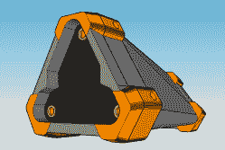

# Hackaday 奖品入口:测距仪+相机= SmartZoom

> 原文：<https://hackaday.com/2017/05/23/hackaday-prize-entry-rangefinder-camera-smartzoom/>

关于 Hackaday 奖的提交，有趣的事情是看到不寻常的项目和概念，否则可能不会弹出。[ken conrad]对基于 Raspberry Pi 的 SmartZoom 成像有一个好奇但经过深思熟虑的设计想法，它使用 Pi 零和相机加上一些激光发射器来创建一个具有非常特定功能的设备:一个不断动态调整图像大小的相机使主体看起来一致，无论它与镜头的距离如何。这个想法将两个独立的功能结合在一起:测距、自动变焦和相机图像的重新采样。

树莓派使用相机板加上一些前向指向的激光点作为测距仪；只要对象上至少有两个激光点可见，就可以计算出设备和对象之间的距离。然后，Pi 使用关于对象有多近或多远的知识来呈现最终图像，该图像的缩放级别已被调整以匹配(和偏移)对象与相机的距离，实际上抵消了对象基于距离而变大或变小的方式。

我们之前已经看到过[可见激光点作为测距](http://hackaday.com/2007/04/14/webcam-laser-rangefinder/)的基础，但从未绑定到变焦功能。毫无疑问，[ken conrad]会用一些示例应用程序更新他的项目，但同时我们也在想:这个不寻常的设备有没有具体的、实际的用例？我们不知道，但我们肯定会很高兴找到一个。

The [HackadayPrize2017](https://hackaday.io/prize) is Sponsored by:   