# 机器人索塔、战斗鹅和机器在世界创造日讲话

> 原文：<https://hackaday.com/2017/05/18/world-create-day-3/>

几个周末前，我们在世界创造日举办了 Hackaday 奖。这是一个建筑材料的庆典，也是建筑大师们聚会一堂，讨论他们今年要建造什么。我们在全球各地的参与人数惊人，大家都度过了一段美好的时光。

### 芬兰米凯利

据 Mikkeli World Create Day meetup 的组织者称，这个小镇很小，位于一个偏僻的地方。从地图上看，这似乎是一个公平的评估。尽管如此，Hacklab Mikkeli 和 Mikkeli 城市图书馆还是组织了一场有 120 多人参加的精彩活动。

这个项目的动机是发展和培养当地的黑客文化，从图片来看，这个团队成功了。有机器人，电子项目，3D 打印机，DIY 电子乐器，以及 Mikkeli 机器人战争第一季。那是芬兰语中的“Robotsota”。

 [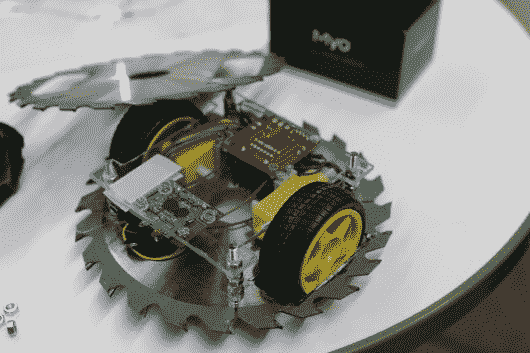](https://i0.wp.com/hackaday.com/wp-content/uploads/2017/05/8230311493051703448.jpg?ssl=1)    [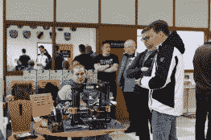](https://i0.wp.com/hackaday.com/wp-content/uploads/2017/05/6358631493052617028.jpg?ssl=1)  [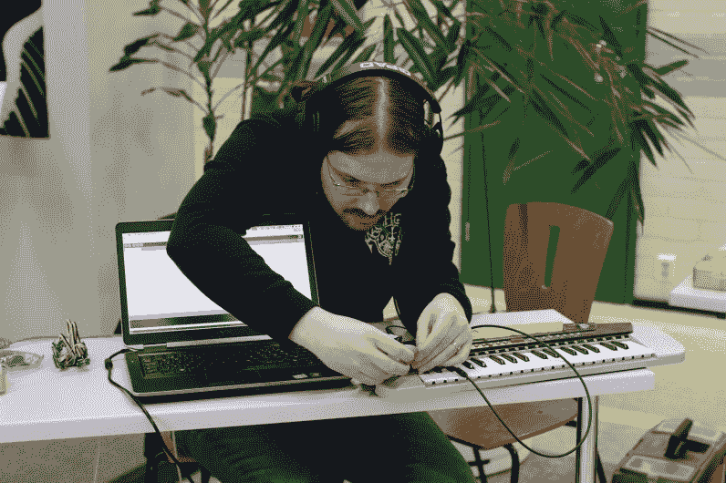](https://i0.wp.com/hackaday.com/wp-content/uploads/2017/05/3683261493051996772.jpg?ssl=1) 

### 开罗世界创造日

开罗黑客空间在我们心中有着特殊的位置。他们的黑客空间在 2016 年崩溃了(不，是真的)[，但他们确实设法拿到了所有的装备，并把所有东西都放进了一辆旧的大众货车。](http://www.cairohackerspace.org/post/143081993447/rollercoaster)[这是一个轮子上的黑客空间](http://hackaday.com/2016/05/08/running-a-hackerspace-is-hard-egypt-edition/)，太棒了。

他们为世界创造日举办的活动提出了挑战，他们花了一天时间集思广益，在笔记本电脑上贴了几张贴纸。干净利落。

### 温哥华黑客空间

温哥华黑客空间有一个半定期的活动，超级快乐黑客屋。这是一个开放的房子，每个人都进来，带来一个项目，谈论他们做了什么，一切都以几个闪电式的谈话结束。这正是我们在世界创造日活动中所期待的。

在这个组合世界创造日/超级快乐黑客屋的甲板上是车床训练、铁匠、战斗鹅、由于[【卢克·苏卡】](https://hackaday.io/hacker/146378)和几个[苹果酒互联网](http://tech.dominioncider.com/)位的一个可饮用的苹果酒演示，以及一个由一个微型黑白 CRT 构成的照相亭。

 [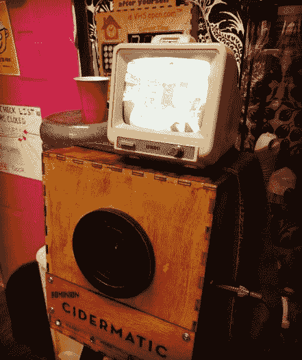](https://hackaday.com/2017/05/18/world-create-day-3/18095176_1772519496323226_2465386557335404544_n/)    [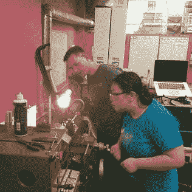](https://hackaday.com/2017/05/18/world-create-day-3/9k-2/)  [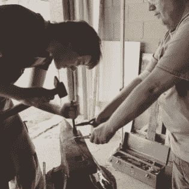](https://hackaday.com/2017/05/18/world-create-day-3/z-2/)  [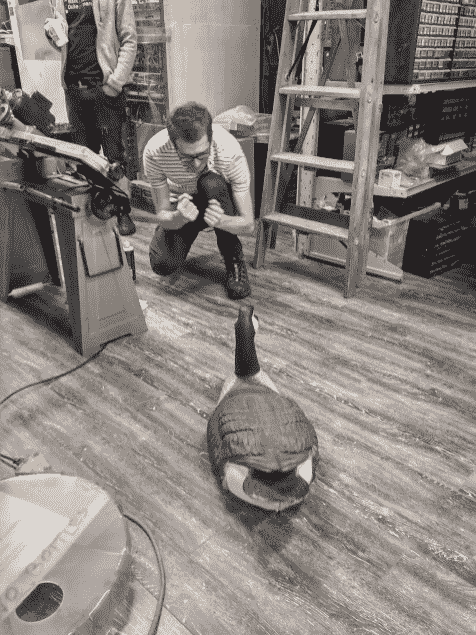](https://hackaday.com/2017/05/18/world-create-day-3/attachment/3343751493067925158/) 

### 富巴实验室

新泽西州的 fubar Labs*应该*不需要介绍。[fuba Rino 从那里出来](http://fubarino.org/sd/)，他们每年都在 Power Racing 系列赛中取得好成绩，hackerspace 的一名成员开发出了我见过的最精巧的 Hebocon 机器人。不，我不会告诉你它是什么；我还需要再偷几个周末的创意。

[Fubar 的世界创造日](https://hackaday.io/event/21000-hackaday-world-create-day-open-house-at-fubar-labs)的焦点是 TI 的 TMS5220NL 语音合成芯片。是的，这很古老，但是 Siri、Cortana、Alexa 以及其他任何在几年内将会流行的婴儿名字现在都是*的东西*，所以为什么不改变一下呢？这个活动很棒，在放弃了古老的 TI 部分后，实验室最终用一个 Emic2 模块实现了文本到语音的转换。这是由一个高中生带来的，他正在考虑为遭受暂时性语言丧失的人建立一个界面。太好了，这正是我们在 Hackaday 奖参赛作品中寻找的东西。

 [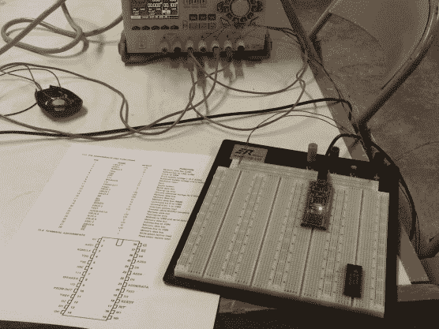](https://i0.wp.com/hackaday.com/wp-content/uploads/2017/05/2919571493817164879.jpg?ssl=1)  [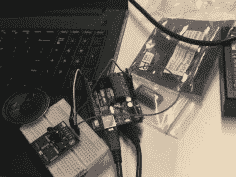](https://i0.wp.com/hackaday.com/wp-content/uploads/2017/05/7348831493817193987.jpg?ssl=1)  [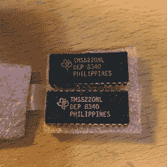](https://i0.wp.com/hackaday.com/wp-content/uploads/2017/05/5591651491577245213.jpg?ssl=1)  [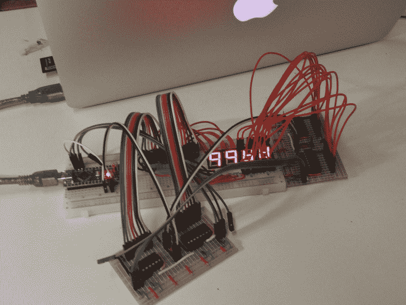](https://i0.wp.com/hackaday.com/wp-content/uploads/2017/05/3566181493817265324.jpg?ssl=1) The [HackadayPrize2017](https://hackaday.io/prize) is Sponsored by:   