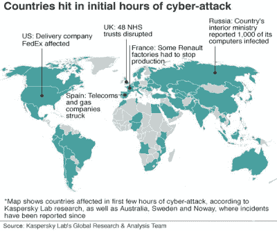

# 全球网络攻击停止:解剖时间

> 原文：<https://hackaday.com/2017/05/13/global-cyber-attack-halted-autopsy-time/>

周五出现了迄今为止最危险的勒索病毒感染。被称为 WannaCry 的感染关闭了英国各地重要的医院 IT 系统，取消了主要的手术，并将生命置于危险之中。

### 传播停止？

它进一步传播到世界各地，几乎成为一个全球性的疫情。尽管机器仍然需要加密的比特币，但一位安全博主【malware tech】[意外地停止了勒索软件](https://www.malwaretech.com/2017/05/how-to-accidentally-stop-a-global-cyber-attacks.html)。在分析代码时，他注意到恶意软件一直试图连接到一个未注册的域名“iuqerfsodp 9 ifjaposdfjgosurijfaewergwea . com”。所以他决定注册这个域名，看看他是否能得到一些分析或蠕虫试图发送回家的任何信息。相反，令他惊讶的是，这阻止了勒索软件的传播。最初他认为这是某种 kill switch，但在进一步分析后，很明显这是一个硬编码到恶意软件中的测试，旨在检测它是否在虚拟机中运行。因此，通过注册域名，勒索软件已经停止传播，因为它认为互联网是一个巨大的虚拟机。

### 为什么英国的 NHS 受到如此严重的打击？

根据[BBC]去年 12 月软件公司 Citrix 根据信息自由法获得的信息显示，高达 90%的 NHS 信托仍在使用 Windows XP，然而 NHS Digital 称这是一个“小得多的数字”。微软推出了 Windows XP、Windows 8 和 Windows Server 2003 的免费安全更新，“以保护他们的客户”。有很多关于 XP 不再接收更新等的警告，2001 操作系统只需要死亡，然而如此多的程序特别是嵌入式设备依赖于操作系统运行的事实是 Windows XP，这是一个需要尽快解决的问题。NHS 仍然面临着明显的问题，因为伦敦 Barts Health NHS Trust 的所有门诊病人预约都被取消了，而该信托恰好是全国最大的信托机构。然而，内政大臣安珀·陆克文表示，97%的 NHS 信托机构“正常工作”，没有证据表明患者数据受到影响。让我们只希望他们更新他们的系统，尽快回去修理人。

### 还有哪里被击中了？

除了英国国民医疗保健系统，还有很多其他地方也受到了影响，包括同样位于英国的桑德兰日产工厂、西班牙电信巨头 Telefonica 以及西班牙的一些天然气公司。在美国，联邦快递受到了影响，法国雷诺的一些工厂已经停产。最后，俄罗斯报告称，1000 个政府计算机系统遭到攻击。

### 那么勒索软件的末日到了吗？

不，这种感染是被意外阻止的，被感染的人要么仍然被感染，要么已经付钱了，如果他们没有在第一时间包括草率的代码，那么谁知道会发生什么。微软已经推出了补丁，但一些人/组织/政府很懒，懒得去应用它们。让你的电脑保持最新，祝你好运，因为我们认为我们将在未来几年看到更多的勒索病毒恶意软件。

【更新 WannaCry v. 2.0 已经发布，没有了“杀死开关”，我们想知道现在会怎么样。可能不是很多，因为媒体的关注一直很强烈，所以它可能不是那么大的影响，但是总有一些人生活在新闻不存在的土地上，他们将度过漫长的一天，直到砰！装上赎金，掏空口袋。]