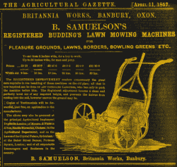
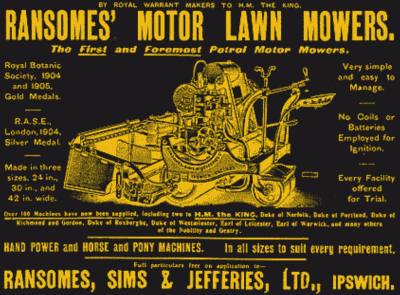
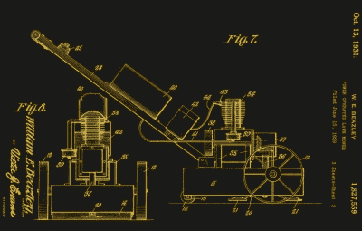

# 当你修剪草坪的时候可以思考的事情

> 原文：<https://hackaday.com/2017/06/29/something-to-think-about-while-youre-mowing-the-lawn/>

现在，我们又到了一年中的这个时候，我们一年一度的从冬天引发的疾病中复苏小型内燃机的仪式正在进行中。又到了割草的季节，我们中的许多人都在周六下午去我们的小块草地上来回走动，这是梅瑟斯·布里格斯和斯特拉顿提供的。在写这篇文章的地方，值得信赖的本田割草机的甲板出人意料地出现了故障，因此一位农业领域的顶尖高手暂时履行了替代职责，留给我们的更多的是障碍赛场地的粗糙绒毛，而不是板球场的光滑天鹅绒。今年草坪上的茶将会更有弹性。

当你想到这一点时，你会觉得在一片草地上付出如此大的努力有点奇怪。我们为什么要这么做？因为我们喜欢？因为其他人都有一个？或者仅仅是因为用草填充空间比放其他东西更省力？好像我们的小块草原已经成为我们消费文化中的一个方面，我们从来没有真正考虑过，我们只是*做*。

Mowers, mediaeval style.

如果你查阅唯一值得一读的历史书，你会发现在过去的日子里，城堡和其他军事设施周围会有一片没有树木和其他植物的草地，用于防御目的。[这在当代电影](https://www.youtube.com/watch?v=A8yjNbcKkNY)中可以清晰地看到。几个世纪以来，随着中世纪城堡慢慢演变成贵族住宅，用修剪整齐的草地包围它们的做法也是如此。割草本来是由动物来完成的，但结果是保留了一些开始类似于粗糙草坪的东西。

当贵族住宅不再有任何军事目的时，它们的花园本身就成了一种艺术形式。正式的花园采用草坪并将其融入设计中，由大批园丁使用手工工具来维护。因此，草坪是一种极端的地位象征；要有一个这样的人，你必须有能力雇佣一些人去做一些毫无用处的工作，比如养草取乐。

因此，到了 19 世纪，向上流动的维多利亚中产阶级对地位象征的贪得无厌的渴望与工业革命的工程师们看似无限的创造力结合在一起，技术不可避免地将草坪所有权民主化，并将我们的文明置于我们当前的布里格斯和斯特拉顿奴役的缓慢但不可阻挡的道路上。

## 割草机

[A period advert for a Budding mower](https://books.google.co.uk/books?id=jz1JAQAAMAAJ&pg=PA262&dq=&hl=en&sa=X&ved=0ahUKEwjo1-WPv_7TAhUMJ8AKHTzRB9M4tAEQ6AEIFzAA#v=onepage&q&f=false).

我们有一位来自英格兰格洛斯特郡的工程师，[ [Edwin Budding](https://en.wikipedia.org/wiki/Edwin_Beard_Budding) ]，来感谢第一台割草机。他在 1830 年发明的旋转刀片滚筒源自羊毛工业中使用的剪刀，由操作者推动时与地面接触的滚轮通过齿轮系驱动，这种设计经受住了时间的考验。齿轮可能已经被链条取代，整个机器可能已经变得更轻，但是[今天你仍然可以买到基本相似的割草机](https://www.webbgardenpower.co.uk/machine/webb-30cm-12-rear-roller-hand-mower)。

[Edwin Budding]以他的名字命名的慈善机构[[Budding]Foundation](http://www.thebuddingfoundation.co.uk/)在 21 世纪被人们铭记，该基金会经营着一个园艺设备博物馆，致力于促进年轻人的教育和机会。你可能会问自己，他与普通读者还有什么其他关联，直到你知道他还发明了可调扳手。我们大多数人都会有一台这样的割草机，即使我们从来没有用过。

[萌芽中的]割草机可能是执行这项任务的第一台机器，但它和它的仿制品仍然会被职业园丁使用，而不是像我们今天使用割草机那样被房主使用。因此，尽管在本世纪余下的时间里对推式割草机的设计有所改进，但直到 19 世纪 90 年代，发明家们才致力于创造一种动力推进器。

The 1902 Ransomes motor mower. ([Public domain](https://commons.wikimedia.org/wiki/File:Ransomes00.gif)).

英国利兰的兰开夏郡蒸汽汽车公司(顺便提一下，20 世纪 70 年代所有质量可疑的英国利兰汽车的祖先公司)被认为是第一台蒸汽动力汽车，在第一次世界大战前的几十年里，出现了各种类似的设计。然而，它们又重，又笨重，又不方便，所以同时出现第一台汽油动力割草机也就不足为奇了。1902 年的 Ransomes 机器被认为是第一台以气体为动力的割草机，与 Coldwell 蒸汽机相比，具有明显的尺寸优势。

[![An early Atco cylinder motor mower. Mike Peel [CC BY-SA 4.0].](img/05134a66a1dfb881df24823ebfe1055d.png)](https://hackaday.com/wp-content/uploads/2017/07/powis_castle_2016_072.jpg) 

一种早期的 Atco 汽缸电动割草机。迈克皮尔[ [CC BY-SA 4.0](https://commons.wikimedia.org/wiki/File:Powis_Castle_2016_072.jpg) 。在第一次世界大战后的几年里，新兴的郊区中产阶级对草坪省力装置的需求，以及内燃机的改进，导致了更适合家用的小型机器的出现。

1921 年的 Atco 割草机显然是一种[萌芽]式的机器，顶部安装了 Villiers 电机和链传动装置，并立即获得了成功。汽油缸割草机现在是一种可以在世界各地的运动场和高尔夫俱乐部看到的设计，多家制造商仍在生产。

The 1929 Beazley rotary mover. From US patent [US1827559A](https://patents.google.com/patent/US1827559A).

与此同时，在同一时期，其他发明家也在追求旋转推进器的设计。第一批美国型号之一来自[William Beazley]，他的 1929 年旋转式割草机开始看起来有点类似于我们今天熟悉的型号。然而，该设计的一个方面揭示了它的早期起源，而不是像我们预期的那样将电机安装在它的侧面，它有一个立式电机和一个通过锥齿轮箱的直角驱动。只是在接下来的十年里，发动机制造商才开始生产安装在侧面的发动机，因此旋转式割草机的普及来得更晚。

## 割草机黑客攻击

上一堂历史课当然很好，虽然很吸引人，但这是一个硬件黑客的网站。用割草机你能做什么？要回答这个问题，有必要看看割草机包含哪些部件，以及为什么一台旧割草机可能会落入你的手中。

最基本的汽油动力割草机将有一个矩形冲压钢刀片盖，发动机坐在上面，曲轴垂直，有四个轮子，每个角落一个。你通常会收到它，因为像我们的本田一样，压制钢已经屈服于不可避免的生锈，整个事情开始解体。因此，如果你能解开一组因生锈和反复热循环而卡住的螺栓，你就有可能找回一台完全可用的发动机和一套塑料车轮。

更多的花式割草机将是自供电的，将有一个带某种形式变速箱的后轮轴，或者是轴传动或者是皮带传动。家用的有点像噱头，除了移动剪草机本身的重量之外没什么好处，但是如果你能找到一个用于运动场或类似场所的专业搬运工，那么你就有了一个更有拉力的东西。

垂直曲轴电机通常不是最高科技的设备，但它们在简单性和可靠性方面弥补了这方面的损失。例如，Briggs and Stratton sidevalve 已经以基本相似的形式生产了几十年，如果维护良好，它将是一个忠实的仆人。你用它们做什么只受你想象力的限制，但在 YouTube 上快速搜索一下，你会发现气垫船上的垂直曲轴割草机发动机[，令人恐惧的电动自行车](https://www.youtube.com/watch?v=qjG4JiLj6W0)上的[，发电机](https://www.youtube.com/watch?v=YU27RlDxdwk)上的[。与此同时，我们还推出了一款用于驱动基本舷外马达的](https://www.youtube.com/watch?v=ozUwXoIovV0)[。](http://hackaday.com/2011/01/04/giving-a-canoe-lawnmower-power/)

所以，当你在你的小块绿草地上来回跋涉的时候，考虑一下那个慢慢振动你手指感觉的机器。你现在对它的历史有所了解了，当它脱离尘世时，你打算怎么处理它的部分？

标题图片:科林·萨克雷[ [CC BY-SA 2.0](https://commons.wikimedia.org/wiki/File:Brough_sports_field_-_geograph.org.uk_-_365485a.jpg?uselang=en-gb) 。