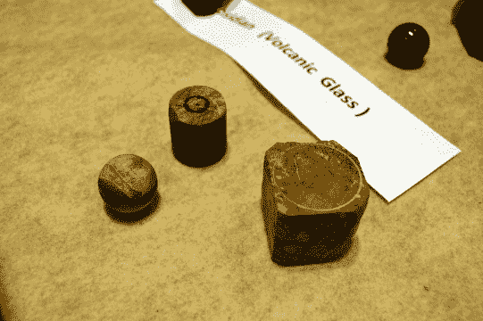
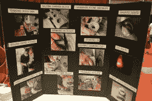
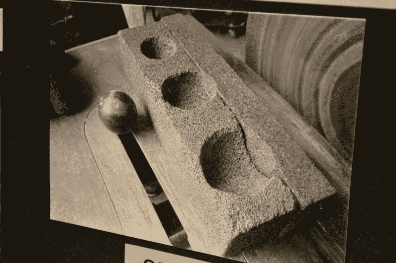
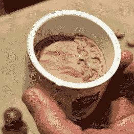
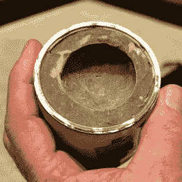
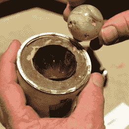
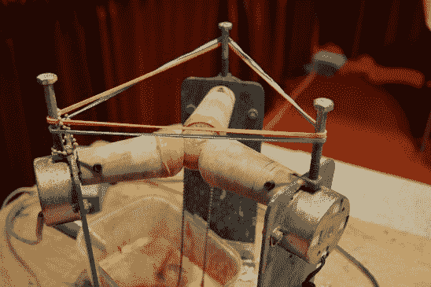
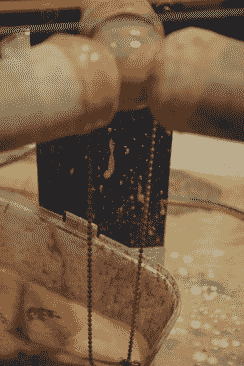

# 对新爱好的需求导致了石头弹子

> 原文：<https://hackaday.com/2017/05/18/need-for-new-hobby-leads-to-stone-marbles/>

[Tom Lange]说他正在寻找一个新的爱好，这时他看到了一个由石头制成的大理石，他想知道为自己制作一个大理石需要什么。三年后，他在麦迪逊迷你创客集市上开店，展示他制作的工具和他制作的迷人的光滑球体。请继续阅读，看看他将一块石头变成完美大理石的惊人过程。

    Tom Lange    Silicon carbide polishing tool

[Tom]没有 YouTube 频道或网页，但他带来了一个记录这个过程的照片板(点击上面的 embiggen)。第一步是选择你的石头，把它切割成一个粗糙的立方体，然后用碳化硅砂轮磨掉锋利的边缘，开始磨圆。

然后他移动到一块碳化硅上，在那里他用金刚石砂轮制作了不同大小的半球。这些并不是为每个弹珠逐步使用的，而是允许他在三个不同大小的弹珠上工作。将粗糙的球体放入其中一个，然后将它举到硬质合金砂轮上，球体将在口袋中旋转，在这个过程中变得更加球形。

  PVC Pipe and Bondo  Ping Pong ball makes hemisphere  Sandpaper cut to fit

粗磨结束后，[Tom]开始打磨。他用 PVC 管和身体油灰建造了这个定制的夹具来支撑球体(你可能从 Bondo 这个品牌名称就知道了)。他把它装进聚氯乙烯里，用一个乒乓球作为半球形口袋的模具。

各种砂砾的砂纸首先被切割成圆形，然后从外到中心进行浮雕切割，这样它就可以平放在半球形的口袋里。将大理石放在夹具中，用相同的砂粒从砂轮上打磨。[Tom]从粗到细，一路切换到陶瓷抛光垫。这很接近了，但还不会闪闪发光。

  Auto polisher uses microwave oven motors  Ball chain picks up polish

最重要的是这个自动抛光夹具完成最后的工作。[汤姆]自己编造的。这三个马达是从旧微波炉的转盘上拉出来的。我喜欢那对橡皮筋，它能给三个抛光臂施加张力。

最精彩的一步是自动给大理石上液体抛光剂的装置。下面有一个托盘，里面有上光剂(也能接住滴下的液体)。为了将抛光剂重新输送到大理石上，[汤姆]在大理石与抛光机相遇的地方绕了一段[球链](https://en.wikipedia.org/wiki/Ball_chain)。他最初试着用绳子，但是被堵住了。当时他在地下室里，试图解决这个问题，当他抬头看着灯时，他认为链条可能是完美的。确实是！

不要错过下面抛光机的视频。我真的很高兴在这个集会上遇到[汤姆]。他是一个伟大的创造者的例子:他做了一些很酷的事情，现在转过身来分享他的方法，让其他人对他们可以在自己的家庭商店里做什么感到兴奋。我没有从他那里得到电子邮件地址，所以如果你认识[Tom],请给他发一个链接，让他知道 Hackaday 的人群对这样的酷版本有多兴奋！

 [https://www.youtube.com/embed/u8CXsIXtYes?version=3&rel=1&showsearch=0&showinfo=1&iv_load_policy=1&fs=1&hl=en-US&autohide=2&wmode=transparent](https://www.youtube.com/embed/u8CXsIXtYes?version=3&rel=1&showsearch=0&showinfo=1&iv_load_policy=1&fs=1&hl=en-US&autohide=2&wmode=transparent)

本周末我将在 Maker Faire Bay Area 下注，所以请务必[在 Twitter](https://twitter.com/szczys) 上联系我，并告诉我我应该寻找哪些酷的东西。如果你要去那里，在 Tindie/Hackaday 展台停下来拿贴纸打个招呼，别忘了周六晚上[来和我们一起聚会](http://hackaday.com/2017/05/15/its-back-hackaday-meetup-at-bay-area-maker-faire/)！