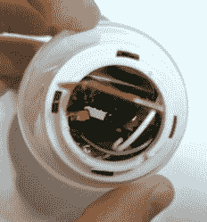

# 为你所有的好主意准备一个神奇的灯泡

> 原文：<https://hackaday.com/2017/06/13/a-magic-light-bulb-for-all-your-bright-ideas/>

[Uri Shaked]对他的智能灯泡被打破的哀叹很简短，也很鼓舞人心——现在他有了一个完全有效的借口将它改装成一个神奇的灯泡。

第一步是拆卸灯泡，并将其转换为使用 130 毫安时的小型电池。在灯泡的底座内，电源板、蓝牙和无线电电路以及 LED 板没有留下太多空间，但他能够为 LiPo 电池安装 3.3V 和 12V 的升压稳压器。

[Shaked]自我强加的奖励是在灯泡中嵌入一个充电电路——这是他从以前的项目中吸收的——而不是每次需要更多电力时就拆卸它。重新焊接零件在一起:容易。将所有东西装进一个小小的拼图盒:很难。Kapton 胶带被证明非常有助于防止有限空间内的短路。

为了安全起见，[Shaked]还将灯泡与底座隔离开来，以防它与一些普通灯泡混在一起。他指出，在一些国家，像这样摆弄灯泡是违法的，除非你是有执照的电工，因为如果插上插头(拧上螺丝)，这很容易发生重大故障？)到房子的电路中。

[Shaked]还成功地将这个项目与他以前为一些酷效果建造的信标结合起来，并集成了基于蓝牙的物联网功能，可以检测声音，适当地改变灯泡的颜色和亮度。

如果你是苹果用户，我们之前介绍过一种让 Siri 控制 Phillips Hue 灯泡的方法。更好的是，如果一个人能够将这个想法与[可见光通信](http://hackaday.com/2015/09/27/sending-the-internet-from-an-led-lightbulb/)融合，他可能能够控制一套具有光电二极管或其他类似接收器的设备，比如真正的魔杖——呃，灯泡。