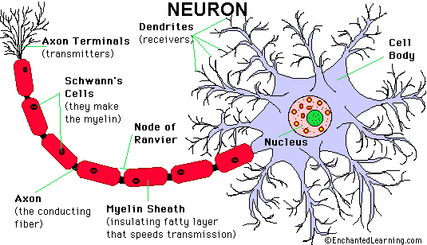
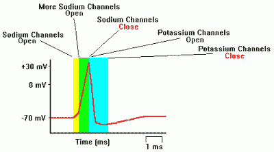
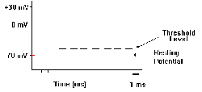

# 神经元——黑客的视角

> 原文：<https://hackaday.com/2017/06/02/the-neuron-a-hackers-perspective/>

你不再经常看到手帕了。今天，它们在很大程度上被认为是不卫生的，嗯…只是很恶心。你会很失望地发现，除了与你的大脑皮层相比，他们有一些相似之处外，他们与这篇文章毫无关系。如果你把大脑皮层从你的大脑中抽出来，在桌子上展开，你很可能看不到它不仅只有一块大手帕那么大；它也有同样的厚度。

新皮层，简称皮层，在拉丁语中是“新皮”或“新树皮”的意思，代表了哺乳动物大脑最近的进化变化。它包裹着“旧大脑”，有几个脊和谷(称为脑沟和脑回)，这些脊和谷是由进化最成功的尝试形成的，即尽可能多地将皮质填充到我们的头骨中。它承担了处理感官输入和储存记忆的职责，这是理所当然的。在你的手帕皮层上画一个一毫米见方的区域，它将包含大约 10 万个神经元。据估计，典型的人类大脑皮层总共包含大约 300 亿个神经元。如果我们保守地猜测每个神经元有 1000 个突触，那么你大脑皮层中的突触连接总数将达到 30 万亿个(T1)，这个数字大到超出了我们的理解能力。显然足够储存一生的记忆。

在你头脑的剧场里，想象一条伸展的手帕躺在你面前。是… *你*。它包含了你的一切。你所有的记忆都在里面。你最好的朋友的声音，你最喜欢的食物的味道，你今天早上在收音机里听到的歌曲，当你的孩子告诉你他们爱你时你的感觉都在里面。你的大脑皮层，你面前那块看起来微不足道的小手帕，此时此刻正在阅读这篇文章。

多么神奇的机器；一台由一种特殊类型的细胞——我们称之为神经元的细胞——构成的机器。在这篇文章中，我们将从电学的角度来探讨神经元是如何工作的。也就是说，电信号如何从一个神经元移动到另一个神经元，并创造了我们。

## 基本神经元

Neuron diagram via [Enchanted Learning](http://www.enchantedlearning.com/subjects/anatomy/brain/Neuron.shtml)

尽管人类大脑表现出惊人的技艺，但神经元在单独观察时相对简单。然而，神经元是活细胞，具有许多与其他细胞相同的复杂性——如细胞核、线粒体、核糖体等。这些细胞的每一部分都可以成为一整本书的主题。它的简单性源于它所做的基本工作——当其输入之和达到某个阈值(约为 55 mV)时，输出一个电压。

使用上面的图像，让我们检查一个神经元的三个主要组成部分。

### 身体

胞体是细胞体，包含细胞核和典型细胞的其他成分。有不同类型的神经元，它们的不同特征来自于细胞体。它的尺寸可以从 4 微米到超过 100 微米。

### 树突

树突从胞体伸出，充当神经元的输入。一个典型的神经元有数千个树突，每个树突都连接到另一个神经元的轴突。这种连接被称为突触，但不是物理上的。树突和轴突的末端之间有一个间隙，称为突触间隙。信息经由神经递质通过间隙传递，神经递质是多巴胺和血清素等化学物质。

### 轴突

每个神经元只有一个从胞体延伸出来的轴突，其作用类似于电线。每个轴突都将以终末纤维终止，与多达 1000 个其他神经元形成突触。轴突的长度各不相同，可以达到几米长。人体中最长的轴突从脚底延伸到脊髓。

神经元的基本电操作是当其输入电压的总和(通过其树突)超过特定阈值时，从其轴突输出电压尖峰。由于轴突与其他神经元的树突相连，你最终会得到这个极其复杂的神经网络。

因为我们都是一群电子类型的人，你可能会认为这些“电压尖峰”是电位差。但事情不是这样的。反正大脑里没有。让我们仔细看看电流是如何在神经元之间流动的。

## 动作电位——大脑的通讯协议

轴突被髓鞘覆盖，起到绝缘体的作用。沿着轴突的长度方向，在薄片上有小的断裂，这些断裂以其发现者的名字命名，被称为兰维尔结。需要注意的是，这些节点是离子通道。在轴突膜内外的空间中，存在钾离子和钠离子的浓度。离子通道会打开和关闭，造成钠离子和钾离子浓度的局部差异。

Diagram via [Washington U.](https://faculty.washington.edu/chudler/ap.html)

我们都应该知道离子是带电荷的原子。在静息状态下，钠/钾离子浓度在轴突膜的外侧和内侧之间产生负 70 mV 的电位差，外侧钠离子浓度较高，内侧钾离子浓度较高。当达到-55 mV 时，soma 将产生动作电位。当这种情况发生时，钠离子通道将打开。这使得轴突膜外的正钠离子泄漏到内部，改变轴突内的钠/钾离子浓度，进而将电位差从-55 mV 改变到+40 mV 左右。这个过程被称为去极化。

Graph via [Washington U.](https://faculty.washington.edu/chudler/ap.html)

钠离子通道沿着轴突的整个长度一个接一个地打开。每一个都只打开很短的时间，随后，钾离子通道立即打开，允许正钾离子从轴突膜内移动到外面。这改变了钠/钾离子的浓度，并在被称为[复极](https://en.wikipedia.org/wiki/Repolarization)的过程中将电位差带回其静止位置-70 mV。从开始到结束，这个过程大约需要五毫秒完成。这一过程导致 110 mV 的电压尖峰沿着整个轴突的长度下降，被称为[动作电位](https://en.wikipedia.org/wiki/Action_potential)。这个电压尖峰会在另一个神经元的胞体中结束。如果特定的神经元获得了足够多的这种脉冲，它也会产生动作电位。这是电模式如何在整个皮层传播的基本过程。

哺乳动物的大脑，特别是大脑皮层，是一台不可思议的机器，其能力甚至远远超过我们最强大的计算机。了解它的工作原理将让我们更好地理解智能机器的构建。既然你知道了神经元的基本电特性，你就能更好地理解人工神经网络。

**来源**

[神经元动作电位](https://www.youtube.com/watch?v=iBDXOt_uHTQ)，通过 Youtube

论情报，作者杰夫·霍金斯，ISDN 978-0805078534