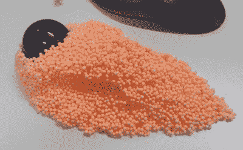

# 只有 90 后的孩子会欣赏这个原型

> 原文：<https://hackaday.com/2017/05/24/only-90s-kids-will-appreciate-this-prototype/>

【Madox】是轨迹球用户，没问题；我们 Hackaday 尊重并欣赏那些过着另类生活方式的人。正如你所料，轨迹球的品牌和型号并不多,[Madox]想要符合人体工程学的东西。DIY 解决方案是必要的，但是在打印出来之前，你如何模拟出“符合人体工程学”的东西呢？ [Floam，显然是](http://www.madox.net/blog/2017/05/22/engineering-design-using-childrens-toys/)。

Highly advanced 3D prototyping skills

Floam 是一种粘性可塑的粘性物质，最初是作为 20 世纪 90 年代早期 Nickelodeon 的 Gak 的后续产品出售的。它由聚苯乙烯泡沫塑料颗粒组成，用彩色粘合剂粘合在一起，不会留下混乱，也不会变干。虽然 Nickelodeon 版本已湮没在时间的长河中，但一种类似漂浮物的物质在任何玩具店都可以买到。[马多克斯]拿起几个泡罩包装，开始制作他理想的轨迹球。

有了合适的形状，[Madox]需要一种方法将这种设计输入计算机。摄影测量是解决方案，虽然 Autodesk Catch 的早期实验取得了成功，但 Autodesk 已经将他们的摄影测量软件改造并更名为[Autodesk reveal](https://remake.autodesk.com/)。将一堆泡沫聚苯乙烯球变成 3D 模型就像拍一堆照片并上传到 Autodesk 的“云”服务一样简单。

仅仅几分钟，一个合适的 3D 网格就从 Autodesk 母舰上送来了，[Madox]开始将这个模型导入 Fusion 360，摆弄倒角，最终到了需要 3D 打印机的地步。它进行了一些修改，但现在[Madox]有了一个定制设计的轨迹球，完全符合人体工程学。