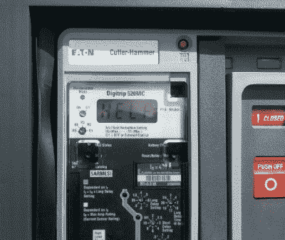
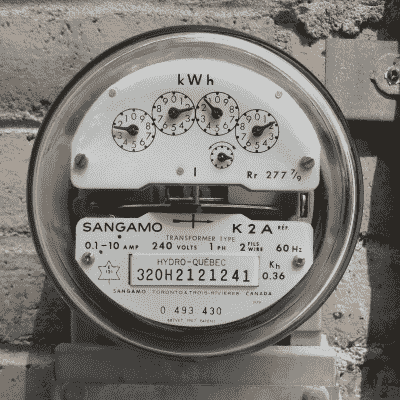
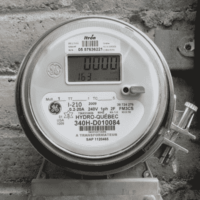

# 电网有多智能？

> 原文：<https://hackaday.com/2017/06/12/how-smart-is-the-grid/>

营销和广告团队往往倾向于利用技术趋势，比工程师和用户适应技术本身的速度更快。也许这并不奇怪，很难抑制将产品推向市场并盈利的动机。目前最明显的例子是不小心将 WiFi 放在电器和玩具中并放在物联网上的做法，但在电力行业也有类似的惨败。被称为“智能电网”的努力正在进行中，以与物联网寻求现代化家用电器相同的方式实现电网的现代化，但要获得更大和更直接的好处。

A Cutler-Hammer industrial breaker ominously predicts the coming confusion in the smart grid arena.
Photo by Bryan Cockfield

为此，如果有什么需要现代化的话，那就是电网。通常仍然广泛使用 19 世纪开创的技术，如同步发电机和变压器(更不用说在晶体管发明之前完善的计量和计费技术)，有很多机会将监督和连接添加到从发电厂到客户的几乎每个电网部分。此外，大多数现代电网正在迅速老化，同时我们要求它们输送越来越多的电力。现代化还可以帮助老化的基础设施更有效地输送能源。

虽然“智能电网”这个术语像“物联网”一样模糊不清，甚至连美国政府的定义都是模糊不清的，但智能电网实际上有一个统一的目的，而且到目前为止，尽管缺乏统一的定义，它仍然是一种非常有用的方式，可以为电网带来所需的改进。虽然没有哪一件事能让电网突然转变为智能电网，但有许多事情同时发生，每一件都提高了电网的性能和状态报告能力。

## 监控和数据采集(SCADA)

最广泛使用的电网控制系统被称为监控和数据采集，或 SCADA。这是一个跨越多种技术的行业标准，已经适用于网格。这使得电力系统操作员可以看到哪些断路器打开或关闭，哪些发电机在线，各个点的电压是多少，配电线路的问题可能在哪里，等等。它允许调度员获得电网的高层次视图，并对电力如何通过电网进行一些控制。这一系统的更新实施和补充使电网能够更快地检测故障，并在可能的情况下绕过故障转移功率流，这是现代智能电网的一个关键特征。

虽然 SCADA 对于系统操作员和调度员来说是一个强大的工具，但在一些受现代技术影响最大的领域，它可能是缺乏的。当然，仅配备 SCADA 系统的电网不被视为智能电网。具体来说，它缺乏对“仪表背后”或客户控制范围内发生的任何事情的控制，而这正是许多新兴智能技术的关注点。这包括处理电动汽车充电，在用电高峰期间积极管理热水器和空调等耗电设备，以及屋顶太阳能等微型发电。

## 智能计量

Analog Meter
by [Kristoferb](https://commons.wikimedia.org/wiki/File:Hydro_quebec_meter.JPG) CC-BY-SA 3.0

Smart Meter
by [Kristoferb](https://en.wikipedia.org/wiki/File:Hydro_Quebec_meter_solid_state.jpg) CC-BY-SA 3.0

除了这些具体的新技术，智能电网的另一个主要部分已经被广泛实施:智能电表的使用。这些是电子(而不是机电)仪表，可以远程报告能源使用情况，消除了对抄表器的需求。它还允许[按需计费](https://www9.nationalgridus.com/masselectric/business/rates/5_demand_faq.asp)以及在一天中的特定时间和不同用途的其他创新计费方式，这是老式电表无法做到的。不幸的是，尽管有这些优势，这些特殊的设备经常出现在新闻中，因为极少数人已经确信智能电表使用的非电离无线电波在某种程度上是有害的，尽管完全没有证据支持他们的说法，并且[尽管这些频率已经得到广泛使用](http://www.arrl.org/smart-meters)。

## 用电池组吸收光点

智能电网带来的另一个重要改进是轻松处理能量存储的能力。虽然电池技术的落后是出了名的，但目前在电网上安装大规模电池来储存能量超过几个小时在经济上是不可行的。

大多数在线电池组执行一项称为“负载平衡”的任务，即短期(几秒到几分钟)供需平衡。例如，启动像锯木厂这样的工业设施可能会对当地电网提出短暂的高要求，这可以通过电池组几乎瞬间平衡，以减轻电压骤降。另一方面，电网上的突然负载损失可以通过对电池组充电来吸收，这在另一个方向上保持了电网的稳定性。

也许在未来，电池技术将成为主流，足以吸收来自太阳能站之类的东西的日常需求，但价格和技术还没有达到广泛采用这种规模的东西所需的水平。[液流电池](https://arstechnica.com/business/2017/04/washington-states-new-8-megawatt-hour-flow-battery-is-the-largest-of-its-kind/)是这类应用中锂离子电池的不错替代品，但在大规模采用之前需要改进。

## 微型发电

像电池组一样，微型发电也可以用来帮助智能电网。微型发电是指小型发电，如屋顶太阳能或垃圾填埋场的小型甲烷发电机。一个足够智能的电网更有能力知道这些分布式发电设施何时在线，并能利用这些信息以比其他方式更有效的方式维持电网运行。

然而，尽管有这么多好处，智能电网还没有一个明确的标准。就像物联网一样，它有时看起来像一场无法无天的技术混战。在同一个州或国家运营的电力公司之间甚至常常没有关于它们应该如何处理和实施这些新兴技术的协议。这个行业需要的是一个明确的标准来支撑，但似乎没有什么东西会很快填补这个空白。