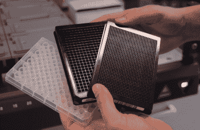

# 变小变大:彻底改变生物科学的黑客技术

> 原文：<https://hackaday.com/2017/06/23/go-small-get-big-the-hack-that-revolutionized-bioscience/>

在这个领域之外，很少有人知道生物科学能发展到什么程度。公众倾向于认为像物理学和天文学这样拥有巨大粒子加速器和大型望远镜的领域是大科学的自然表现。但几十年来，生物学一直在变大，尤其是在制药行业。围绕使现代制药研究成为可能的自动化设备而建立的专业实验室，甚至会让最疲惫的欧洲核子研究中心物理学家眼花缭乱，成群结队的机器人手臂移动实验室器皿，试图找到下一个大药物。

我以前写过关于大生物学以及如何让 STEM 项目更加引人注目的文章。但是生物学到底是怎么变大的呢？是什么让生物学超越了一堆试管，发展到可以进行数百万次实验的地步，这不仅是可能的，而且是实际需要的？是机器人的进步，还是更好的检测方法？也许这是基因工程的一个突破？

没有。信不信由你，那是一小块钻了孔的塑料。这是一个关于微量滴定板如何使生物科学实验小型化到一次可以进行数百或数千次测试的故事。

### 一场严重的流感

Dr. Gyula Takátsy. Source: [Wikimedia Commons](https://commons.wikimedia.org/wiki/File%3AGyula_Tak%C3%A1tsy00.jpg)

大多数人都知道在一战结束前后导致数百万人死亡的西班牙流感疫情。但自 1918 年爆发以来，其他流感爆发虽然没有达到疫情的定义，但在某些方面甚至更加致命。这样的疫情曾经是 1951 年的流行病，据说是从利物浦的码头上开始的。该市每周死于流感的人数将超过 1918 年的疫情，除了二战闪电战期间的死亡人数，就死亡率而言，仅次于 1849 年的霍乱爆发。

这种流行病在世界各地肆虐——英国、美国和加拿大受到的打击尤其严重。但是匈牙利也遭受了强烈的流感爆发，处理公共卫生问题是困难的。在战后的匈牙利，很难获得医学实验室用品，对病人样本的准确测试既繁琐又缓慢。必须做点什么。

医生科学家 Gyula Takátsy 博士出场。Takátsy 博士看到了基本问题:当时的流感测试需要相对大量的试剂，足够用*移液器*处理，这些移液器是玻璃(或现在的塑料)管，有点像校准的吸管。由于测试所需的试剂和分配试剂的移液器供应短缺，Takátsy 博士意识到他需要将他的分析小型化。他推断，更小的体积可以扩大试剂的供应，并允许他在同一时间做更多的测试，增加产量。

Dr. Takatsy’s microtitration technique. Source: [Laborjournal Online](http://www.laborjournal.de/rubric/produkte/products_10/2010_01.lasso)

但是如何处理用于他的微型实验的容器，以及如何精确地分配小体积？后一个问题通过使用铂丝的小环来解决。缠绕成螺旋形后，这些线可以通过毛细作用获得可重复体积的含水试剂，依靠表面张力将液体珠保持在螺旋笼中。Takátsy 博士还利用相同的原理，尝试使用普通织针转移试剂。他称他的技术为“微量滴定”，因为他是连续稀释或滴定样品。

至于他的微量滴定技术的容器，Takátsy 博士不能依赖传统的试管——它们太大了，而且无论如何都供不应求。因此，他突发奇想，把井加工成一块有机玻璃。这些井小到只能容纳几百微升，比最小的试管还要小。但是主要的优势来自于能够在有机玻璃板上钻 X-Y 阵列的孔。因此，Takátsy 博士可以使用他的导线或针头将试剂同时转移到一行或一列的每个孔中。这使他能够快速组装分析，也许同样重要的是，能够轻松地一次性处理它们。

### 八乘十二

Microtiter plates – 96, 384, and 1536 wells. Source: By S.D. Hamilton [via Wikimedia Commons](https://commons.wikimedia.org/wiki/File%3AMicroplates.jpg)

Takátsy 博士最初的设计是一个 6x 12 的阵列，允许他同时处理 72 个反应。虽然这无疑是小型化的巨大进步，但他最终选定了一种更密集的排列方式，即现在经典的 96 孔设计。鉴于两个数字都有如此多的因素，八乘十二阵列是一个巧妙的设计；这给了研究人员在设置实验时难以置信的灵活性。例如，一种流行的设置是横跨板的前 10 列的稀释系列，最后两列留作对照。一式两份甚至一式三份很容易排列在盘子的下面。

尽管 Takátsy 博士的微量滴定设计非常出色，但在 20 世纪 50 年代的大部分时间里，它在匈牙利之外鲜为人知。匈牙利难民开始传播这项技术，很快，世界各地大学的机械工厂开始生产机械版的钢板。但是机械加工不能很好地规模化，到 50 年代后期，第一批注射成型的 96 孔板已经可以在市场上买到。后来的创新包括将板上的孔密度增加到 384 甚至 1536 个孔，同时保持 2:3 的纵横比，以及不同的塑料成分和处理以支持不同的实验条件。

Manual eight-channel micropipettor. Source: [Pipette.com](http://www.pipette.com/jenconspipettes?sbr=249&sbn=Sealpette%20Original%20Multichannel%20Pipette)

大规模生产的微量滴定板的出现导致了配套仪器的发展，这是 Takátsy 博士做梦也想不到的。尽管他的线和针都很创新，但这项技术需要相当多的手工技巧，而且很难改变输送的液体量。微量移液器解决了这一问题，使用可微调的活塞将液体吸入一次性塑料吸头。后来推出了多通道移液器，吸头的间距可以一次处理 8 或 12 个孔。引入了自动化设备来处理微量滴定板，包括自动化移液器、蠕动式分配器，甚至可以一次重复转移纳升的声学转移仪器。整个行业都是围绕检测模式建立的，从读取每个孔中颜色变化的简单分光光度设备到复杂的荧光读取器，甚至是对整个染色细胞板的图像分析。

Takátsy 博士用他的小加工塑料板开始的革命怎么说都不为过。通过将反应微型化，并使在一个易于操作的容器中进行多个实验成为可能，Takátsy 博士的影响远远超出了 1951 年的流感疫情。他为一个成功收获化小为大的力量的行业奠定了基础。