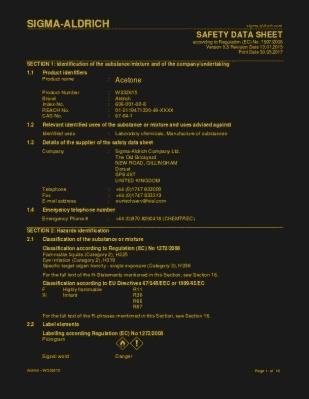
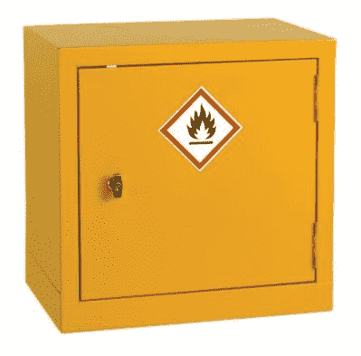

# 为你的商店挑选化学品储存

> 原文：<https://hackaday.com/2017/07/07/sort-out-chemical-storage-for-your-shop/>

在硬件黑客工作室的世界中有一个不变的事实，无论是你车库中的私人工作室还是公共的黑客空间，都是这样的:

直到事故发生之前，每个人都是各自工作领域的安全专家。

换句话说，人们很容易对你熟悉的事物或你不了解的危险抱着漫不经心的态度，这就滋生了一种环境，在这种环境中，灾难很有可能发生。

作为硬件人，我们熟悉基本的工具安全或电气安全。很可能在我们成长的某个时候，实验室主管、车间老师或父母把它灌输给了我们。作为读者的你和作为作家的我能存活这么久，足以证明这种教育的成功。但是，在那些我们可能没有接受过这种教育的领域，那些我们很少遇到或看起来无害的事情，它们的安全不需要我们关心，那该怎么办呢？例如，化学品:从胶水到溶剂和焊接消耗品，再到 PCB 化学品，甚至是油漆。这一切看起来足够安全，还会出什么差错呢？这个问题的答案可能是我们大多数人都不愿意知道的，所以有必要看看一个运营良好的车间如何以尽可能安全的方式管理其化学品。

## 阅读说明

The safety data sheet for acetone, a common solvent for 3D printer owners. ([Sigma-Aldrich](http://www.sigmaaldrich.com/MSDS/MSDS/DisplayMSDSPage.do?country=GB&language=en&productNumber=W332615&brand=ALDRICH&PageToGoToURL=%252Fcatalog%252Fproduct%252Faldrich%252Fw332615%253Flang%253Den))

这似乎是显而易见的事情，但当你得到一种化学药品时，请阅读它的说明书。它的包装里会有一个，如果没有的话，会有一个可以从制造商的网站上下载。在上面你会找到所有你需要的关于它的潜在危险，如何使用，以及如何储存的信息。从这些信息中，你可以决定对你来说最合适的处理方法，不管是什么化学物质。

## 知道你有什么吗

在一生的修补过程中，人们很容易收集到各种各样的随机化学物质。随着时间的推移，也很容易忘记你的收藏到底包含了什么。标签褪色脱落，你不知道你把瓶子放在哪里，你也不再知道你得到了什么。

在某些司法管辖区，法律要求商业机构维护其化学品库存清单。虽然这看起来很麻烦，但即使法律没有要求，这对任何车间来说都是值得的。它不必是任何花哨的东西，只要一个简单的笔记本就可以了，因为它真的有助于了解你有什么。如果某件事确实造成了事故，那么了解一些可能的原因会对你如何处理它有很大的帮助。

## 妥善存放所有物品。

这又回到了之前关于阅读数据手册的问题。你可以在上面找到如何储存产品的细节。如果你幸运的话，它是一种惰性、无腐蚀性、无毒的固体，不会产生烟雾，你可以存放在任何地方而不受惩罚。不过，更有可能的是，它含有一种会释放烟雾的溶剂、易燃物质、氧化剂或其他危险物质。因此，你不仅要考虑它应该如何存放，还要考虑它应该放在什么旁边。

A typical fireproof chemical storage cabinet, [RS Stock No.424-5364](http://uk.rs-online.com/web/p/hazardous-substance-cabinets/4245364/).

仅举一个例子，大多数车间化学品很可能含有易燃溶剂。这些应储存在位于溢出托盘中的防火柜中，以控制柜内的任何火灾和任何液体溢出。你可能会认为这是一个安全的地方，也储存任何其他化学品，但由于每个有自己的要求，可能不是这样。例如，氧化剂不应与易燃溶剂存放在一起。

最后一点，**在任何情况下**化学品都不应该和食物存放在同一个地方，比如共用冰箱。这似乎是显而易见的事情，但在像 hackspace 这样的公共工作室中，似乎总有成员认为这一限制不适用于他们。如果你是这样一个空间的董事会成员，把有问题的化学物质绑定并禁止该成员。当有人中毒时，这样做比和警察打交道容易得多。

## 保持在它上面

你可能会认为，如果你有一个清单，列出你已经得到的东西，并且都妥善保存，那就足够了。但是差异总是有可能出现，有人把东西放错了柜子，或者没有记在书里。因此，你应该偶尔承担管理库存的繁琐任务。将你的库存与你的商店中的库存进行核对，并做出相应调整。

## 适当地处理它

[![Find the appropriate place to dispose of your chemicals. Robert Kaufmann/FEMA Photo Library [Public domain].](img/ac2a00e13d83ad91d6170e16fe649131.png)](https://hackaday.com/wp-content/uploads/2017/05/epa-disposal.jpg) 

找到合适的地方处理你的化学物品。罗伯特·考夫曼/联邦应急管理局照片库[ [公共领域](https://commons.wikimedia.org/wiki/File:FEMA_-_21306_-_Photograph_by_Robert_Kaufmann_taken_on_01-11-2006_in_Louisiana.jpg?uselang=en-gb) ]。总会有某个时刻，一些化学物质或其他物质已经过期，必须被处理掉。数据表会告诉您处理它的合适位置，您应该遵循它的建议。如果你幸运的话，你可以把它扔进垃圾里，如果你运气不好，你可能不得不去当地的化学处理点。我们在车间里发现的一些常见化学物质尤其需要妥善处理，例如废弃的 PCB 蚀刻剂，其中的铜盐对鱼类特别有毒。

## 确保每个人都在同一页上

如果没有得到普遍遵守，那么拥有一个精心设计的化学品管理系统是没有用的。特别是在共享空间中，总会有一些用户认为他们的资格不适合他们，因此您必须确保所有用户都以应有的尊重对待他们。如果有必要的话，为你的共享空间建立一个系统，在这个系统中，只有在通过适当的培训后才能获得化学品，并准备好威胁那些不遵守这个系统的人，取消他们的特权。

在硬件黑客和制造商的世界中，我们是幸运的，对我们大多数人来说，我们可能遇到的化学物质比你可能在化学实验室中遇到的化学物质安全一个数量级。但是，我们仍然会遇到重大的危险，例如，任何拥有 3D 打印机的人都可能会关心丙酮火灾的影响。希望以上几点能为我们在车间安全处理和储存化学品提供一个起点。毕竟，我们都更愿意花更多的时间去做东西，而不是向消防人员解释他们要去营救的人到底在用什么。