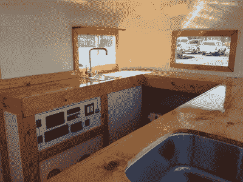

# 拖车里的移动酒吧！

> 原文：<https://hackaday.com/2017/06/04/a-mobile-bar-in-a-trailer/>

好吧，有一些有价值的法律来规范酒类的销售和分销——而且理由充分。然而，对于许多私酒贩子来说，将一辆 1946 年的旧拖车改造成流动酒吧的梦想是必须实现的——等等，什么？[已经存在的](http://imgur.com/gallery/nKLsN)？

 这不是[移动工作间](http://hackaday.com/2014/02/03/from-a-truck-trailer-to-a-mobile-workshop/)，但这个酒吧最初是为婚礼上的宾客建造的。【HelloPennyBar】已经和全世界分享了重建过程。里面有供应饮料所需的一切，包括一个(双)厨房水槽。除了水箱，一对汽车电池作为中央电源，为室内灯安装了电气工程，一个小风扇使调酒师保持凉爽，室外灯，水泵，拖车灯，以及更多的室外灯，以便顾客可以彻夜狂欢。

在你说话之前，[HelloPennyBar]说他们需要执照才能出售酒，但声称对于在他们州的私人活动中供应酒的*，有一个场外负责供应执照就足够了。此外，一些有帮助的 redditors 也加入了关于电池安全和电缆安装的讨论，这是[HelloPennyBar]应该做的。注意安全和合法性，移动酒吧必须为一个有趣的新颖的夜晚。*

[通过 [/r/DIY](https://www.reddit.com/r/DIY/comments/6e5kb8/but_i_really_did_turn_a_1946_trailer_into_a_kick/)