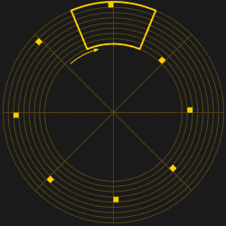
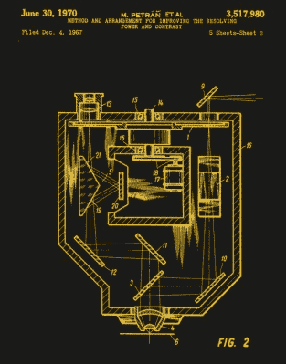

# 用尼普可夫圆盘获取机械图像

> 原文：<https://hackaday.com/2017/06/28/mechanical-image-acquisition-with-a-nipkow-disc/>

如果你的青少年时代没有好好利用，从垃圾箱里捡坏了的电视机，要么把它们抢走，要么把它们修好，以便能在楼上看 A 队比赛，而不是像我一样在客厅里看，那么很可能你也会对模拟电视技术产生浓厚的兴趣。你可能会说，你会从你的消隐间隔和你的彩色脉冲中知道你的前廊。

An illustration of a simple Nipkow disk. Hzeller ([CC BY-SA 3.0](https://commons.wikimedia.org/wiki/File:Nipkow_disk.svg)).

有一项电视技术躲过了 20 世纪 80 年代的拾荒者，20 世纪 70 年代的 625 行 PAL 电视永远无法接近最早的电视机的魅力。因为它们不是 CRT 及其相关的电子设备，而是一个带有螺旋形孔洞的旋转圆盘。这些机械电视系统在 20 世纪 30 年代很快被全电子系统所取代，因此在生产的极少数电视机中，只有一小部分幸存了下来。

机械电视中的旋转圆盘被称为尼普可夫圆盘，以其发明者保罗·戈特利布·尼普可夫的名字命名。[Nipkow]在 19 世纪 80 年代构思了一个带有螺旋孔的旋转盘的想法并获得了专利，以将图像依次分割成一系列线，但没有几十年后出现的电子放大的好处，无法产生一个可行的系统来演示它。大约在 20 世纪 20 年代，[[约翰·洛吉·贝尔德](https://en.wikipedia.org/wiki/John_Logie_Baird)才利用[尼普科夫]的发明开发出第一个可用的电视系统。

[![[Baird] with his invention, showing a large Nipkow disk. (Fair use).](img/cb2e83f7c4b1b71b882f9fa398372d8b.png)](https://hackaday.com/wp-content/uploads/2017/05/john_logie_baird_apparatus.jpg) 

【贝尔德】用他的发明，展示了一个[巨大的尼普可夫圆盘。](https://en.wikipedia.org/wiki/File:John_Logie_Baird,_Apparatus.jpg)

尼普可夫盘的操作再简单不过了。一个图像被投射到它的表面，穿过螺旋孔穿过的区域。当圆盘旋转时，它的每一个洞都会穿过它自己的弧线，这个弧线与它前面的洞所穿过的弧线非常接近。当每个孔执行遍历时，它们逐渐逐行扫描图像，并且当螺旋中的最后一个孔通过时，紧接着是螺旋另一端的第一个孔，并且重复该过程。如果光敏检测器被放置在盘的后面，那么它接收的光强对应于将图像表示为视频扫描线的电压输出。

如果将该过程颠倒过来，将灯放置在盘的后面，并供给放大的视频信号，当每个孔经过它的前面时，将显示一条新的图像线，并且由于观察者眼睛中视觉的持续性，所产生的快速移动的光点被构建成图像。

A confocal microscope in cross-section, with the Nipkow disk being inside the casing horizontally immediately below the eyepiece. US patent [US3517980A](https://patents.google.com/patent/US3517980A/en).

众所周知，普通读者不太可能偶然发现贝尔德电视机或其他机械电视机。但是这项技术的美妙之处在于尼普可夫圆盘很容易制造。小学的方法包括在一张卡片或类似的平面材料上以适当的角度标记孔的位置，然后用尺子测量每个角度的中心位置，但当代的建议是借助一根缠绕在中心轴上的钢琴线画一个螺旋。或者，黑客读者可能希望尝试用程序创建一个模式，这是我在试验尼普可夫圆盘时选择的解决方案。我的代码——VBScript，但它*是*20 世纪 90 年代！–已经消失在时间的迷雾中，但它首先按照钟面演示脚本绘制一圈同步孔，然后绘制另一圈，每个孔与中心的距离适当减少。

恐怕你会认为尼普科夫圆盘是一种过时的技术，只存在于博物馆和机械电视爱好者的长椅上，但在科学的前沿领域，它们仍然发挥着作用。[共焦显微术](https://en.wikipedia.org/wiki/Confocal_microscopy)是一种用精确聚焦的光扫描样品的技术，产生极窄的景深，减少或消除样品失焦部分的反射。在这项任务中，通过激光扫描连接了尼普可夫圆盘，但当光敏样品需要非常低的光强度时，它保留了一个边缘。

一种过时的制作低分辨率电视的方法可能不会让每一位业余读者感到兴奋。但是我确信我不会是我们社区中唯一对这个方向感兴趣的人。如果我刚刚描述了你，那么也许是时候给你自己切一张尼普可夫光盘，把你的机械电视机贴在 [hackaday.io](https://hackaday.io/) 上了。

标题图片:H. G. Cisin [ [公有领域](https://commons.wikimedia.org/wiki/File:Spinning-disk_television_receiver_1931.jpg)。