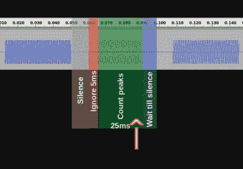

# 一个 LED 显示屏有多少个漏洞？

> 原文：<https://hackaday.com/2017/06/06/how-many-hacks-in-an-led-display/>

在[Joekutz]的[复古 LED 显示屏项目](https://hackaday.io/project/24926-arduino-driven-led-display-with-bt-data-transfer)中有如此多的好点子，以至于很难知道从哪里开始。这是他的 DIY LED 显示屏，由 Arduino UNO 控制。为了显示一些文本或图片，他将蓝牙扬声器的输出直接连接到 Arduino，并向其发送编码文本的扬声器音调。似乎这还不够，他从一个模拟时钟上砍下了一块石英驱动板，将显示屏也用作时钟。

让我们从 LED 矩阵显示器开始，这可能是尝试移位寄存器的最佳借口。这种显示器使用两个这样的 8 位移位寄存器菊花链在一起，馈入两个 8 位达林顿阵列。显示器有十行十六列，你猜对了，列是由十六个移位寄存器控制的。两个 Arduino 引脚告诉移位寄存器打开哪一列。这些行通过十个晶体管打开和关闭，这些晶体管由十个 Arduino 引脚控制。以每秒 80 帧的速度扫描，他得到了一个漂亮的、无闪烁的显示屏。

为了制造 LED 矩阵电路板和控制板，[Joekutz]使用自制的数控铣床在覆铜板上雕刻出隔离路径。一定要看看下面的第一个视频，看看他的不幸遭遇，最终导致他华丽的板。

Tones sent to the Arduino

Arduino 在显示器上画画，但为什么不告诉它从笔记本电脑或手机上画什么呢？为此，他在笔记本电脑上安装了一个廉价的蓝牙扬声器。在笔记本电脑上，他制作了一个简单的网页，可以用来画画或写文字。点击一个标有“光束”的按钮在网页上运行一些 javascript，将图片或文本转换成音调。然后， [AudioContext](https://developer.mozilla.org/en/docs/Web/API/AudioContext) 对象将这些音调发送给配对的说话者。

为了将音调从扬声器传输到 Arduino，他入侵了蓝牙扬声器的电路板，将其输出重定向到 Arduino 模拟引脚。观看第二个视频，了解他如何找到编码这些音调的方法，以便 Arduino 能够解码它们，并将其转化为控制 LED 显示屏的东西。

最后，既然他有一个显示器，为什么不把它当作一个时钟呢？他发现 Arduino 的内部时钟不够精确，所以他买了一个便宜的模拟时钟，并拆除了石英电机驱动板。通过一些小的修改，以及一个放大信号的晶体管，他使用定时信号来保持他的 Arduino 时钟程序的时间准确。

虽然[Joekutz]的这些技巧单独来看令人愉快，但看到它们全部组合在一个包中似乎太有趣了。

DIY LED 显示屏在 Hackaday 并不新鲜。看看这个庞然大物，恰如其分地被命名为巨像，在两平方米的空间里有 1250 个发光二极管。时钟似乎也是最受欢迎的，我们经常被人们想出的展示它们的[新奇方式所惊喜。](http://hackaday.com/?s=clock+led)

 [https://www.youtube.com/embed/TQ2XsBGDPI0?version=3&rel=1&showsearch=0&showinfo=1&iv_load_policy=1&fs=1&hl=en-US&autohide=2&wmode=transparent](https://www.youtube.com/embed/TQ2XsBGDPI0?version=3&rel=1&showsearch=0&showinfo=1&iv_load_policy=1&fs=1&hl=en-US&autohide=2&wmode=transparent)

 [https://www.youtube.com/embed/cMQ5T5r7BlQ?version=3&rel=1&showsearch=0&showinfo=1&iv_load_policy=1&fs=1&hl=en-US&autohide=2&wmode=transparent](https://www.youtube.com/embed/cMQ5T5r7BlQ?version=3&rel=1&showsearch=0&showinfo=1&iv_load_policy=1&fs=1&hl=en-US&autohide=2&wmode=transparent)

