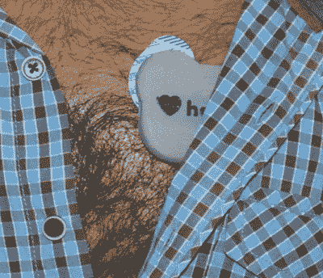

# 在周一之前向我们展示你的有用物联网

> 原文：<https://hackaday.com/2017/06/07/show-us-your-internet-of-useful-things-by-monday/>

不要忘记在周一早上之前让您的连接设备参加 Hackaday 大奖。目前的挑战是 *[IuT！物联网](https://hackaday.io/prize/details#two)* ，一个聪明的倾斜在物联网，这是现在这么热。我们不仅仅希望事物之间有联系，我们希望这种联系是有用的，所以把你的网络烤面包机和推特马桶留到下一轮吧。

 那么我们在这里寻找什么呢？任何与其他设备进行通信，从而执行有意义的服务的设备。Hackaday 奖是关于建立一些重要的东西。

我们已经报道了许多优秀的参赛作品。 [HeartyPatch](https://hackaday.io/project/21046-heartypatch-a-single-lead-ecg-hr-patch-with-esp32) 是一款开源的心率监护仪和 ECG，可通过智能手机进行通信。我们已经看到一个[负担得起的水位测量站](https://hackaday.io/project/21579-affordable-water-level-measuring-station)来帮助跟踪洪水易发地区水位何时危险地快速上升。万用表的[平视显示器](https://hackaday.io/project/20780-safety-glasses-with-bt-display-for-multimeter)试图让那些处理高电压的人工作更安全。从所有的 IuT 中获得灵感！物联网条目。

仅在这次挑战中就有 20，000 美元的赌注，因为 20 个 IuT 项目将被命名为决赛选手，每个项目获得 1000 美元，并在决赛中争夺最高奖项。

如果你还没有把你的项目上传到 Hackaday.io，现在正是时候。一旦您的项目发布，输入就像使用项目页面左侧栏的下拉框一样简单。[舒列]甚至制作了一个简短的视频，展示如何提交你的参赛作品。检查以确保“物联网”列在你项目的侧边栏上，如果没有，使用下拉菜单添加它。

The [HackadayPrize2017](https://hackaday.io/prize) is Sponsored by:   