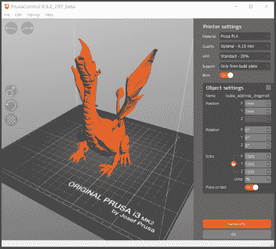
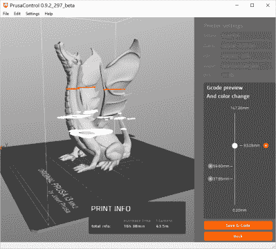
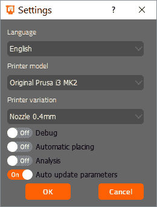

# PrusaControl:初学者的切片机

> 原文：<https://hackaday.com/2017/06/12/prusacontrol-the-beginners-slicer/>

管理 3D 打印和 g 代码生成有两个主要应用程序。Cura 是一个很棒的应用程序，从行业中的重量级人物那里看到了很多发展。最初由 Ultimaker 开发，Lulzbot 有他们自己的 Cura 版本，这是与数千种不同打印机打包在一起的默认软件。Slic3r 也经历了多年的发展和一些有趣的黑客攻击。您想打印非平面表面吗？ [Slic3r 可以做到](http://hackaday.com/2016/07/27/3d-printering-non-planar-layer-fdm/)。Slic3r 和 Cura 是 3D 打印硬币 CAM 部分的两面，尽管 Cura 肯定是更漂亮的一面。

将 Slic3r 的可扩展性与 Cura 的用户界面结合起来的能力已经在我们的愿望清单上有一段时间了。终于到时间了。[【Josef Prusa】发布了 PrusaControl](http://prusacontrol.org/) ，这是一款 3D 打印 CAM 解决方案，它将 Slic3r 的精华结合到一个奇妙、好看的包中。有什么好处？是什么样的？看看下面。

PrusaControl 的发布是在 Slic3r Prusa Edition 发布几个月后。Slic3r 家族树的这个分支中最大的变化是增加了可变层厚切片。简而言之，可变层切片允许非常，非常高分辨率的打印，只有在你想要很多细节的地方才是高分辨率的。

Slic3r 的 Prusa 版中的可变层厚切片非常棒。我们看了第一批发行的中的一个，它确实如罐头上所说的那样。在这次拆卸中，我给[印了一个口袋妖怪](https://hackaday.io/project/4032-the-original-low-poly-pokemon)，它的头顶急需低图层高度。使用高分辨率打印的标准切片器设置，我在五个小时内得到了一个打印的口袋妖怪。使用低分辨率设置，一个小时就搞定了一个口袋妖怪。使用可变的图层高度设置，我在两个多小时内就得到一个看起来很棒的打印效果。可变层高度切片是 3D 打印的杀手级功能之一。它允许高分辨率，同时避免过长的打印时间。如此伟大的功能花了这么长时间才成为标准的 3D 打印软件包之一，这一事实令人费解。

但是，在 Slic3r 的状态下，有些东西是烂的。虽然这可能会让任何已经使用它五年的人感到惊讶，但 Slic3r 并不容易使用。这是令人困惑的，糊涂的，丑陋的。没有人会指责开源程序的 GUI 看起来不错，但 Slic3r 相当糟糕。

正好有两个推荐的免费应用程序用于为 3D 打印机准备 STL:slic 3r 和 Cura (Repetier 和 ReplicatorG 是 *so* 2012，Simplify3D 要花钱)。新手购买的 3D 打印机是整箱装的，制造商需要一个易于使用的应用程序。Cura 将是所有新打印机的默认应用程序。它的易用性减少了客户支持，降低了消费者的成本。这就是为什么 Ultimaker 爱它，这就是为什么 Lulzbot 爱它，这就是为什么它是著名的 200 美元 Monoprice 打印机推荐的切片机。

### 那么为什么是 PrusaControl 呢？

尽管[Prusa]是 3D 打印机的领先制造商之一，但他从一开始就是 Slic3r 的粉丝。毕竟，Slic3r 对[修改器网格](http://slic3r.org/blog/modifier-meshes)、奇怪的填充和奇怪的床形状的能力*稍微*更具可扩展性。易用性意味着更低的支持成本，所以最好的解决方案是 Cura 前端和 Slic3r 后端。这正是 PrusaControl 它采用 Slic3r Prusa Edition 的切片引擎，“为用户提取设置，并将我们的知识放到后端以获得相同的结果。”

是给大家的吗？不，如果你正在阅读 Hackaday，你显然是在人类野心、能力和创造力的第 99 百分位。如果你在抱怨一个愚蠢的 Slic3r，这不适合你。PrusaControl 是训练车轮，这是一件好事。我们不需要 3D 打印的新人一直摔个嘴啃泥。

### 那么 PrusaControl 中有什么

根据上述介绍，您可以在 PrusaControl 中做些什么？不多，这是设计好的。

该接口正是您期望从一个简化的、Cura 派生的切片器中得到的。将 STL 放到 PrusaControl 窗口上，模型就会显示出来。您可以编辑打印机设置，例如材料(包括各种品牌的 PLA 和 ABS，以及一些陶尔曼和 E3D 丝)、质量、填充以及是否应生成支撑。有一个帽檐的拨动开关，除了位置，旋转和比例设置，*就是这样*。PrusaControl 没有花哨的设置。

The main Interface for PrusaControl. What you see is what you get.

The Color Print interface. After generating G-code for the model, the Color Print interface allows the user to pause printing to change filament.

 还有更多选项，可从设置菜单中获得。其中包括 UI 语言、打印机型号、喷嘴直径和一些用于调试的单选按钮。想要将您的打印机添加到列表中吗？您必须编辑一些 json 文件。你有进取心吗，有没有把你的 Prusa i3 改装成更大的加热床？您必须编辑存储在 PrusaControl 目录深处的 STL 文件。

PrusaControl 是否极其有限？是的，但这才是重点。你可以给任何人一台预装的打印机和一份 PrusaControl，他们会在 15 分钟内打印出来。

3D 打印很难。这可能会让那些自从我们用镍铬合金丝制作 hotends 以来就一直使用打印机的人感到惊讶。如果 3D 打印要比现在发展得更快，打印机，更重要的是软件需要易于使用。如果我们不想让 3D 打印机成为 21 世纪录像机上闪烁 12:00 的时钟，就需要一个易于使用的切片机。

PrusaControl 就是这样。是的，它是有限的，但这就是重点。