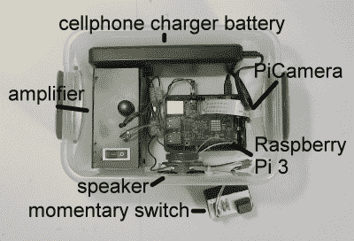
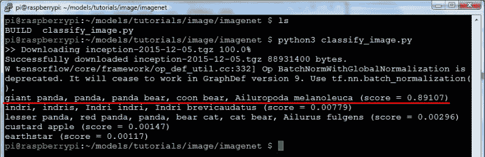
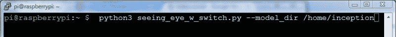

# DIY 树莓神经网络看到所有，识别一些

> 原文：<https://hackaday.com/2017/06/14/diy-raspberry-neural-network-sees-all-recognizes-some/>

作为一个有趣的项目，我想我会把谷歌的 Inception-v3 神经网络放在树莓派上，看看它在直接识别物体方面有多好。事实证明，它不仅实现起来很有趣，而且我实现它的方式给我展示它的每个人都带来了很多乐趣，大多数是 hackerspaces 和类似聚会上的人。是的，其中一些近乎色情——厚颜无耻的黑客。

许多人指出，一个额外的好处是，一旦安装，没有互联网接入是必需的。这是最先进的，独立的物体识别，没有老大哥知道你在做什么，不像爱管闲事的 Alexa。

但是会导致广泛有用的 AI 吗？如果神经网络可以识别周围的每一个物体，那是否会导致类似人类的技能？请继续阅读。

## 如何进行物体识别



Inception object recognizer internals

实施包括:

*   树莓 Pi 3 型号 B
*   放大器和扬声器
*   皮卡梅拉
*   瞬时开关
*   Pi 的手机充电器电池

必要软件的核心是 Google 的 Inception 神经网络，它是使用 TensorFlow 框架实现的。可以按照 [TensorFlow 图像识别教程](https://www.tensorflow.org/tutorials/image_recognition)下载。本教程不涉及任何编程，所以如果你不知道 Python 或 TensorFlow 也不用担心。也就是说，除非你像我一样修改他们的样本代码。



classify_image.py printing that it saw a panda

示例代码获取一个包含熊猫图片的固定命名文件，并对其进行对象识别。它给出的结果是打印出它看到了一只熊猫。但这还不够有趣。

我四处寻找一些文本到语音转换软件，找到了 [Festival](http://elinux.org/RPi_Text_to_Speech_(Speech_Synthesis)) 。现在，当它想说它看到了一只熊猫时，我修改了示例代码，在 linux shell 中运行 Festival，并告诉它实际上对说话者说“我看到了一只熊猫”。

<https://hackaday.com/wp-content/uploads/2017/06/classify_speak_panda_audio.wav?_=1>

[https://hackaday . com/WP-content/uploads/2017/06/classify _ speak _ panda _ audio . wav](https://hackaday.com/wp-content/uploads/2017/06/classify_speak_panda_audio.wav)
但那还是不够好玩。我将一台 PiCamera 连接到 Raspberry Pi，让它拍摄一张照片，并将其发送给 TensorFlow 代码来进行对象识别。用通俗的话说，它现在在我的照片上运行推论。

最后，为了让这一切变得简单，我将一个瞬时开关连接到 Pi 的一个 GPIO 引脚，并在瞬时开关被按下时拍照。

这里是 Python 程序的`main()`函数之前…

```

def main(_):
  maybe_download_and_extract()
  image = (FLAGS.image_file if FLAGS.image_file else
           os.path.join(FLAGS.model_dir, 'cropped_panda.jpg'))
  run_inference_on_image(image)

```

…以及之后。

```

def main(_):
  os.system(&quot;echo %s | festival --tts&quot; % &quot;Wait while I prepare my brain...&quot;)

  maybe_download_and_extract()
  # Creates graph from saved GraphDef.
  create_graph()

  # preparing for the switch
  GPIO.setmode(GPIO.BCM)
  GPIO.setup(17, GPIO.IN)

  camera = PiCamera()

  os.system(&quot;echo %s | festival --tts&quot; % &quot;I am ready to see things.&quot;)

  while True:
    # loop for the switch
    while (GPIO.input(17) == GPIO.LOW):
      time.sleep(0.01)

    # take and write a snapshot to a file
    image = os.path.join(FLAGS.model_dir, 'seeing_eye_image.jpg')
    camera.capture(image)

    os.system(&quot;echo %s | festival --tts&quot; % &quot;I am thinking about what you showed me...&quot;)
    human_string = run_inference_on_image(image)
    os.system(&quot;echo I saw a %s | festival --tts&quot; % human_string)

```

对`os.system()`的调用是我运行 Festival 文本到语音转换程序的地方，让它对说话者说些什么。

谷歌的初始神经网络可以从互联网上下载，如果它还没有出现的话。默认情况下，它将其下载到 RAM 磁盘上的`/tmp/imagenet`。它第一次这样做的时候，我把它从 SD 卡上的`/tmp/imagenet`复制到`/home/inception`，现在使用命令行运行程序，命令行包括在哪里可以找到盗梦空间网络。



Running the inception object recognizer

对`create_graph()`的调用是从`run_inference_on_image()`函数内部转移的。`create_graph()`设置神经网络，你只需要做一次。以前这个程序是一次性的，但是现在它有一个无限的 while 循环，每次都通过这个循环调用`run_inference_on_image()`。显然，建立神经网络只需要做一次(参见我们的[tensor flow 简介](http://hackaday.com/2017/04/11/introduction-to-tensorflow)了解更多关于图形的信息)，所以它必须被移到循环之上。

`run_inference_on_image()`功能是将图像提供给神经网络进行物体识别。它过去只是打印出它认为图像中的任何内容，但我修改了它，改为返回包含它认为对象是什么的文本字符串，例如“咖啡杯”。所以最后一行是它对扩音器和扬声器说“我看见一个咖啡杯”的地方。

将所有这些打包给了我一个小的、独立的包，可以被任何人携带和试用。这里有一段视频。

[https://videopress.com/embed/mjtLSbgE?hd=1&cover=1&loop=0&autoPlay=0&permalink=1&muted=0&controls=1&playsinline=0&useAverageColor=0](https://videopress.com/embed/mjtLSbgE?hd=1&cover=1&loop=0&autoPlay=0&permalink=1&muted=0&controls=1&playsinline=0&useAverageColor=0)