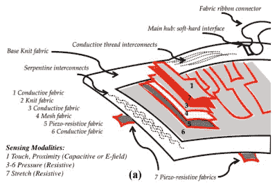
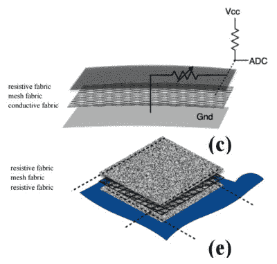

# FabricKeyboard 是钢琴、特雷门琴等等

> 原文：<https://hackaday.com/2017/06/17/fabrickeyboard-is-piano-theremin-and-more/>

麻省理工学院媒体实验室“反应环境”的两名研究人员已经将一种设备组装在一起，这种设备是一种压缩在一个柔性包装中的令人惊叹的乐器阵列。使用七层具有不同电属性的织物制成，结果可以使用触摸、接近、压力、拉伸或它们的组合来播放。使用基于织物的键盘、ribbon 控制器和触控板，它可以作为一个八度音阶键盘、一个特雷门琴来演奏，并且以无字的方式演奏，例如在按下按键的同时拉伸。它还可以折叠起来，和你的笔记本电脑一起塞进一个箱子里，甚至还可以洗。

The FabricKeyboard layers

第一层，即顶层，是用于检测接近和触摸的导电织物。这 12 个按键可以通过一个 [MPR121](https://www.sparkfun.com/datasheets/Components/MPR121.pdf) 接近触摸控制器独立工作，或者控制器可以将它们作为一个整体，延长手的距离并使其仍然工作。第二层只是一种针织织物，但第三层到第六层可以检测压力，由两个导电层组成，中间是网状织物和压阻织物。压阻织物是来自 eeonyx 的 [LTT-SPLA，一种涂有导电聚合物聚吡咯(PPy)的针织织物。第七层由两条针织氨纶织物组成，也涂有 PPy，并检测拉伸。底部缝有两条这样的带子，一条水平，一条垂直。你可以在下面的视频中看到和听到这一切产生的惊人声音。](http://eeonyx.com/products/ntex-stretchy-sensor/)

Ribbon-controller and trackpad

长织物带控制器是一个卡扣式附件，允许手指沿其长度滑动。它由导电织物上的非导电网格上的电阻织物组成。按压电阻织物使其通过网与下面的导电织物接触。电压施加到电阻织物的一端，手指的位置改变该端和导电织物之间的电阻。这是一个 555 定时器电路的例子中，在纸上用石墨铅笔线[经常使用的相同技巧。](http://hackaday.com/2013/06/23/a-555-player-piano/)

触控板被实现为使用 4 线配置的电阻式触控板。我们已经在另一篇文章中讨论了 [4 线配置的工作原理。就织物而言，顶部和底部使用两种电阻织物，中间夹有不导电的网状层。导电线被缝入电阻织物的相对两端。](http://hackaday.com/2016/09/16/resistance-in-motion-everything-you-should-know-about-variable-resistors/)

除了触摸，触控板上方的一只手可以玩弄电场，在另一只手按下按键时改变声音参数。视频中演示了这一点。

制作了两块电路板，一块叫做 FabricKeys，另一块叫做 reminKeys。关于这个小组的实验的更多信息在他们的论文中，但是他们选定了一个带状连接器和一个阿达果羽毛 M0 作为中枢。他们选择 MIDI 作为与计算机通信的协议。

[https://player.vimeo.com/video/213298236](https://player.vimeo.com/video/213298236)