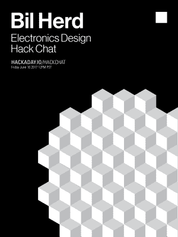

# 周五聊天:电子设计和给小狗命名

> 原文：<https://hackaday.com/2017/06/14/friday-hack-chat-electronics-design-and-naming-a-puppy/>

出于这样或那样的原因，Hackaday 拥有一个由能力惊人的贡献者组成的大家庭。其中最杰出的是[比尔·赫德]，准将难民，电子工程师，医生，和全面的令人敬畏的家伙。他将于本周五加入我们的 Hackaday.io，就电子设计进行一次非正式的交流。

 本周五，[我们将与【Bil】](https://hackaday.io/event/25382-electronics-design-hack-chat-with-bil-herd)举办一场黑客聊天。如果你想谈谈准将，就是这个人。如果你想谈论 PLAs 和可编程数字逻辑，这就是那个家伙。如果你想知道如何在短短几个月内从头开始构建一个系统，[Bil]就是你要找的人。[比尔]有几十年的经验，他的设计作品有数百万件。你很少会遇到像他这么有经验的人，他会出现在我们周五的聊天中。

[Bil]在电子设计领域有很长的职业生涯，从修理 CB 收音机和电视开始，当时修理电视还是一件事。最终，他在 Commodore Business Machines 公司的工程阶梯上一路攀升，在那里他设计了 Commodore TED 机器和令人惊叹的 [Commodore 128](http://hackaday.com/2013/12/09/guest-post-the-real-story-of-hacking-together-the-commodore-c128/) 。

从《准将》中幸存下来后，[比尔]在新泽西州卡姆登的一家创伤中心工作，与军队中的医务人员一起飞行，最终来到 Hackaday，在那里他制作各种主题的视频，从[直接数字合成](http://hackaday.com/2014/11/24/direct-digital-synthesis-dds-explained-by-bil-herd/)、[可编程逻辑](http://hackaday.com/2014/06/24/programmable-logic-i-plapal/)、[有源滤波器](http://hackaday.com/2015/01/13/universal-active-filters-part-1/)和【CMOS 实际上是如何工作的。基本上，如果涉及到电子产品，[Bil]知道发生了什么。

哦，作为额外的奖励，我们这周可以给一只小狗命名。[比尔]有一只新的小狗，它需要一个名字。[提交您的建议](https://www.youtube.com/watch?v=iVTj08qTwGw)！

### 以下是参与方式:

 我们的 Hack Chat 是 Hackaday.io 上的实时社区活动 [Hack Chat](https://hackaday.io/project/5373-hacker-channel) 群发消息。这次黑客聊天将在太平洋时间 6 月 16 日星期五中午举行。困惑于‘中午’是在何时何地？这里有一个时间和日期转换器！

登录 Hackaday.io，访问该页面，并寻找“加入这个项目”按钮。一旦你成为这个项目的一部分，这个按钮就会变成“团队信息”，直接带你进入黑客聊天。

你不必等到星期五；随时加入，你可以看到社区在谈论什么