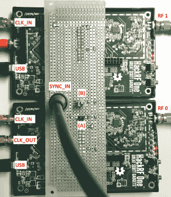

# 基于 CPLD 的多软件无线电同步

> 原文：<https://hackaday.com/2017/06/15/cpld-based-synchronization-of-multiple-software-defined-radios/>

原谅点击诱饵标题，但来自[马尔科·巴托鲁奇]和[何塞·a·德尔·佩拉尔-罗萨多]的最新作品真的很棒。他们使用多个同步的 HackRFs 和混合定位算法[来获得更精确的定位精度](http://spcomnav.uab.es/docs/conferences/Bartolucci_NAVITEC_2016.pdf)。(PDF)

 与所有 SDR 一样，HackRF 可用于解决使用 WIFi、蓝牙、3G、4G 和 GNSS 的定位问题。也可以使用多个接收器，但这需要基于时间或基于频率的测距同步。[巴托鲁奇]和[佩拉尔-罗萨多]提出了一种新颖的解决方案，利用板上几个方便的端口、一点 CPLD 黑客技术和一个 1 pps 输出的 GNSS 接收器来同步这些黑客 RF。

从技术上讲，这是两个黑客合二为一，第一个是两个黑客之间的主从设置。HackRF、[Bartolucci]和[Peral-罗萨多]使用 Xilinx XC2C64A CPLD 有效地将两个器件连接在一起。同步误差低于一个采样周期，两个以上的 HackRFs 可以链接在一起，每个 HackRFs 的 SYNC_IN 端口并联在一起。在[他们对 HackRF 代码库](https://github.com/mossmann/hackrf/pull/381)的 pull 请求中了解更多信息。

如果 HackRF 接收器必须分开，这种最简单的技术将不起作用，这就导致了第二种攻击。[Bartolucci]和[Peral-罗萨多]提出了另一种方案:使用 GNNS 接收器的 1 pps 输出作为同步脉冲。只要两个黑客都能看到天空，他们就能合二为一。非常酷！