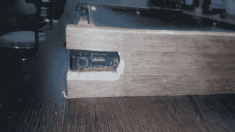

# 木制笔记本外壳:旧 Thinkpad 的新生活

> 原文：<https://hackaday.com/2017/06/28/wooden-laptop-enclosure-new-life-for-old-thinkpad/>

技术旨在为我们服务，让我们的生活更美好。当一个设备过时了，它要么被处理掉，要么被埋在一堆垃圾里再也看不到了。然而，有些人倾向于对他们的机械仆人产生某种尊重，并在他们变得多余后努力保留他们。

我和我的第一台笔记本电脑的关系就是一个很好的例子，说明了如何长久地抓住心爱的硬件不放。我把那台笔记本电脑改装成了台式电脑，并进行了大量的修改，这帮助我一路学习木工。也许只是买新设备更务实。但是你每天花这么多时间使用你的设备。这是令人难以置信的令人满意的个人联系，这种联系来自于向他们灌输你自己的手艺。

## 为什么要努力？

IBM Thinkpad R60 via [Notebook Review](http://www.notebookreview.com/notebookreview/lenovo-thinkpad-r60-review-pics-specs/)

问题中的笔记本电脑是一台 IBM R60，我在毕业后的头三年里一直带在身边。在一些艰难的日子里，它是我的伴侣，自然地，我对它产生了某种依恋。随着时间的推移，它的外围设备出了故障，包括装有电源开关的键盘，人们认为修理的成本将超过它的实用性。

后来有一天，我受到启发，用我工作室里堆积的废木料做了些东西。这将是我有史以来的第二个木工项目，我没有大多数 YouTube 视频中宣传的专业重型机械。然而，我对这个项目有两个目标。

1.  让 R60 再次有用。
2.  了解木工，为将来的项目创建外壳。

配备了大部分手动工具，一个钻头和一个装有锯条的研磨机，我开始使用 IBM R60 到多合一 PC mod。以下是我做过的事情和我后悔没有做的事情，也就是我学到的教训。请继续阅读。

## 耐心就是力量

重要的事情先来。因为键盘没电了，而电源开关在键盘上，我需要想办法打开它。经过短暂的谷歌搜索，没有发现任何有用的东西，我决定追踪键盘连接器上可以用来触发操作的引脚。经过反复试验，找到了关键的两个引脚。

我从有故障的键盘上扯下了带状电缆，并能够将两根电线焊接到适当的触点上。选择 PCB 安装按钮是因为我打算将其安装在机箱的侧面。在下面的视频中，你可以看到黑客如预期的那样工作。

 [https://www.youtube.com/embed/SuqYBGmL6X0?version=3&rel=1&showsearch=0&showinfo=1&iv_load_policy=1&fs=1&hl=en-US&autohide=2&wmode=transparent](https://www.youtube.com/embed/SuqYBGmL6X0?version=3&rel=1&showsearch=0&showinfo=1&iv_load_policy=1&fs=1&hl=en-US&autohide=2&wmode=transparent)

在这种情况下，热胶水非常有用，我在电缆上涂了大量的热胶水，沿着底座和按钮最终放置的边缘将电缆固定住。这解决了开机问题，我打算使用一个外部鼠标和键盘的成品系统。

## 割伤和擦伤

显然，为了能够向后折叠显示器，必须拆除铰链，然而，另一个挑战正在等待着。将显示器连接到主板的带状电缆没有像我计划的那样缠绕在外壳上，并且比我希望的要短；短得多。

我没有丢弃机箱和液晶屏盖，而是选择了电动工具。这个想法是在主机箱上切一个槽，以便让电缆轻松到达目的地。拧下连接器并将其移除后，我小心翼翼地做了必要的切口。

    

在电池槽和液晶显示器后盖上进行切割是必要的，尽管这可能不是最干净的，但它确实有效。我担心的是电缆本身，正如你在上面的图片中看到的，它受到了一点损坏。

## 外壳概念的演变

接下来的部分是创建一个围栏，我想用我周围的废木头。至少可以说，我不是一个有经验的木匠。事实上，这是我的第二个木工项目，我主要使用手工工具。最大的部分是液晶显示器，我进行了一些测量，看看我是否可以做一个小盒子一样的外壳。

结果是不像一个外壳，但是，我在这里分享图像，因为它是一个起点。这些端口都可以访问，但却无法呈现。当系统投入使用时，我继续测试我的可用性假设。我安装了 Kali Linux，因为 WiFi 卡可以有多种用途，包括用于网络实验的蜜罐。

此时，硬件工作正常，只剩下处于未完成状态的存储模块。

 

对于最终的设计，我选择了标准的一体化台式机外形，并决定将 12 毫米的胶合板切割成所需的尺寸。厚厚的胶合板意味着完成后的框架会很重，但如果必要的话，它也会给我空间来修剪和钻孔。

        

在我把所有东西钉在一起之前，我模拟了一下，看看端口和电源插头的插槽会放在哪里。这一点很重要，因为当东西被缝合在一起后，剪孔会变得非常困难。

在切割之前，我把所有的东西都标了出来，并且测量了两次，因为已经没有碎木头了。我没有把它放在锯子下面，而是决定用一个大钻头的钻子来钻孔。

        

我的决定得到了回报，我用圆锯切割其余的槽。通常这种东西是用曲线锯做的，但我用我的动力锯和一个小木片做支点，结果很好。产生的槽随后用油漆作业进行了归档和清理。一旦我确定一切就绪，我就用木胶和钉子做最后的外壳。我拍了上面这张模糊的照片，但是你明白了。

## 涂成红色！

此时的围栏很粗糙，不太适合油漆。要做的第一件事是加一层木底漆来填补一些缝隙。接下来，我添加了一层木材填料，然后打磨光滑。我从 80 号砂纸开始，分 5 步移动到 220 号砂纸。

      

这个想法是用填充物填充木头上的任何不平整的地方，让所有的东西都变平。然后我添加了另一层底漆，然后一些红色瓷漆。我可以选择层压板或其他东西，但这是一个实验和学习的机会。看着油漆变干并不像我希望的那样有趣，但最终我还是得到了光滑的漆面。

## 发起这个项目的人

没有正面的外壳是不完整的，我已经为此预留了一块。显示器的尺寸被测量并标记在指定的部件上。切割它比我想象的要难，最好比要求的多剃一点，因为无论如何边缘都需要准备。

该板涂有底漆，并涂有与外壳相同的红色瓷漆，以与背面相配。边缘可以使用一些木质板边缘，使事情顺利，但我想尽量减少我的材料清单，所以这不得不这样做。

        

对于展示窗口的边界，我使用了一些我在废料中留下的银白色塑料角模。幸运！我尽我所能把它们剪成合适的大小，并用强力胶把它们固定住。

## 螺丝钉和无聊的东西

为了把东西固定在一起，应该使用螺丝，但是它们会沿着白色的边界看起来很丑。即兴创作导致了从后面穿过胶合板一直到前面的螺丝孔的增加。我用一个较小的钻头先钻孔(首尾相连)，然后用一个较大的钻头钻一个埋头孔。

    

那是最后一颗螺丝，外壳只缺少了一个细节…快乐扳手。几年前我有一个来自 Hackaday 奖的，我还添加了一些其他的贴花来完成这项工作。

## 3D 打印世界中的木工

当我们在网上看到用木头盒子做的项目时，我们通常不会感激为创造它所付出的努力。我个人认为这很容易，并且发现与 3D 打印相比，这是一种混乱的体验。以下是几点建议。

*   尽可能使用连接器。从长远来看，他们可以节省很多时间。
*   储备一些按钮。你已经知道原因了。
*   对电缆和组件要格外小心。我损坏了显示器电缆的一部分，我希望我已经采取了自己的建议。
*   如果你决定手工切割木材，决定以后是否要添加装饰(修剪)。如果是这样，那就比你需要的多刮一点，但只刮一点点。
*   打磨需要时间。木制品的完美加工没有捷径可走。
*   安全装备是必须的。你不想失去你的一部分。
*   如有疑问，请寻求专业建议。

我的旧笔记本电脑获得了新的生命，我计划把它作为一个桌面，直到它发生什么事情。准备好的外壳有一些缺陷，这些缺陷使它独一无二。它充分说明了投入的努力，并增加了机器的情感价值。

我已经学习了一些关于使用木材的知识，接下来我将尝试使用木材。我看到的唯一缺点是相对于塑料的额外重量。坚固的优点是对于大容量项目来说很方便。分享你的项目和技巧，希望像我这样的初学者会随着时间变得更好。