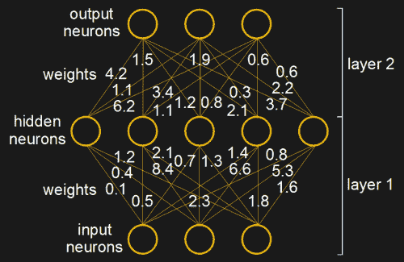
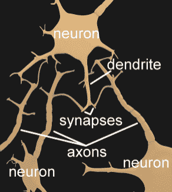
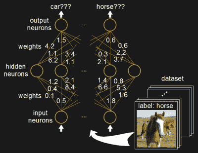
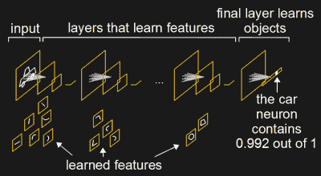
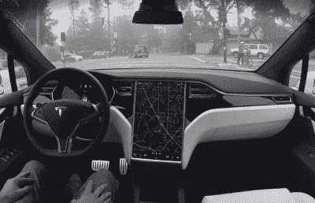
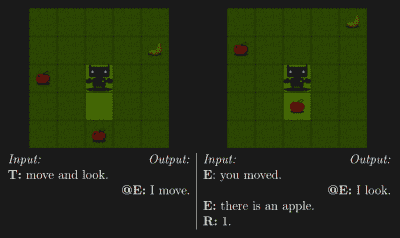
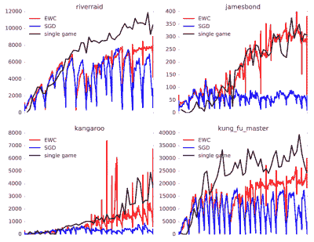

# 灾难性遗忘:学习对机器思维的影响

> 原文：<https://hackaday.com/2017/06/23/what-if-learning-new-things-made-you-forget-the-old/>

如果每次你学到新东西的时候，你都忘记了一些你以前知道的东西，那该怎么办？这种改写不会发生在人脑中，但会发生在人工神经网络中。这被恰当地称为灾难性遗忘。尽管如此，为什么神经网络如此成功呢？这对自动驾驶汽车等事物的未来有何影响？这给神经网络的能力带来了什么限制，对此正在做些什么？

  Numerical weights in an artificial neural network  Neurons in the brain

神经网络存储知识的方式是通过设置权重值(图中神经元之间的线)。这就是那些线的字面意思，只是分配给成对神经元的数字。它们类似于我们大脑中的[轴突，即从一个神经元延伸到另一个神经元树突的长卷须，它们在称为突触的微小间隙处相遇。两个人工神经元之间的权重值大致类似于大脑中生物神经元之间的轴突数量。](https://hackaday.com/2017/06/02/the-neuron-a-hackers-perspective/)

为了理解这个问题和下面的解决方案，你需要知道更多的细节。

Training a neural network

例如，要训练神经网络识别图像中的对象，您需要找到一个包含数千幅图像的数据集。你一个接一个地向网络一端的输入神经元展示每幅图像，并对所有的权重进行微小的调整，这样输出神经元就开始代表图像中的一个对象。

然后对数据集中成千上万的图像重复这一过程。然后整个数据集被反复运行数千次，直到各个输出强烈地表示图像中的特定对象，即网络已经学会识别这些图像中的特定对象。所有这些都需要几个小时或几周的时间来完成，这取决于硬件的速度和网络的规模。

但是，如果你想在一组新的图像上训练它，会发生什么呢？当您开始使用新图像执行该过程时，您就开始用不再代表先前图像数据集的值的新值来覆盖这些权重。网络开始遗忘。

这不会在大脑中发生，没有人知道为什么不会。

## 最小化问题

Learning objects in the final layer

一些网络最小化了这个问题。例如，该图显示了谷歌初始神经网络的简化版本。这个神经网络被训练用于[识别图像](https://hackaday.com/2017/06/14/diy-raspberry-neural-network-sees-all-recognizes-some/)中的物体。在图表中，除了最后一个图层(右侧的图层)之外，所有图层都经过了训练，能够理解构成图像的特征。更靠左、更靠近输入的层已经了解了简单的特征，例如直线和曲线。更深层次的人在此基础上学习由这些线条和曲线组成的形状。更深的层次已经了解了眼睛、轮子和动物的腿。只有最后一层在此基础上学习特定的对象。

因此，当用新图像和新对象重新训练时，只有最后一层需要重新训练。它仍然会忘记以前知道的对象，但至少我们不必重新训练整个网络。谷歌实际上让你通过 TensorFlow 网站上的[教程用他们的初始神经网络来做这件事。](https://www.tensorflow.org/tutorials/image_retraining)

不幸的是，对于大多数神经网络来说，你必须重新训练整个网络。

## 有关系吗？

如果网络这么容易忘记，为什么这不是一个问题？有几个原因。

Self-driving car via [tesla.com](https://www.tesla.com/en_CA/autopilot)

以自动驾驶汽车为例。自动驾驶汽车中的神经网络可以识别交通标志。但是如果引入了一种新型的交通标志呢？嗯，这些网络的训练不是在车上完成的。相反，训练是在一些设备上进行的，这些设备配备了带有多个 GPU 的高速计算机。(我们在本文的[中谈到了用于神经网络的 GPU。)](http://hackaday.com/2017/04/24/neural-networks-youve-got-it-so-easy/)

由于这样的快速硬件是可用的，新的交通标志可以被添加到完整的数据集中，并且网络可以从零开始被重新训练。该网络然后通过互联网传输到汽车作为更新。利用训练过的网络需要的计算速度远不及训练网络的速度。识别一个物体只需要通过网络一次。将其与我们上面描述的通过数据集进行数千次迭代的训练进行比较。

更直接的问题呢，比如路上的新型车辆？在这种情况下，汽车已经有传感器来检测物体并避免它们。它要么不需要识别新类型的车辆，要么可以等待更新。

许多神经网络甚至不位于它们的知识被使用的地方。我们在谈论像 Alexa 这样的设备。当你问它一个问题时，这个问题的音频可以被传输到一个神经网络进行语音识别的位置。如果需要再培训，可以在完全不涉及消费者设备的情况下完成。

许多神经网络根本不需要重新训练。像大多数工具或器具一样，一旦制造出来，它们只是继续执行它们的功能。

## 已经做了什么来消除遗忘？

幸运的是，大多数公司都在中短期内赚钱。这通常意味着目标狭窄的神经网络。当神经网络需要不断学习来解决新问题时，就会产生问题。[人工通用智能(AGI)](http://hackaday.com/2017/02/06/ai-and-the-ghost-in-the-machine/) 就是这样。

Facebook intelligence training via [Facebook research](https://arxiv.org/pdf/1511.08130.pdf)

很少有公司在解决 AGI 问题。早在 2016 年 2 月，脸书人工智能研究所的研究人员发布了一篇论文，他们在论文中给出了走向机器智能的[路线图，但它只详细描述了训练 AGI 的环境，而不是 AGI 将如何实现。](https://arxiv.org/pdf/1511.08130.pdf)

谷歌的 DeepMind 多次表示，他们的目标是生产一款 AGI。2016 年 12 月，他们上传了一篇名为[“克服神经网络中的灾难性遗忘”](https://arxiv.org/abs/1612.00796)的论文。在引用了之前的研究后，他们接着引用了老鼠大脑中的研究，该研究表明当学习一项新技能时，树突棘的体积会增加。从根本上说，这意味着旧的技能可能会受到突触的保护，变得更不可塑，更不可改变。

然后他们继续详述他们对这种突触活动的模拟方法，他们称之为弹性重量巩固(EWC)。简而言之，它们减缓了对已经学过的东西很重要的权重的修改。这样一来，对于已经学过的东西来说不那么重要的重量就更有利于新的东西。

他们在手写识别上测试他们的算法，更有趣的是，在一个你可能听说过的神经网络上。早在 2015 年新闻中提到的网络[学会了](http://www.wired.co.uk/article/google-deepmind-atari)[如何玩不同的雅达利游戏](https://www.cs.toronto.edu/~vmnih/docs/dqn.pdf)，其中一些达到了超人的水平。一个可以熟练地玩 Breakout、Pong、Space Invaders 等游戏的神经网络听起来已经像一个通用人工智能了。然而，新闻中缺少的是它可以被训练成一次只播放一个。如果它被训练玩突破，然后玩乒乓球，它必须重新训练，同时忘记如何玩突破。

EWC algorithm charts

但是使用新的 EWC 算法，它同时接受 10 个游戏的训练，这些游戏是从 19 个可能的游戏中随机选择的。嗯，不完全同时。它学习一段时间，然后切换到另一个，等等，就像人类一样。但最后，神经网络在所有十场比赛上都得到了训练。然后玩这些游戏，看看它能玩得多好。重复这种训练，然后一次测试 10 个随机游戏，这样所有 19 个可能的游戏都有机会被训练。

这里显示了从他们的论文中得到的图表样本。点击图表查看全部 19 场比赛。Y 轴显示玩游戏时的游戏分数。使用 EWC 算法学习的 19 个游戏中有 9 个在只训练一个游戏时也能玩得很好。作为对照，同时训练也是用一种正常的训练算法来完成的，这种算法容易发生灾难性遗忘(随机梯度下降，SGD)。剩下的十个游戏和 SGD 算法一样表现的稍好或者一样差。

但是对于一个多年来很少解决的问题来说，这是一个好的开始。鉴于 DeepMind 的记录，他们很可能会利用它做出重大改进。这当然会激励其他人去解决这个最容易被忽视的问题。

所以，庆幸你还是一个能记住[电阻颜色代码](http://hackaday.com/2013/08/28/hackadays-resistor-code-reference-card/)的生物人类吧，不要急着跳进硅脑。