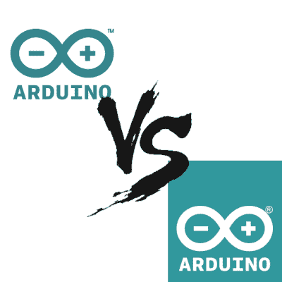

# Arduino 基金会:怎么了？

> 原文：<https://hackaday.com/2017/06/19/the-arduino-foundation-whats-up/>

Arduino 战争于去年 10 月正式结束，新的 Arduino 制造公司于 2017 年 1 月注册。当时，我们被承诺有一个 Arduino 基金会，它将以开放和社区服务的方式来维护开源 IDE 和代码基础设施，但我们还没有。是阴谋吗？还是谋杀？我们的建议是:不要烦恼。这些事情需要时间。

但另一方面，Arduino 社区想知道发生了什么，显然对 Arduino-land 的现状有一些真正的困惑，所以我们采访了负责人 Massimo Banzi 和 Federico Musto，并要求他们提供进度报告。

简而言之，仍然有两个“Arduino”:Arduino AG，一个盈利性公司，以及即将成立的 Arduino Foundation，一个负责指导和资助软件和 IDE 开发的非营利组织。前者于 2017 年 1 月注册，后者仍在进行中，但看起来可能会在夏季结束前注册。

作为 Arduino AG 的股东，Banzi 将成为基金会的主席，AG 的首席执行官 Musto 将成为执行委员会的成员，两位负责人都向我们讲述了类似的愿景，即难以置信的透明度和社区驱动的发展。事实上，Banzi 希望在基金会的章程被刻在石头上之前，尽早得到一个草案版本，供社区评论。

现在判断该基金会将会或应该独立于以相同名称销售主板的公司还为时过早。正确地建立基金会对 Arduino 的未来极其重要，Banzi 在一次采访中对我们说，除非做得正确，否则他不会担任主席一职。Arduino 社区现在不需要的是一个基础分叉。相反，一旦基金会成立，他们需要我们的帮助、鼓励和参与。事情看起来已经步入正轨。

## 两个阿杜伊诺的故事

直到 2014 年底，[有两个“Arduino”](http://hackaday.com/2015/03/12/arduino-v-arduino-part-ii/):Arduino LLC，它承担了开发 IDE 和指导社区的任务，以及 Smart Projects，它是该项目的制造部门，顺便拥有“Arduino”这个名称的商标，至少在欧洲是这样。2014 年 11 月，当 Smart Projects 更名为 Arduino SRL(一种意大利形式的有限责任公司)并停止将利润返还给 Arduino LLC 时，所有的法律纠纷都爆发了。Arduino LLC 在美国申请了商标，Arduino SRL 基于他们的欧盟商标反驳了该申请。Arduino LLC 在美国提起了诉讼，这导致了两年来关于哪家公司是“真正的”Arduino 的不确定性、零售渠道的混乱、两个网站和 IDE 的两个版本。不太好。

2016 年 10 月，[官司庭外和解](http://hackaday.com/2016/10/01/arduino-vs-arduino-arduino-won/)。和解文件本身有保密协议，我们被告知大约有 500 页。但一个非常简短的版本是，一个新的 Arduino 公司(Arduino AG)将持有商标和生产电路板的权利，而 Arduino 基金会，一个 [501(c)(6)非营利公司](https://en.wikipedia.org/wiki/501%28c%29_organization#501.28c.29.286.29)将成立，以开发固件和 IDE。

在一个近乎所罗门式的决定中，Arduino AG 由 Arduino SRL 的前所有人持有 51%的股份，由 Arduino LLC 的前负责人持有 49%的股份。SRL 的最大股东 Federico Musto 现在是 Arduino AG 的首席执行官，LLC 的最大股东 Massimo Banzi 被选为 Arduino 基金会的主席。

所以仍然有两个“Arduinos ”,但他们的动机现在是一致的，而不是对立的。Arduino AG 拥有商标，制造电路板，并赚钱。Arduino 基金会将至少由 Arduino AG 资助，但也由 Arduino 生态系统中任何其他希望做出贡献的利益相关者资助。从某种意义上说，Arduino AG 现在只是一家制造开发板的公司，而 Arduino 基金会控制着 Arduino“Arduino”的其余部分:非有形环境。

因此，社区应该非常关心基金会。在那里做出的选择将最直接地改变您的编程体验，如果您对向主线发行版贡献代码感兴趣，基金会将是看门人——就像完全开源软件中可以有看门人一样。

## 进步，但进展缓慢

那么，为什么建立 Arduino 基金会需要这么长时间呢？我们会说它不是，两党的迹象表明它在正确的轨道上。

首先，在过去两年半的时间里，Musto 和 Banzi 一直在争夺对“Arduino”所有权的控制权。截至 2017 年 1 月，他们成为 Arduino AG 控股公司的部分所有者，但这并不意味着他们立即开始相处。毫不奇怪，两人之间至少有半年的时间来建立信任。

除了这些个人问题之外，基金会并不是最重要的(合法的)优先事项。Banzi 提到，在 500 页的和解协议中，Arduino 基金会是最后一项，和解协议在这方面一开始就不是非常详细。因此，有很多工作要做，它被推迟，直到优先的东西都解决了。我们被告知，在解决方案中没有最后期限，事实上，他们迄今为止在基金会上的工作还没有超过四个月。再花点时间请律师和国税局认证，我们会原谅他们拖到 2017 年底。希望能快点。

最后，Banzi 和 Musto 都非常坦率地表示，这是他们中任何一个人建立的第一个基金会，而且是一个重要的基金会。没有人想弄错这一点，双方都在向其他成功的开源基金会寻求灵感和指导。两人都提到了 Linux 和 Mozilla 基金会作为模型。这表明将会有开发者、用户和制造商的利益混合在一起。这表明创始人在尽职尽责，而不是胡乱拼凑。

## 信号和噪音

那么我们能从 Arduino 基金会期待什么呢？Banzi 和 Musto 都不能保证任何具体的东西，因为他们仍在讨论中。尽管如此，班兹和穆斯托所说的话还是有一定程度的重合，令人欣慰。听起来他们就要到了。

如果你对 IDE 的未来感兴趣，Banzi 最近关于不久的将来的文章可能是一个很好的路线图，并且有很多值得喜欢的地方:将跨平台代码与特定于设备的代码分离(“Project 锯”)，以及重新思考高级和低级 API 之间的划分对我们来说听起来很棒。调整 Arduino 预处理器和工具链以与更现代的工作流(在 [LLVM](https://en.wikipedia.org/wiki/LLVM) 上 [clang](http://clang.llvm.org/) )一起工作是一个巨大的胜利。Musto 提到要使 IDE 更加模块化，这样它的任何给定部分都可以被外部代码轻松调用。

至于组织本身，很可能会有一个执行委员会，一半由 Musto 任命，一半由 Banzi 任命，他们将负责运作。此外，Musto 提出了几个顾问委员会的想法，可能会按照硬件制造商和固件开发商的路线进行划分。他在宣扬这些可能性时反复说，最终要由身为总统的班齐来决定。就班兹而言，他拒绝谈论任何细节，直到他们敲定细节。无论以何种形式，如果来自英特尔、ST、Nordic Semiconductor 和其他制造 Arduino 板的芯片制造商的代表在会议桌上有一席之地，我们都不会感到惊讶。我们也希望看到开发者社区被拉进来，并以某种方式给出正式的声音。

Musto 和 Banzi 似乎都致力于基金会的极度透明。Musto 提到，基金会的财务状况应该每个月都可以在网上看到。Banzi 提议预先发布基金会的章程。Musto 正在考虑让 Arduino AG 按照 Arduino 销售额的比例向基金会捐款，并允许购买者将他们的捐款部分指定用于特定项目，以此作为一种激进民主的形式。Musto 和 Banzi 在采访中说“开放”这个词的次数都数不清了。考虑到 Banzi 作为开源硬件先驱的历史，以及 Musto 保持 Arduino 发展的财政激励，我们没有理由怀疑他们的意图。

## 基础叉？

与此同时，Make Magazine 的创始人 Dale dough erty[写了一篇文章](http://makezine.com/2017/06/09/free-arduino/),其中他呼吁建立一个“免费 Arduino”基金会，Arduino 社区可以共同决定小蓝板及其编程环境的未来。文章的一半是对费德里科·穆斯托的人身攻击。具有讽刺意味的是，正是穆斯托本人[首先提议创建一个 Arduino 基金会](http://hackaday.com/2016/01/04/new-products-and-new-directions-an-interview-with-federico-musto-of-arduino-srl/)，作为一个负责 IDE 的中立方，并作为一种手段将资金回馈给对生态系统贡献最大的人——开发人员。多尔蒂在帖子中没有提到班兹在基金会中的角色。

除了 Dale Dougherty 在 Make 上的帖子之外，Adafruit 的 Phil Torrone 上周也发表了几篇帖子，以模糊或其他方式暗示 IDE 的未来正被“[引下悬崖](https://groups.google.com/a/arduino.cc/forum/#!topic/developers/vwosT9uSZMo)”或以其他方式被基金会劫持，因为 Musto 的参与。他将 Dougherty 的帖子解释为呼吁建立一个基于开发者的草根 Arduino 基金会。

我们询问了马西莫·班奇和费德里科·穆斯托，他们对呼吁建立基金会有何看法。他们两人都没有和多尔蒂或阿达果谈过这件事，他们都对自己的指控感到措手不及。Banzi 对“Arduino 不再是开源”的说法不屑一顾，声称一旦代码以开放许可证的形式出现，就无法收回。如果 Arduino 驶下悬崖，只需回滚几个版本并分叉。Banzi 觉得这个争论侮辱了他和其他早期创始人过去十年的工作。他不会对多尔蒂的文章发表评论，而是说他稍后会和他谈谈。

房间里的大象是 Musto 所谓的伪造他以前的学历证书，他已经收回了。当然*确实*提出了他是否值得信任的问题。但是，由于 Banzi 仍然参与其中，并被任命为基金会的掌舵人，我们看到了更多对未来抱有希望的理由，或者至少是观望的理由。

Arduino 基金会是内部人士办的吗？当然是了。除了马西莫·班齐，你还会任命谁来管理它？你必须给 Arduino AG 的首席执行官一个席位，尤其是因为他们拥有商标，软件需要在他们的硬件上运行。Banzi 和 Musto 展示了想要把事情做好的每一个迹象:保持开放、透明，并对社区和行业做出回应。

Arduino 在过去 12 年中的代码接受也不总是完全透明的，IDE 的许多部分可以使用一层新的油漆。理想化过去很容易，但展望未来，一个将众多不同的利益相关者聚集在一起的基金会可以帮助更新陈旧的观点。Banzi 的 IDE 路线图很扎实。有了更多的好主意和资金支持，这个基金会可能是 Arduino 遇到的最好的事情。