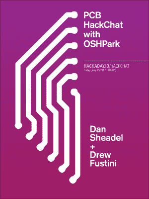

# 周五黑客聊天:完美的紫色印刷电路板

> 原文：<https://hackaday.com/2017/06/21/friday-hack-chat-perfect-purple-pcbs/>

每周五，我们都聚集在 Hackaday.io 上的热风枪周围，邀请一些很酷的人过来，让他们谈谈他们的工作。这是黑客聊天。这已经成为一种传统，已经有一大堆了不起的人走进我们的大门。

 本周五，[我们将与完美紫色 PCB 的供应商](https://hackaday.io/event/25499-pcb-hack-chat-with-osh-park)坐在一起。在过去十年左右的时间里，小型 PCB 生产领域发生了很大变化。10 年前，PCB 很贵，花几百美元买一小块微型电路板是正常的。现在，面板中的 DEF CON 24 徽章比以往任何时候都更便宜，使勤劳的硬件创作者能够以几年前的零头价格获得专业质量的制造。

在过去的几年里，OSH Park 一直是小批量 PCB 制造的中流砥柱。他们的网站非常简单:上传一些 Gerbers、Eagle board 文件或 KiCad PCB，按几个按钮，一周左右你的邮箱里就会有一个完美的紫色 PCB。

本周，我们邀请[Drew Fustini]和[Dan Sheadel]来谈谈 OSH Park 是做什么的，它们是如何成为当你需要 PCB 时首先想到的地方的。他们将解释为什么电路板是紫色的，美国 PCB 制造的环境法规，[共享项目](https://oshpark.com/shared_projects/mly5ktob)以及创造完美电路板的技巧和诀窍。

你希望从 PCB 供应商那里看到什么？你想看到奥什公园进一步扩展到[他们蓬勃发展的 Pog 业务](http://hackaday.com/2016/04/01/osh-park-reintroduces-pogs/)吗？[贴纸俱乐部](https://twitter.com/laen/status/875834091358134273)怎么样？蓝色机器狗和紫色机器鲨鱼打架谁会赢？所有这些问题以及更多的问题都将得到解答；如果您对 OSH Park 团队有任何问题，[请将它放入此电子表格](https://docs.google.com/spreadsheets/d/1ZHahHN4kU0YBjMgrZMU9ntrmdDD8JOUmpHX2mR6Ok0w/edit#gid=0)。

### 以下是参与方式:

 我们的 Hack Chat 是 Hackaday.io 上的实时社区活动 [Hack Chat](https://hackaday.io/project/5373-hacker-channel) 群发消息。这次黑客聊天将在太平洋时间 6 月 23 日星期五中午举行。困惑于‘中午’是在何时何地？这里有一个时间和日期转换器！

登录 Hackaday.io，访问该页面，并寻找“加入这个项目”按钮。一旦你成为这个项目的一部分，这个按钮就会变成“团队信息”，直接带你进入黑客聊天。

你不必等到星期五；随时加入，你可以看到社区在谈论什么