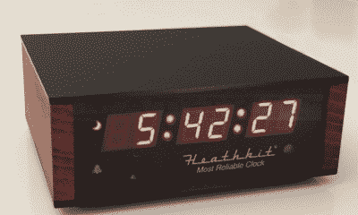

# 希斯基特的新射频仪:为谁服务？

> 原文：<https://hackaday.com/2017/06/23/heathkits-new-rf-meter-who-is-it-for/>

一定年龄的电子黑客和业余无线电爱好者对希斯基特品牌情有独钟。也许这就是为什么当我们看到希斯基特网站有新产品时，我们有一种怀旧的冲动。你可能还记得希斯基特已经走上了渡渡鸟的老路，直到几年前这个品牌开始重新浮出水面。他们最新的套件是一个可以预订的[精密射频仪](https://shop.heathkit.com/shop/product/precision-rf-meter-hm-1002-pre-order-33)。

在有网站和黑客空间以及所有“自己动手”的现代推动手段出现之前，希斯基特通过组装工具教人们电子学。当然，他们以业余无线电和测试设备而闻名，但许多人建造了立体声音响(高保真)、电视、无线电控制装置、计算机，甚至机器人。如果你没有见过，很难想象所有的[手册。他们是世界级的。](http://www.schematicsunlimited.com/h/heathkit/heathkit-hw9-man)

希斯基特产品线让我们困惑。与个人电脑或自行车市场相比，电子设备市场并不算大。但即便如此，对测量正向和反向 RF 功率感兴趣的人可能还是很少。然后排除那些不想要这种仪表中所有精密“实验室级”特性的人。最后一击:该套件尚未上市，预订价格为 575 美元。

如果初步规格是准确的，这不是一个坏米。功率范围为 50 mW 至 2 kW 时，1.6 MHz 至 54 MHz 范围内的精度为 125 PPM。有一个频率计数器包括在内，希斯基特声称有一项专利正在申请中的设备操作的某些方面。

 我们必须承认，出售 Arduino 板和其他你可能在易贝花几美元就能买到的简单东西是很难竞争的。新的希思罗机场似乎将面向精品市场——我们敢说——价格相当高的手工高端产品。比如说他们的超准时钟。对于 100 美元，似乎很难证明购买它的合理性，因为它只不过是一个每天漂移半秒钟的 Atmel CPU。

想要一台 TRF AM 收音机吗？那是 150 美元。它看起来不错，但实际上，这对于一个简单的 AM 收音机套件来说太多了。你可以从他们的网站索引中看到他们有很好的计划，但是很多页面都是空白的。在我们看来，他们可以区分的领域将是教育手册——也许提供广播课程，就像旧的 EDUKIT 课程一样——或者具有更广泛吸引力的东西，这些东西很难仿制。也许那是具有独特设计的机器人或四轴飞行器。也许希斯基特手机套件或下棋机器人手臂会吸引一群人。我们不知道。

不要误解我们。我们希望他们成功。希斯基特有助于培养许多电子爱好者、技术人员和工程师。我们只是不确定这个世界是否需要一个 150 美元的调幅收音机或一个接近低端业余无线电收发机价格的射频瓦特计。

去年我们看了希斯基特时钟套件。我们还看了无焊版本的 [AM 无线电套件](https://hackaday.com/2015/12/17/heathkits-triumphant-return/)(它后来以焊接套件的形式发布)。