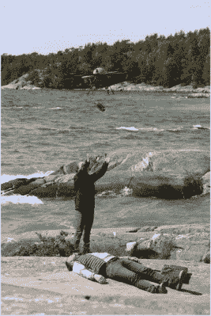

# 飞行除颤器

> 原文：<https://hackaday.com/2017/07/11/flying-defibrillators/>

可悲的现实是，总的来说，心肺复苏术(CPR)并不能拯救生命。尽管所有“你可以挽救一条生命”的营销都旨在让人们获得 CPR 认证，但即使及时应用正确的技术也能挽救生命的例子少之又少，而且大多仅限于在医院目睹的逮捕。从个人经历来说，没有什么比作为第一反应者到达现场，看到丈夫对妻子实施 CPR，并且知道无论我们做什么，都不会有好结果更令人难过的了。

问题在于时间。心脏很少完全停止跳动；通常某种心律不齐会首先导致心脏无效跳动，导致缺氧和意识丧失。从那里到脑死亡大约有四分钟的路程，但在这短暂的时间里，心脏很有可能重新启动。这就是为什么在医院目睹心脏骤停有更高的存活率——用除颤器对心脏进行电重启所需的距离只有最近的急救车那么远。

自动体外除颤器(AED)的出现增加了院外心脏骤停(OHCA)的存活率，但自动体外除颤器在公共场所的渗透还远远不够，不足以在几分钟内将一台自动体外除颤器提供给每个可能需要它的人。因此，很自然地，人们会想到用无人机给心脏病患者送去 aed。这似乎是个好主意，但它行得通吗？

### 当前研究

这并不是又一次“让我们在无人机上放点东西，称之为创新”的努力。斯德哥尔摩卡罗林斯卡学院复苏科学中心的一组研究人员已经认真思考了这个问题，并一直在进行一项严肃的测试计划，旨在了解无人机递送的 aed 是否显示出任何临床益处。[一项初步研究](https://www.ncbi.nlm.nih.gov/pubmed/27729058)从分析 OHCA 事件开始，寻找部署无人机进行测试的最佳位置，以确保充足的数据集。然后，他们使用 GIS 数据建立模型，在地面 EMS 工作人员和无人机之间进行虚拟比赛。发现无人机在农村环境中大约 93%的情况下会击败地勤人员，然后他们进行了有人驾驶无人机试飞，以测试 AED 的释放方法。测试了带降落伞从 25 米高空释放和仅在 AED 低空投放，以及从着陆的无人机释放。

AED test drop. Source: [Hjärtstoppscentrum](http://www.hjartstoppscentrum.se/sll-satsar-pa-innovationer-dronare-med-hjartstartare-glesbygd/)

他们的最新研究(遗憾的是，其全文在付费墙后面)将该项目向前推进了一步，在 OHCAs 之前出现过的 18 个农村地区运行完全自主的航班。他们模拟了完全内置的系统最终将能够实现的功能——调度员根据呼叫者的信息将 GPS 坐标上传到无人机，无人机被发射并自主飞向事发地点。为了安全起见，无人机飞行员监控着发射和着陆。他们发现响应时间有了显著改善——总体平均减少了 16.5 分钟，从调度到发射只需三秒钟，相比之下，地面工作人员需要三分钟才能让救护车上路。

尽管大众媒体对这项研究进行了令人屏息的报道，无人机递送的 aed 不会很快出现，至少就作者而言不会。他们明智地朝着看似伟大的想法迈出了小步，但最终可能不会带来任何好处，并可能导致存活率下降。这是否会改善 OHCA 的结果还有待检验，但鉴于目前令人沮丧的 8-10%的低存活率，很难看出几分钟内让 AED 出现在现场不会有助于提高数字。

### 问题

主要问题都围绕着系统中的薄弱环节——现场的响应者。现代 aed 的极其简单的用户界面对于未受过训练的撒玛利亚人来说是具有挑战性的，并且可能不能及时正确地部署以产生影响。即使经过适当的训练，当一个真实的人在你面前死去时，表演的压力会让你忘记一切；再加上一个事实，受害者往往是回应者的爱人，所有关于表现的赌注都被取消了。

还有一些技术障碍——AED 能经受住严酷的飞行考验吗？在道具旋转之前，救援人员试图从着陆的无人机上取回 AED 会受伤吗？天气对及时交货有什么影响？所有这些问题都需要回答，看起来斯德哥尔摩团队很好地解决了所有这些问题。

 [https://www.youtube.com/embed/y-rEI4bezWc?version=3&rel=1&showsearch=0&showinfo=1&iv_load_policy=1&fs=1&hl=en-US&autohide=2&wmode=transparent](https://www.youtube.com/embed/y-rEI4bezWc?version=3&rel=1&showsearch=0&showinfo=1&iv_load_policy=1&fs=1&hl=en-US&autohide=2&wmode=transparent)

那么空中除颤器的舰队什么时候开始在空中飞行呢？你的猜测和我的一样好，但我敢打赌，它不会很快。现在在瑞典进行的所有测试肯定会将球向前推进，但在将这样的系统投入使用之前，将有巨大的监管障碍需要处理。仅在美国，这样的系统可能必须通过美国联邦航空局和美国食品及药物管理局的检查，如果无人机和调度中心之间需要进行通信以进行指导，可能还需要通过联邦通信委员会的检查。让一家字母表代理商签署一项新技术已经够难了，但是三家呢？这可能很有挑战性。

但就目前情况来看，空中 aed 似乎有一天会成为现实，它们可能会被证明是无人机的另一个很好的用例。