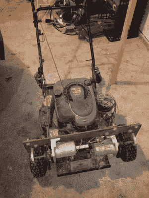

# LCA As——草坪护理即服务？

> 原文：<https://hackaday.com/2017/07/06/lcaas-lawn-care-as-a-service/>

这个周末，当我在修剪郊区的小块绿地时，就像在从事一项平凡的工作时经常发生的那样，我的思绪在游荡。“为什么，2017 年了，我还在割草？”在很多方面，我们生活在未来——我们口袋里装着功能强大的电脑，我们中的一些人拥有半自动汽车，几乎任何东西都可以通过手指触摸购买，并在第二天或更早的时间送达。我们甚至有可以吸尘的机器人，那么为什么没有机器人割草机呢？

原来我们确实有机器人割草机，但不幸的是，它们有点糟糕

 [https://www.youtube.com/embed/_f-4J98EWrI?version=3&rel=1&showsearch=0&showinfo=1&iv_load_policy=1&fs=1&hl=en-US&autohide=2&wmode=transparent](https://www.youtube.com/embed/_f-4J98EWrI?version=3&rel=1&showsearch=0&showinfo=1&iv_load_policy=1&fs=1&hl=en-US&autohide=2&wmode=transparent)

请记住，该视频是由富世华制作的，因此毫不奇怪，他们在机器人草坪护理领域的表现是最好的，而其他可能对所有割草机产生同等挑战的变量，如高湿草，根本没有经过测试。我在视频中看到的是一堆割草机，它们都有一些基本问题，这回答了我的问题，为什么我们没有在每个郊区的院子里看到机器人割草机。

## 更多动力！

你可能认为我的主要不满是普遍需要电线来为机器人定义边界。如果能看到一个完全自主的机器人，仅仅使用 GPS 和图像分析就能定位花坛，那将是一件好事，但有线边界似乎是一种合理的手段，可以达到控制机器人所需的精度。电线边界类似于狗的“隐形围栏”，安装电线的一次性成本将在让机器人处理我每周一次家务的几年内摊销。那是另一篇文章——[威尔·斯韦特曼]已经做了很好的工作，涵盖了[自动机器人位置跟踪技术](http://hackaday.com/2017/03/01/where-are-the-autonomous-lawnmowers/)。

我认为真正的问题是缺乏动力。这些机器人都是由电池供电的，它们在传动系统和切割方面似乎都严重动力不足。动力不足最明显的表现是大部分被测试的单位都无法应付山地，但有些甚至不擅长割草。很多切割能力似乎都与刀片设计中的妥协有关——这些机器人没有巨大的钢制刀片。最成功的基本上是旋转的刀片，它们无法在现实世界的院子里生存，在那里，石头、网球、倒下的树枝和吉娃娃大小的松果是常见的障碍。

普通手扶式割草机使用喷火内燃机是有原因的:没有什么比它更集中、更轻便的动力了。割草机甲板下旋转的刀片背后有令人难以置信的能量，足以割草，将其覆盖成小块或吹进袋子，还剩下足够的能量来移动机器，所以你不必这样做。尽管噪音很大，对环境也不友好，但内燃机是绿色之王，即使电池和电机技术已经取得了很大进步，也很难看到它们能够在短期内达到燃气发动机的功率重量比。

## 安全

因此，对我来说，最重要的问题是:你如何利用内燃机集中的能量来安全、有效、自动地护理草坪？我怀疑我们是否会看到装有燃气发动机的消费级草坪机器人，主要是因为液体燃料的自动加油比电力要复杂得多。需要手动加油的不便，加上使机器足够坚固以经得起在振动、热量、油和燃料溢出、灰尘和湿气的动态环境中正常使用的成本，几乎使消费级汽油草坪机器人无法启动。

 

如果你想为你的房子买一个，你需要自己动手。几年前我们推出了[Kurt ' s][遥控割草机](http://hackaday.com/2014/02/22/remote-controlled-lawn-mower-lets-you-sit-back-and-enjoy-the-show-2/)。它向电动割草机机器人乞求导航系统。

但是专业级自主机呢？园艺师已经花了很多钱购买大功率的机器来快速有效地割草。给这样的机器增加自主控制会增加成本，但对于专业人士来说，这可能是一个有价值的提议。想象一下，你可以开着拖车，带着两三辆自动驾驶割草机开进一个社区。手动加油后，操作员可以将每台割草机放在不同的院子里，从卡车驾驶室监控每台割草机。车载摄像头和传感器可以让他看到任何障碍物，并在紧急情况下关闭发动机。当机器人完成后，它们会回到拖车上，向下移动到下一组客户。一个庭院设计师可以在一天内修剪两倍或三倍的草坪，并真正获得利润。

在“草坪护理即服务”成为现实之前，将有大量的问题需要解决，尤其是要让房主相信，一队强大的机器人带着旋转的死亡刀片在他们的社区中穿梭是一个好主意。但似乎有强大的经济力量在起作用，可能会促使一个足够有远见的草坪设备制造商开始为专业市场开发一种“大男孩”机器，而不是生产更多注定失败的弱小草坪设备。