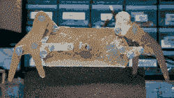

# Hackaday 奖参赛作品:机器人步行机 Octo

> 原文：<https://hackaday.com/2017/07/06/hackaday-prize-entry-octo-the-robotic-walker/>

像 Strandbeest 这样的步行器是最受欢迎的，部分原因是它们平滑的设计和流畅的运动，但[Leandro]以稍微不同的方式开发了 [Octo，这是一个用于探索崎岖地形的八足平台](https://hackaday.io/project/25629)。Octo 基于 1994 年开发的 [Klann 连杆](https://en.wikipedia.org/wiki/Klann_linkage)，由于其应对崎岖地形的能力，该连杆旨在作为车轮的替代品。[Leandro]用焊接黄铜做了一个小的概念验证，并喜欢这个结果。下一个版本将会更大，由铝和钢制成，能够携带有效载荷。

Strandbeest 和 Octo 有许多共同之处，但在一些重要方面有所不同。詹森的连杆(strand beest 使用的)每条腿使用八个连杆，需要相对平坦的地形。Octo 使用的 Klann 连杆每条腿只需要六个连杆，并且有能力处理更粗糙的地面。

[莱安德罗]不只是从网上找到的文件中剪下一些部分；黄铜概念证明是基于一个 Klann 链接动画起草的。在下一个版本中，[Leandro]使用模拟器来确定最佳的连杆设计，旨在使步态不太平坦，并最大限度地提高腿部的垂直高度，以帮助清除障碍。

我们以前在乐高蜘蛛机器人中见过 Klann 连接。我们很高兴地看到[莱安德罗]的奥克托在环的*轮子，翅膀，和步行者*类的 Hackaday 奖。

The [HackadayPrize2017](https://hackaday.io/prize) is Sponsored by:   