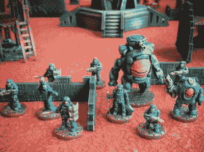
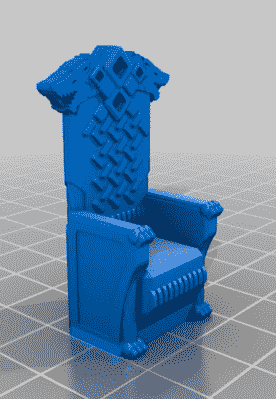
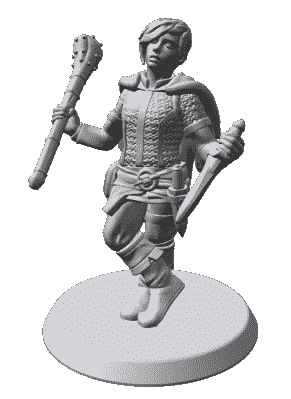
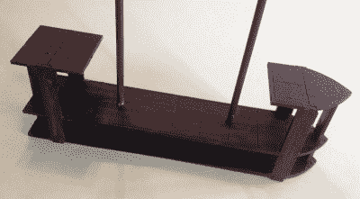

# 制作你自己的桌面游戏道具

> 原文：<https://hackaday.com/2017/07/14/fabricate-your-own-tabletop-gaming-props/>

深入桌面角色扮演游戏的神秘世界。战锤幻想角色扮演，暗影之旅，探路者，阿尔玛奇卡，吸血鬼，任何能让你掷骰子的游戏——在无骰子系统中的隐喻。这很可能是你爸爸的 D&D。如果你不是游戏玩家，你肯定对这个概念很熟悉。人们围坐在一张桌子旁，假装有一场史诗般的冒险，通常在骰子的帮助下加入随机元素。桌子上通常会展示一张地图，大小适合显示各种英雄和恶棍的图形。

作为一个可以接触到各种数控机器的人，我发现自己想要创造一些东西来让游戏变得更有趣。我想建造一座大型城堡并进行围攻。我想用按比例建造的木船进行一场船对船的战斗。但我也认为更小。我能做些什么来帮助我们度过每一天？比如说，骰子的盒子。不是每个项目都需要成为龙的巢穴。

原来很多其他人也在想同样的事情。

### 走向模块化

 我们是成年人，诱惑是把同样的能力运用到我们的爱好中，就像我们运用到工作中一样。所以为什么不全力以赴建造一座华丽的寺庙或城堡或其他什么呢？如果你很有艺术细胞，你可以把激光切割的木头漆成橡木板的样子，用火车模型商店里的草来装饰 3D 打印的山丘。

建造和装饰终极 boss 巢穴的问题是，你之后怎么处理这个东西？尽管火山城堡对 boss 战来说很棒，但你不能把它变成乡村酒吧。当然，并不是所有的创作都是史诗。例如，Thingiverse 用户【Yngel】的[激光切割木屋](https://www.thingiverse.com/thing:484518)不会被混淆为黑暗圣骑士的城堡。然而，最终，它也有同样的弱点:你只能用它来做这么多的设置。

解决方案可能是一个模块化系统，可以用来构建各种各样的地图。墙壁可以改变用途；一场战役的守卫塔是另一场战役的废墟。城堡变成了豪宅，客栈变成了铁匠铺。

 即使跳过围墙，你仍然可以完成很多事情。例如，像桶、雕像、喷泉等可以放入任何布局的东西。你可以在 Thingiverse 等 3D 打印文件网站上找到单个项目——搜索 30 毫米就可以开始了，但(当然)也有其他比例，如 28 毫米和 18 毫米。

Thingiverse 用户[dutchmogul]向该网站贡献了几十个游戏道具和布景，他的钻研装饰系列包括一些普通的东西，如一堆石头、柱子、书架和板条箱。他的[狼王座](https://www.thingiverse.com/thing:2153661)可以在左边看到。[荷兰大亨]将他的热情投入到一个小游戏设计公司的职业中，[不义之财游戏](https://www.patreon.com/illgottengames)。

肯定有钱可赚。一家名为 Dwarven Forge 的公司在 Kickstarter 上运行，他们的 10 万美元目标飙升至 220 万美元。GeekDad 有一系列关于 Dwarven Forge 的伟大[帖子，可以让你了解这个系统。这个项目的一个很酷的成果是](https://geekdad.com/tag/dwarven-forge/) [Open Forge](https://www.thingiverse.com/devonjones/collections/openforge/) 的创建，这是一个创建连接官方矮人锻炉产品的新元素的开放标准。

还有其他的例子:pw_jamison 的[龙门架](https://www.thingiverse.com/thing:2246090)包括建造科幻猫步所需的一切。他还包括 SketchUp 中的所有部分，因此您可以在打印之前创建自己的虚拟设计。

最后，[荷兰大亨]的旅行者[模块化科幻游戏拼图](https://www.thingiverse.com/thing:703514)有很多令人喜欢的地方，包括由切割的磁性名片制成的连接。

### 数字

 不要低估模块化游戏的极致:图。以前由铅制成，在减排发生之前的雾年，我们都改用白色金属。最近，我们开始看到一些高质量的塑料人像；有些是铸造的，有些是 3D 打印的。

让我们面对现实吧，买人偶很糟糕，因为它们很贵，而且通常和你的角色不太像。Thingiverse 正在获得越来越多的身材，像[dutchmogul]这样的用户上传自己的设计，让你有更多的选择来寻找或适应完美的身材。

当然，熟练的设计师可以简单地创造自己的作品。然而，我们不可能样样都擅长。像 Hero Forge 这样的服务引导你完成[创造你自己的形象](https://www.heroforge.com/)，决定种族、身体尺寸、姿势、装备等等。当然，该公司也愿意用两种不同的塑料、钢铁或青铜来打印你的肖像，价格从 15 美元到 100 美元不等。他们不允许你下载设计并自己打印，尽管你可以抓取一个 PNG。

### 或者只是坚持机械

虽然很酷的布局很棒，但我寻求的是让我的游戏更容易玩的东西。我的兴趣纯粹是机械的。该项目如何帮助我获得更多乐趣？

例如，我们在棋盘上有许多与几十个，通常是 100 个以上的数字的大战。我必须记住每个人物是站在谁的一边，他们扮演什么角色，以及他们的总体健康状况。我们在一个 1”的格子上玩，所以我用激光切割出 1”正方形的两足动物，1”x2”矩形的马，2”x4”的马车，等等，用喷漆涂层来帮助区分彼此。你也可以用方块作为颜色代码来提醒你一个角色的状态。例如，我们用黄色方块代表遭受魔法恐惧的角色(这是小便，明白吗？)以及表示着火橙色和表示出血的红色。

我注意到另一个我们需要帮助的地方是角色的高度。如果有人在树顶上，那么这个数字就应该有这么高。我用激光从 3 毫米厚的胶合板上切割出树木，我的女儿将它们画得看起来很逼真，但对我来说，它们的重要性在于可以将人物放在树枝上，既可以放在离地面更低的地方，也可以放在更高的地方。放置狙击手的最佳地点！如果你的角色在飞呢？如果地图准确显示那个人有多高不是更好吗？

尺子、模板和其他测量工具也可以被定制或重新创建。我用 1/4 英寸的丙烯酸树脂为战锤幻想角色扮演制作了一套[爆破模板](https://www.thingiverse.com/thing:312855),它们在确定哪个人物被什么效果击中方面非常有效——只需将模板放在战场上并浏览它。

 另一个领域是车辆激光切割形状辅助。假设你有一艘飞船，上面有 8 个数字。在桌子上移动它是一件痛苦的事情，因为你每次都必须重新定位这些数字。如果你有一块船形的木头，人物可以放在上面，会怎么样？

你可以更进一步，做一整艘船。还记得我想做自己的海盗船吗？嗯，我用*弯刀*做了一次演习。这是一艘[双层纵帆船](https://www.thingiverse.com/thing:2412325)，配有一对能够容纳 30 毫米身材的乌鸦巢。我想把它增加到全战舰的大小，有多层甲板可以起飞，但我从小的开始。它会很快变得疯狂。实际上，一艘 30 毫米大小的船将覆盖整个桌子，一个 50 英寸的模型大约相当于一艘 300 英尺的船。

我的船遭遇了和火山巢穴一样的问题:它经常没有用处。即使有船，也可能不是同一艘船。或者不需要我的模型，因为在船上不会发生战斗。

### 继续前进

还有太多的领域需要讨论。CNCed 游戏世界地图是怎么回事？自己做骰子是怎么回事？我想制作自己的便当盒，用来放索引卡和铅笔。我想做一个只适合 20 面骰子的架子。我想做一个丙烯酸平台来模拟一个飞行的角色。

作为一种天生具有创造性和想象力的爱好，桌面游戏吸引了这种探索。跟着它跑！有了激光切割机和 3D 打印机，为你的游戏制作道具和模型变得如此容易，无论是为了酷的因素还是仅仅为了帮助你的游戏运行得更流畅。有很多想法，很多人渴望分享。请在评论中分享你参与过的或者想要参与的桌面游戏项目。

3DP 模型图片由[dutchmogul]提供，经许可使用。