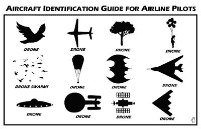

# 伦敦盖特威克机场因无人机袭击关闭跑道

> 原文：<https://hackaday.com/2017/07/04/london-gatwick-airport-closes-runway-in-alleged-drone-strike/>

伦敦是那些在机场方面存在身份问题的城市之一。伦敦没有一个机场，而是有一组机场在离它不同的距离为这个城市服务。伦敦盖特威克机场是其中的第二大机场，它只有一条跑道，位于苏塞克斯郡的乡下，在城市以南约 30 英里处。

如果你关注英国的新闻来源，你可能在过去的几天里听说过一些关于盖特威克的事情。它的跑道被关闭了两个短时期，一些航班被迫改变航线，因为有报道称发现了无人驾驶飞机。这是一个极其严重的问题，负责任的多旋翼飞机所有者将痛苦地意识到机场附近飞行的距离和高度规定。

An oft-shared drone identification guide for airline pilots, of uncertain provenance ([phantompilots.com](https://phantompilots.com/threads/aircraft-identification-guide-for-airline-pilots.75482/)).

如果你熟悉大众媒体报道无人机故事的方式，你可能不需要点击上面 BBC 报道的链接来找出它的语气。在多旋翼社区中有一个很大的担忧，那就是它提出了一个非常片面的观点，并从表面上看，声称看到的是一架无人机，而事实上没有任何证据证明这是事实。对于我们这些看过许多这样的故事来来去去的人来说，很难不同意无人机飞行员的说法，往好里说，空气中有一些懒惰的报道，往坏里说，有一些彻底的记者不负责任。

作为 Hackaday 的读者，你已经习惯了对他们所写的主题有深入了解的作家。我们不知道技术的所有可能方面，我们偶尔会出错，但我们都在我们所写的技术、黑客和制造商行业和社区中有非常强大的背景。我们有工程教育，我们在各种各样的技术行业工作过，我们为乐趣建造我们自己的东西，我们建立并运营黑客空间。

相比之下，你将在主流媒体上读到其作品的记者是多面手。他们会有特定的教育背景和特殊的兴趣，但在他们的工作中，他们会报道从事件的传送带上滚下来的任何故事。因此，当无人机报道出现时，他们会发现自己脱离了政治或当地新闻的正常舒适区，无法依靠自己的经验来报道。负责任的新闻方法是做一些研究，问一些相关的问题，要求无人机参与的具体证据。我们仍在等待这些所谓的无人机遭遇发生。

多旋翼建筑和飞行是我们社区的一个重要特征，任何引起执法部门对我们工作的注意的事情都应该成为我们所有人的担忧。多旋翼并不是 Hackaday 报道的唯一可能以同样方式被歪曲的东西。我们以前讨论过这个话题，看看[我们对一系列归咎于无人机](http://hackaday.com/2016/05/02/debunking-the-drone-versus-plane-hysteria/)的空中接近报告的分析。有些是你编不出来的。

盖特威克机场图片:安德烈·沃德曼[ [GFDL 1.2](https://commons.wikimedia.org/wiki/File:London_-_Gatwick_(LGW_-_EGKK)_AN1763497.jpg) ]。