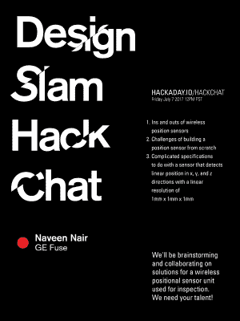

# 周五黑客聊天:一个设计 Slam 挑战

> 原文：<https://hackaday.com/2017/07/05/friday-hack-chat-a-design-slam-challenge/>

每周五，Hackaday.io 社区都会聚集在壁炉旁，讨论世界面临的挑战。这是黑客聊天，在以前的版本中，我们已经讨论了定制硅、Arduinos、PCB 制造、旧技术和硬件制造。

 在本周的黑客聊天中，我们将开启一项设计挑战。我们请求社区[帮助开发无线位置传感器](https://hackaday.io/event/25727-design-slam-hack-chat)。这是一个设计 Slam 黑客聊天，我们正在寻找贡献者。

我们本周黑客聊天的嘉宾是[Naveen Nair]，GE Fuse 的技术负责人。在这次聊天中，我们将讨论位置传感器。如果你曾经使用过鼠标，你使用的是位置传感器，但对于这次聊天，我们设计了一些更具挑战性的东西。Fuse 集团正试图制造一种带有手持式超声波检测装置的低成本无线位置传感器。GE 为什么对这项技术感兴趣？我们的猜测是检查喷气涡轮机，或类似的东西。不过，这并不意味着低成本无线位置传感器没有其他应用。想象一下，如果四轴飞行器能够以 1 毫米的分辨率感知自己的位置，它会做些什么。

无法进行黑客聊天？别担心，我们会在事件结束后的某个时候把文字记录[放在这里。](https://hackaday.io/event/25727-design-slam-hack-chat)

### 以下是参与方式:

 我们的 Hack Chat 是 Hackaday.io 上的实时社区活动 [Hack Chat](https://hackaday.io/project/5373-hacker-channel) 群发消息。这次聊天将在太平洋时间 7 月 7 日星期五中午进行。困惑于‘中午’是在何时何地？这里有一个时间和日期转换器！

登录 Hackaday.io，访问该页面，并寻找“加入这个项目”按钮。一旦你成为这个项目的一部分，这个按钮就会变成“团队信息”，直接带你进入黑客聊天。

你不必等到星期五；随时加入，你可以看到社区在谈论什么。