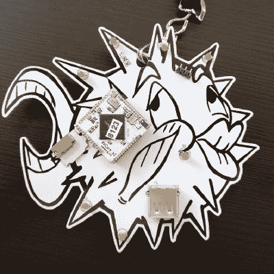

# DEF CON Badgelife:运行 Linux 的泡泡

> 原文：<https://hackaday.com/2017/07/07/def-con-badgelife-the-puffy-that-runs-linux/>

DEF CON 今年又取消了，这一次这句话至少有一部分是真的。今年将不会有特别的官方徽章。DC 官方徽章中没有挑战或神秘。今年，来自村庄和随机参与者的非官方徽章最终取代了官方徽章。这里是 badgelife，在接下来的几周里，我们将会看到一些 DEF CON 的非官方徽章。

关于[【呆瓜引擎】的膨胀徽章](https://shiftj.is/post/puffy/)的想法始于去年，来自和的所谓的[班德徽章！异或。](http://hackaday.com/2016/07/25/hands-on-the-andxor-unofficial-def-con-badge/)把这归因于一个以“但是你必须去过那里”结尾的故事，但是 Bender 徽章非常受欢迎，非常畅销，是 DC 独立徽章工艺的惊人成功。[傻瓜引擎]决定加入行动，并为 DC 25 建立自己的徽章。

 蓬松徽章的设计基于 OpenBSD 徽标和吉祥物的高度风格化渲染。为什么是有着卡戴珊嘴唇的河豚？[dorkengine]有一堆运行 OpenBSD 的机器，这对我们来说是一个足够好的理由。

一个电子徽章必须做一些事情，而[dorkengine]提出的功能列表包括某种无线连接、可攻击性、串行控制台、闪光灯和某种类似 nix 的操作系统。OpenBSD 没有入选，但[dorkengine]最终偶然发现了 [VoCore2](http://vocore.io/v2.html) ，这是一个运行 Linux 的微型模块系统，有 WiFi 和几个 GPIOs，侧面只有一英寸。

在获得一大笔 VoCores 订单后，[dorkengine]开始着手 PCB。电路非常简单，只需将 VoCore 连接到 USB 端口、电源适配器和几个 led。蓬松的渲染完美地转化为阻焊和丝网印刷，在 ITEAD Studio 的原型之后，[dorkengine]有 40 个 PCB 完美地工作。

那么,[傻瓜引擎]打算怎么处理一个装满膨胀徽章的盒子呢？他将在大会上以 40 美元的价格出售它们。对于一个焊接到 17 美元 SoC 上的大型 PCB 来说，这是惊人的便宜。如果你想染指其中一个，你可以给他发电子邮件或者在推特上发微博。当然，如果你想自己制作，[dorkengine] [有 KiCad 文件和软件可用](https://gitla.in/darkengine/puffy)，但在这一点上，你会看到板房的快速周转。