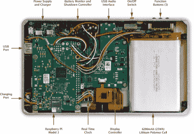

# 强大的功能，小巧的包装:定制平板电脑，覆盆子风格

> 原文：<https://hackaday.com/2017/07/23/huge-functionality-small-package-a-custom-tablet-raspberry-style/>

俗话说，“如果你想把事情做好，自己动手。”渴望一台平板电脑，但更喜欢避开消费者模型，[Stefan Vorkoetter]建造了自己的小巧轻便的 [Raspberry Pi 平板电脑](http://www.stefanv.com/electronics/a-compact-home-made-raspberry-pi-tablet.html)，在这个过程中多走了几英里。

这款平板电脑采用了 Raspberry Pi 3 和官方触摸屏，最终产品略大于屏幕本身。本着“越瘦越好”的设计理念，[Vorkoetter]不得不修改几个  组件以符合这一理念；其中最明显的是移除 Pi 的 GPIO 头、USB 和以太网端口，并从触摸屏控制器板上移除 USB 电源输出端口，以便两者可以并排安装。

Adafruit PowerBoost 1000C 可以为 6200 毫安的电池充电，这意味着长达六个小时(！)的 YouTube 视频——通过一个微型 USB，但只是在[Vorkoetter]连接了一对自制的散热器之后，因为机箱内的气流可以忽略不计。一个经过修改的 USB 音频适配器增强了 Pi 的音频功能，可以使用耳机、麦克风和连接到平板电脑后盖上的内置扬声器。

增加的许多硬件包括一个外部时钟芯片(DS3231)，一个用于外围设备的 USB 端口，三个循环使用的按钮来访问一些常用的功能(如将键盘放在前面)，以及一个连接到定制电路板的电源开关，该电路板可以监控电池电压并充当关机控制器。

油漆和最终组装完成后，[vork etter]为 Rasbian Jessie 添加了一些功能，使其成为一款功能性平板电脑——特别是 xvkbd 触摸屏键盘软件，twofing 使触摸屏表现为传统平板电脑，以及[vork etter]自己编写的自定义平板电脑守护程序。

从那以后，除了在 16 毫米厚的包装中享受这一切之外，几乎没有什么可做的了——如果你不想走另一条路，将[平板电脑变成笔记本电脑](http://hackaday.com/2016/11/05/turn-that-old-tablet-into-a-sub-100-linux-laptop/)。