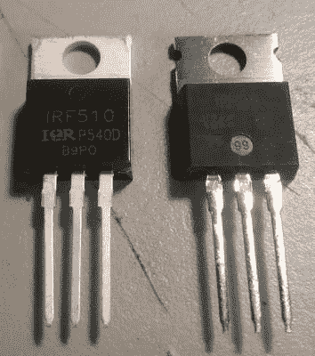

# 让我们来玩识别假 MOSFET 的游戏

> 原文：<https://hackaday.com/2017/07/15/lets-play-spot-the-fake-mosfet/>

最近，[Ryan]的 BITX40 收音机中的语音按键通话电路被关闭了很长一段时间。蓝烟被释放，一个 MOSFET 被烧坏，[Ryan]需要一个新的 IRF510 N 沟道 MOSFET。不是问题；这是一个 1 美元的数量，但如果你一次只买一个零件，从 Mouser 或 Digikey 发货总是会杀了你。相反，[Ryan]以 6 美元的运费找到了其中 5 个 MOSFETs 的供应商。这是一笔好交易，也是一个糟糕的举动，因为那些新零件是假的。现在，我们有机会[发现假 MOSFET](http://miscdotgeek.com/genuine-irf510/) 并了解这一切都与供应链有关。

Spot the fake

公平地说，如果 Ryan 用他的收音机来播放 SSB 语音，那么这个假冒的 MOSFET 可能会工作得很好。[Ryan]正在使用此无线电进行数字传输，这意味着此 MOSFET 的占空比连续两分钟为 100%。假货火了，神奇的蓝烟放出来了。

通过行业联系人，[Ryan]直接从 Vishay Semiconductors 获得了一款全新的正品 IRF510。这是一个绝佳的机会，可以对真的和假的半导体进行并排比较，如右图所示。看一看:左边的 MOSFET 有清晰的字体，右边的有镀锡引线和凹槽散热片。[Ryan]向几个脸书小组提出了这个问题，他们达成了明确的共识:在 37 张投票中，有 21 人选择了左边的 MOSFET 为正品。

大多数人都错了。真正的芯片看起来很丑，有镀锡的引线和更薄的散热片。真芯片看起来像是假芯片的劣质仿制品。

这里有什么外卖？即使是“专家”——即那些自认为知道自己在互联网上谈论什么的人——有时也不知道什么是假冒零部件。怎样才能让自己不被假冒的元器件烫伤？坚持信誉良好的经销商(Mouser、Digikey 等)，并假设好得难以置信就是好得难以置信。