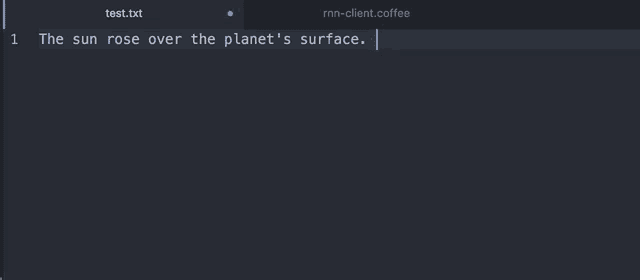

# 神经网络现在可以成为你的写作助手

> 原文：<https://hackaday.com/2017/07/14/a-neural-network-can-now-be-your-writing-assistant/>

写作是一项困难的工作；不过，作为一个主要基于单词的网站，我们在 Hackaday 这里可能会有点偏见。作家不仅要知道基本知识，比如什么是分号，什么时候用分号，他们还需要用一种易读的方式来表达信息。正如许多评论者喜欢指出的那样，即使我们偶尔也会为此而挣扎(尽管我们受到称赞，也很有学者风范)。

如果我们能让我们的计算机为我们做繁重的工作，那不是更好吗？毕竟，一只拥有无限时间的猴子最终会写出莎士比亚之类的作品。当然，当我们坐下来享受咖啡的时候，一台电脑可以被编程来完成所有那些花哨的单词组装。嗯，这就是罗宾·斯隆(Robin Sloan)开始用一个由神经网络驱动的写作助手(T1)来做的事情。

好吧，所以它实际上并不完全自己写。相反，[Robin 的]软件利用了[[JC Johnson 的] torch-rnn 项目](https://github.com/jcjohnson/torch-rnn)，并将其集成到 Atom 中以自动完成句子。[Robin]用科幻杂志《Galaxy》和《IF Magazine》的数百期旧刊训练他的神经网络，这些杂志可以在互联网档案馆找到。一旦安装了服务器和相应的 Atom 包，作者只需按下 Tab 键，句子就会完成。

结果很有趣。【罗宾】自己说“这就像你肩上扛着一只精神错乱但却博览群书的鹦鹉在写作。”虽然它不太可能在短期内被用作一个严肃的写作工具，但是它的潜力确实很吸引人。当接受相关源材料的培训时，集成到像 Atom 这样的软件中会非常有用。如果一个[神经网络能作曲](http://hackaday.com/2017/03/17/neural-network-composes-music-says-ill-be-bach/)，它肯定能写出一些愚蠢的科技文章。

【感谢 Tim Trzepacz 的提示！]

打字机图片:LjL ( [公有领域](https://commons.wikimedia.org/wiki/File:Olivetti_Lettera_22_by_LjL.jpeg))。