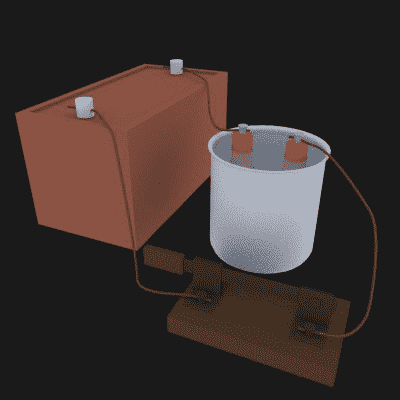

# 传统电流与电子电流

> 原文：<https://hackaday.com/2017/07/17/conventional-current-vs-electron-current/>

电流有多种形式:导线中的电流、电池极板之间以及电解过程中极板之间的离子流动、电弧、火花等等。然而，今天我们主要讨论导线中的电流。但是电流在电线中是朝哪个方向流动的呢？有两种可能性，取决于你是用电子流还是常规电流来思考。

Electron current vs. conventional current

在连接到电池的电路中，电子是电荷载体，从电池的负极流经电路，回到正极。

传统电流的方向正好相反，从正极端子，绕过电路，回到负极端子。在这种情况下，没有电荷载体向那个方向移动。常规电流是我们告诉自己的一个故事。

但是，由于电流以如此多样的形式进入，电荷载体有时确实从正极向负极移动，有时移动是双向的。当使用[铅酸电池](https://en.wikipedia.org/wiki/Lead%E2%80%93acid_battery)时，正氢离子向一个方向移动，而负硫酸根离子向另一个方向移动。因此，如果方向不重要，那么有一个忽略电荷载体的约定会使生活更容易。

说我们需要一个独立于电荷载体的公约是非常好的，但这似乎是一个副作用，而不是我们有这个公约的原因。早在电流以各种已知的形式出现之前，这个惯例就已经确立了——甚至可以追溯到电子甚至原子被发现之前。我们为什么要开大会？正如你将在下面读到的，它始于本杰明·富兰克林。

## 富兰克林的实验

Franklin’s experiment

为了让你对我们谈论的电的发展领域有多早有所了解，莱顿瓶，第一个电容器，在 1745 年刚刚被发明出来。关于它的消息和其他发现通过信件和讲座迅速传播开来。其中一位讲师是 T2 的阿奇博尔德·斯潘塞博士。富兰克林参加了他的讲座，甚至在 1746 年买了斯潘塞博士的设备。

富兰克林是一个多产且严谨的实验者，并开始写他自己的关于他的工作和理论的信。通过这些字母，我们得到了实验的细节，从中我们得到了常规电流的方向。

在几封信中，他描述了用 A、B 和 C 三个人做的一个实验。A 和 B 站在蜡上，使他们与地面绝缘，而 C 直接站在地面上。一个人用一根玻璃管摩擦他的手，正如富兰克林所描述的，“把他自己身上的电火焰收集到玻璃里”。然后，b 将他的手指伸到玻璃管附近，“接受由玻璃管收集的来自 A 的火焰”。但是对 C 来说，A 和 B 看起来都是带电的，“因为只有中等数量的电火，在接近 B 时接收到火花”，或者“给 A 一个，而 A 的数量不足”。相反，如果 A 接触 B，那么火花会更强，因为它们之间的差异更大。如果在 A 和 B 接触之后，C 接触了它们中的任何一个，就没有火花了，因为“所有的电之火都被还原为最初的相等”。

## 富兰克林的解释

富兰克林的信接着定义了一些新的术语，并建立了我们今天使用的惯例。

> “因此，在我们中间出现了一些新的术语:我们说，B，(以及类似情况下的物体)是带正电的；答，负面的。或者说，B 是带电的加号；a，减号。……要使正负电带电，没有比这更需要知道的了，被摩擦的管子或球体的部分，在摩擦的瞬间，确实吸引了电的火焰，因此从摩擦的东西那里获得了电的火焰:当摩擦停止时，同样的部分立即倾向于把它们所接受的火焰给任何拥有较少的物体。”

因此，富兰克林提出了这样一个观点，即电荷是一种从正电荷向负电荷移动的物质，或者是从电荷多的物质向电荷少的物质移动的物质。这是我们今天采用的传统电流。

请注意，通过像信中描述的那样摩擦物体，他们利用[摩擦电效应](https://en.wikipedia.org/wiki/Triboelectric_effect)给物体充电。哪些物体带正电，释放电子，哪些带负电，吸收电子，这些都列在一个名为摩擦电系列的表格中。从这些字母中，富兰克林正确地推断出不同的物体会带哪种电荷，例如，玻璃带正电，硫带负电。

问题是，当你靠近带正电的玻璃产生火花时，富兰克林猜测电流体从带正电的玻璃流向你，而我们现在知道是你给玻璃提供了电子。

Ebenezer Kinnersley 是富兰克林电气实验者小圈子中的一员，他也经常被认为是这个想法的提出者，所以很难知道是只有一个人提出这个想法还是合作的结果。富兰克林在信中似乎暗示了后者，他写道:“我们每天在实验中使物体带正电或负电，就像我们认为的那样。”

## 法拉第的电流方向难题

在 19 世纪，迈克尔·法拉第(Michael Faraday)遇到了类似的问题，在没有完全理解的情况下，他不得不说出电荷载流子的名字。他用[电解](https://en.wikipedia.org/wiki/Electrolysis)做了一些实验，并且在[写一篇关于它们的论文](http://www.gutenberg.org/files/14986/14986-h/14986-h.htm#toc_28)时，需要给我们现在称之为阴极和阳极的东西命名。

Faradays electro-chemical cell

他的电化学电池的两块极板与电路相连，所以有一块正极和一块负极。正如我们在上面看到的，惯例是在电池周围的电路中，电流离开正极板进入负极板。在决定如何称呼电极板之后，他需要从内部离子如何与电极相互作用的角度来区分两者。他还想要一些与理论无关的名字。

他用地球磁场和电流围绕地球流动以产生磁场的方向进行类比，这将与太阳的方向相同，从东到西，或者从东到西。他的朋友[威廉·韦维尔](https://en.wikipedia.org/wiki/William_Whewell)建议用希腊语中的“向下”和*希腊语中的“一种方式”，即太阳落下的方式。结果就是“阴极”。同样使用 *ano* ，希腊语向上，导致“阳极”。*

有趣的是，在同一篇论文中，在提供了这些名字之后，他表现出了对事物命名的关注，而当时人们对事物的理解还处于早期。他写道“无论我们对电的本质和电的作用的看法会发生什么变化，似乎都没有理由期待它们会导致混乱，或者以任何方式倾向于支持错误的观点。”果不其然，由于电子的发现和移动电荷载体的方向实际上是相反的事实，[有人建议](https://en.wikipedia.org/wiki/Cathode#Etymology)向下的*卡塔奥多斯*，现在可以解释为向下进入电池的方式，即电子进入电池的地方。

## 汤姆逊对电子的发现

“Crookes tube” by [D-Kuru](https://commons.wikimedia.org/wiki/User:D-Kuru) CC BY-SA 2.0 AT

电线中真正的电荷载体电子的发现始于对阴极射线的研究。首次观察到阴极射线是在稀薄气体中从阴极发出的辉光。19 世纪 70 年代，威廉·克鲁克斯爵士在高真空中产生了第一束阴极射线，并证明了它们从阴极移动到阳极。他还使用磁场来偏转它们，并意识到它们带负电。

但是，是 J·J·汤普孙在 1897 年认识到射线实际上是独特的粒子，并对粒子的电荷和质量做出了很好的估计。他称它们为“微粒”，但后来它们的名字被改成了“电子”。汤姆逊还发现它们是由白炽灯光和光电效应发出的，不久之后人们发现它们是电线中的电荷载体。

## 有关系吗？

事实证明，无论你使用常规电流还是电子电流都没有关系，只要你在使用中保持一致。[基尔霍夫电流定律](http://hackaday.com/2017/05/25/ohm-dont-forget-kirchhoff/)举例来说，电路中进入一个结(节点)的电流之和与从该结流出的电流之和相同。它不在乎哪个方向是进是出，只要你跟踪标志。

然而，在原理图中，常规电流是以各种元件的形状来表示的。二极管的“箭头”形状指向常规电流的方向，晶体管中的“箭头”也是如此。但是很容易记住电子是逆着箭头方向流动的。[右手定则](https://en.wikipedia.org/wiki/Right-hand_rule)在计算洛伦兹力的方向或载流导线周围磁场的方向时也使用常规电流。看来你至少得熟悉常规电流。

## 赢家圈

你最先学的是哪个？你喜欢哪一个？你用常规电流做一些事情，用电子电流做另一些事情吗？根据我在空气间隙中产生电晕放电的经验，尖电极是否提供电子很重要，因为产生的电晕是不同的。请在下面的评论中分享你的经验和观点。