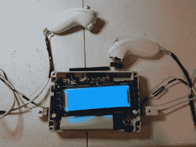

# 这不是你要找的 R2-D2 控制器

> 原文：<https://hackaday.com/2017/07/19/this-isnt-the-r2-d2-controller-youre-looking-for/>

谁喜欢一个好的 R2-D2 机器人？每个人，尤其是年轻的《星球大战》粉丝——令人沮丧的是——都不介意找到一个控制器，破坏一个 R2 单元被赋予生命的幻觉。[Bithead942]隐藏了他的 R2-D2 遥控器，重新建立了一个自主机器人的幻觉——不需要[绝地心术](https://bithead942.wordpress.com/2017/07/04/hidden-r2-d2-controller/)。【T2

[Bithead942]更喜欢穿着传统的义军同盟飞行员服装陪伴他的机器人，这样他在连体衣下就有了一点额外的空间来隐藏控制器。[Bithead942]拆除了一个 Frsky Taranis X9D 控制器，思考如何在如此隐蔽的情况下使用它。灵光一现，他想到了自己未用过的 Wiimote 双截棍，并投入了制作。

 由于他只想使用操纵杆和按钮，他不得不执行一点电路回避，并运行一些额外的电线，以获得他想要的双截棍的所有功能。实现后，需要用光剑(一种带锯)将一个适当大小的项目箱切割成合适的大小，然后粘在一起，在这个过程中为各种按钮、电线、软线、充电用的桶形插头和天线打孔。就像绝地——或者西斯！——使用原力引导他们制造光剑，[Bithead942]的遥控器在第一次尝试中就几乎完美地工作了。

项目箱铆接在一个带衬垫的肩带上，在[Bithead942]的服装下几乎看不到，腕带管理着他手臂长度上的电缆，同时也让他在需要时放下双截棍悬挂起来。完成后不久，他在一次会议上使用这种新设置对他的 R2 装置进行了试运行——获得了巨大的成功！他确实遇到了一些问题:值得注意的是，安全带移动得太多了，不舒服，控制头部旋转的摇杆开关坏了几次，所以他们被调换了。双截棍的隐蔽性是对直白显眼的控制器的巨大改进，但并不完美。不过，没有热点问题，其他与会者普遍对这个看似独立的 droid 感到惊讶。说到弄清楚最近电影中的 BB-8 机器人是如何工作的，[我们也为你介绍了](http://hackaday.com/2016/07/20/how-bb-8-works-revealed-at-star-wars-celebration-europe/)。