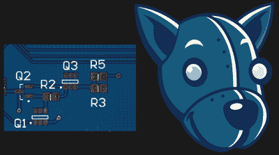
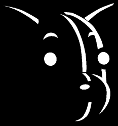
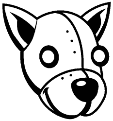
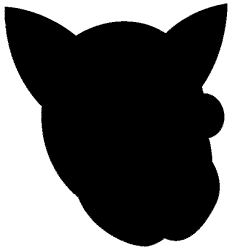
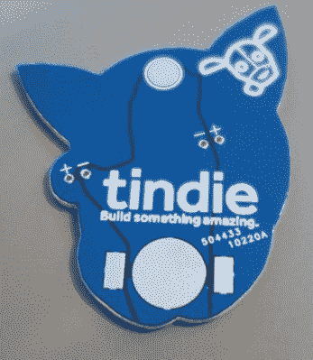

# 两周内制作一个 DEF CON 徽章

> 原文：<https://hackaday.com/2017/07/27/building-a-def-con-badge-in-two-weeks/>

DEF CON 现在开始*了*，今年是#badgelife 的一年。在过去的几年里，独立的硬件奇才一直在 DEF CON 上创造和销售他们自己的非官方徽章，但今年它打破了记录。我们已经看过了[班德徽章](https://hackaday.com/2017/07/12/hands-on-new-andxor-unofficial-def-con-badge/)、 [BSD 河豚](https://hackaday.com/2017/07/07/def-con-badgelife-the-puffy-that-runs-linux/)和[有史以来最糟糕的会议徽章](https://hackaday.com/2017/07/18/def-con-badgelife-someone-finally-did-it/)，这只是皮毛。

对于 DEF CON 上的 Hackaday / Tindie / Supplyframe 家族来说，今年也是辉煌的一年。我们正在赞助物联网村，[Jasmine]——Tindie 的女祭司——我将花一些时间在硬件黑客村，称赞我们的霸主，并说这句话，“像 Etsy，但对电子产品来说”太多了。我们将向人们展示如何焊接，固定徽章，并在总体上帮助广大未洗过的群众。

显然，这意味着我们需要自己的非官方 DEF CON 徽章。我们在 7 月 10 日意识到了这一点。这给了我们不到两周的时间来构思徽章，设计一个，订购所有部件，等待 PCB 订单，最后在将它们拖到 DEF CON 之前将所有徽章打包。这可能吗？令人惊讶的是，是的。这几乎很容易，任何人都没有理由不为明年的 con 开发自己的硬件徽章。

### 灵感

这个项目开始于 7 月 10 日。这使得这个项目从构思到设计到装备徽章，再到将它们拖到现场，只有两周的时间。这显然不会是一个复杂的徽章，但在简单的徽章领域，我们实际上可以用两周的开发和制造时间做什么呢？

[Jasmine]的第一个建议是一个简单的“我可以焊接徽章”，或者类似于 Partfusion 在 Tindie 上卖的东西。因为我们会在硬件黑客村——本周拉斯维加斯最大的烙铁集中地——闲逛，一个“我会焊接”的徽章是一个很棒的主意。这是对烙铁的完美介绍。

The Tindie robodog head, using colors taken from a standard blue soldermask PCB.

然而，就在这些计划实现的前几天，我偶然发现了一个关于可穿戴印刷电路板的全新想法。翻领别针现在已经过时了。[jglim]发现“蝶形离合器拉杆”是有效的 SMD 元件。

在这两个想法之间，[茉莉]和我最终想出了一个可行的主意。我们将制作一个徽章，形状像我们可爱的机器人吉祥物的头，眼睛用发光二极管。电路将非常简单——只需一个 3 V、1220 号电池和两个发光二极管——以及背面翻领针扣的衬垫。PCB 必须放在一个 50 毫米 x 50 毫米的正方形内，以从板房获得最佳价格，整个顶层，包括铜，都将是艺术品。

这是一个实验板，虽然我们以前见过类似的项目。几个月前，[Andrew Sowa] [在标准的 OSH Park PCB 叠层上使用不同层的掩模、丝绸和铜从我这里赚了钱。[Trammell Hudson]和[Blake Ramsdell]](http://hackaday.com/2017/03/22/making-more-of-me-money/)[也在奥什公园的 PCB 上做着令人难以置信的工作。然而，Tindie 的吉祥物是*蓝色*，而不是紫色。任何人都可以用蓝色阻焊膜得到 PCB，但我没有看到任何探索中国板房 PCB 艺术潜力的实验。只有一种方法可以证明这是否可行。](https://twitter.com/pdp7/status/879511763561189376)

### 创建徽章

有了这个徽章应该是什么的令人信服的想法，BOM 的大部分已经排序。这些“徽章”实际上是翻领别针，我们可以从使用的同一家全球速卖通商店[买到数百枚。我们需要袋子来装所有这些零件，方便的是，这家全球速卖通商店](https://www.aliexpress.com/item/100-Pairs-Butterfly-Clutch-Tie-Tacks-Pin-Back-Replacement-with-Blank-Pins-for-Craft-Making-Silver/32801251429.html)[也出售不干胶袋](https://www.aliexpress.com/item/Clear-Self-Adhesive-Sealing-Plastic-Bags-Jewelry-Pouches-3x5cm-4x6cm-5x7cm-6x9cm-7x10cm-8x12cm-10x14cm/32801522148.html)，用来装电路板、led、电池和所有零件。这是一个订单，大约是 BOM 上五分之一的零件。

The finished PCB

电池座是最难找到的部分。我不太相信全球速卖通的数据手册，如果我要围绕电池座制作电路板，我需要第一次就确定尺寸和焊盘。电池座[来自 Digikey](https://www.digikey.com/products/en?keywords=BK-916-CT-ND) ，装有 1216、1220 或 1225 尺寸的锂电池。

亚马逊 Prime 是天赐之物，这是我们用来采购 led 和电池的。由于 Tindie 的眼睛是不同的颜色，[一套 5 毫米的 led 灯](https://www.amazon.com/Elfeland-495x5mm-Emitting-Assorted-Diffused/dp/B06Y3T491K/)是最好的选择。我们还挑选了[几个多色闪烁的 RGB 发光二极管](https://www.amazon.com/Multicolor-Flashing-Changing-Electronics-Components/dp/B01C19ENFA)用于额外的特殊发光材料。

那就只剩下制作 PCB 了。这个徽章必须在很短的时间内设计和制作，但我喜欢冒险的生活。我们与 [Seeed 的融合 PCB 服务](https://www.seeedstudio.com/fusion_pcb.html)一起制作实际的 PCB。过去我和他们有过很好的经历，因为我们支付了 DHL 运送到加州的费用，所以我们很有信心这些主板会准时到达。

这个徽章的艺术是由鹰完成的。我知道选择 EDA 套件会受到一些批评，但是 Eagle 更快。我只用了 10 分钟就完成了[终极防御徽章](https://hackaday.io/project/25150-the-official-hackaday-defcon-25-badge)的制作，Tindie 徽章的想法也有类似的复杂性。

这个徽章的艺术是从我们的内部艺术家[Joe Kim]的作品中提取的。在 Illustrator 中将不同的丝印层、轮廓层、阻焊层和铜层分开，并以 300 dpi 的分辨率将每一层转换为. BMP。这些层被一次一个地导入到 Eagle 中。之后，剩下唯一要做的事情就是在徽章的背面建立一个微小的 LED 电路。

The silkscreen layer. The silk layer must be inverted for some bizarre reason. Eagle does have its quirks

The keepout layer. This is the area where no copper will go

The outline layer. Once this was imported into Eagle, I traced over it with a milling line.

 这个徽章的电路非常简单:将电池座的负极端子连接到发光二极管的一侧，将电池端子的正极端子连接到发光二极管的另一侧。你*应该*用走线来做这个，但是对于这么简单的电路我想实验一下。在原理图中，我用铜填充了 GND 和 VCC。我认为这更健壮一点，但是我承认我的实现看起来像垃圾。

除此之外，完成电路板的背面就像在丝网上添加一个 Tindie 狗头标志和一些文字一样简单。

制作所有这些徽章的总成本是多少？我们订购了足够 300 套配件，尽管我们不得不购买 500 个电池座来获得价格折扣。总的来说，每个徽章的价格约为 1.80 美元。与我们在 cons 上分发的其他营销材料相比，这相当便宜。我们称之为胜利。

### 我们下次要做的是

在不到两周的时间里，我们设法创造了 300 个实用、有趣的徽章。这并不意味着没有改进的余地。在徽章的正面使用多层铜、阻焊和丝网印刷是一个成功的实验，但我完全忽略了在徽章的调色板中使用裸露的 HASL 铜的可能性。这就是我们下次复习要做的。