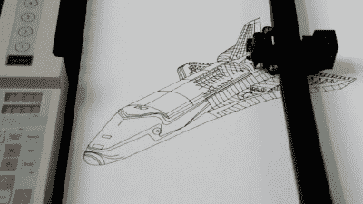
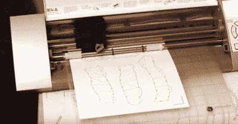
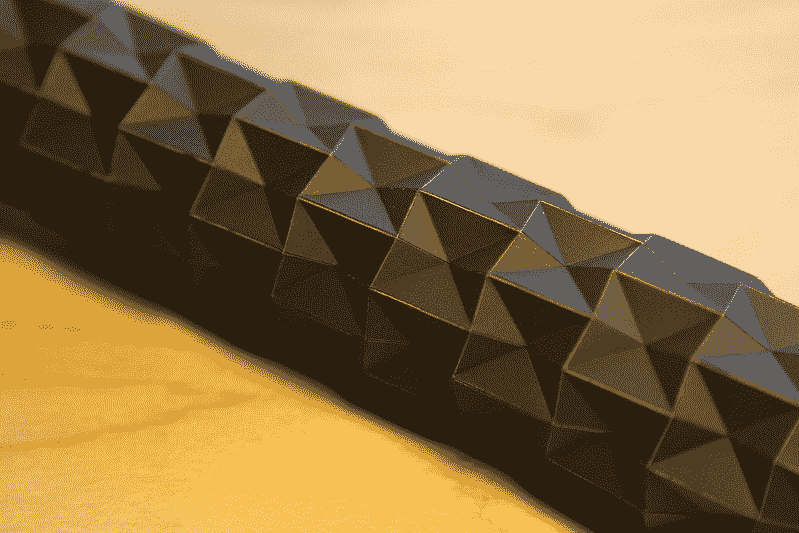
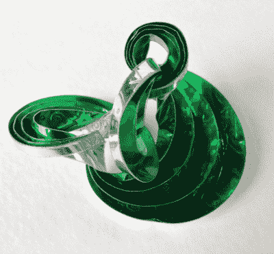

# 桌面乙烯基切割机的外壳

> 原文：<https://hackaday.com/2017/08/01/a-case-for-the-desktop-vinyl-cutter/>

就桌面工作台 fab 工具而言，让 3D 打印机一直抢风头太容易了。我的意思是，当我们的打印机将 3D CAD 模型喷射到塑料生活中时，谁不欣赏机电一体化的“嗡嗡声”呢？虽然 3D 打印机可能会占据我工作台的一个角落，但仍然有足够的空间来放置其他桌面快速成型设备。

今天，我想给大家介绍一下乙烯切割器。当然，我们可以从贴纸开始，甚至可以启动一个下班后的 Etsy-mart，但除了乙烯基切割之外，还有许多其他的好处。事实上，乙烯基切割机可能只是折叠和纸艺研究中的无名英雄。

## 我们画钢笔的祖父母

 

一台 1985 年的罗兰 DXY-1300[[YouTube](https://www.youtube.com/watch?v=iziP0cQhOFY)]

乙烯基切割机是笔式绘图仪和数字切割机家族中的一个小进步。(数字切割和数控以及 CNC 的诞生本身就是一整篇文章！)笔式绘图仪在 50 年代末和 60 年代初出现。绘图仪不是像现代图像那样打出像素网格，这需要很高的内存价格，而是描绘出矢量图形，这只是占用更少的内存。事实上，当年内存是如此珍贵，以至于第一个出版的笔式绘图仪的 CNC 控制算法[ [PDF](https://pdfs.semanticscholar.org/c443/c0b5f74f75d87193bc373cdc5b0b61cf28fd.pdf) ]甚至强调了它的“执行速度和内存利用”效率

从钢笔绘图到标志制作的实际转变是模糊的，但是，在某个时候，一些钢笔绘图公司也开始在他们的剧目中加入乙烯基切割。他们的目标受众从日常的信号制造商到像波音这样的飞机巨头。幸运的是，由于笔绘图的血统，乙烯基切割机的数学和 CNC 控制已经是一个解决的问题。

## 少于常规用途

“我还能用它做什么？”这是一个古老的问题，它阻碍了我们在桌面上安装和运行乙烯基切割机。这太常见了，以至于 [Make 列出了 34 个用例](http://makezine.com/2015/12/15/34-things-didnt-realize-can-vinyl-cutter/)。不要害怕！我也面临过这个问题。不过，与其重复这个列表，我想我应该挑选一小部分，给他们一些真实世界的背景。这是现在使用它们的社区的普遍体验。

### 绘画遮罩

模版曾经来自我老师美术用品的小隔间。现在我可以随心所欲地为各种精确的油漆工作制作它们。在这里，我和几个朋友光荣地给我们的大学火箭实验涂上了一层乙烯基模板，上面印着我们火箭的名字:“霍布斯。”喷漆后，我们很快剥掉乙烯基，让油漆不受干扰地干燥。实话实说:多年的破坏无法让我的绘画技巧如此精湛！这里有一台计算机在工作，乙烯切割器是从数字输入到数字输出的精密仪器。

我们不知道的是，事实证明，香草乙烯实际上并不是这个油漆面具应用的最佳选择。典型的乙烯树脂有一个[压敏胶](http://hingstssignpost.blogspot.com/2014/04/pressure-sensitives-101-made-easier.html)。用手将它牢牢地粘在一个表面上，启动了这种粘附过程，让它非常高兴地撕掉最近的油漆工作。谢天谢地，[一个油漆面具乙烯](http://www.uscutter.com/ORAMASK-813-Paint-Mask-Stencil?utm_source=google&utm_medium=cpc&adpos=1o1&scid=scplp300&sc_intid=300&gclid=EAIaIQobChMIkN_y95Kh1QIV1D2BCh3z8wTgEAQYASABEgLvFfD_BwE)专门存在，以解决这个问题。

### 纸质服装

对于门外汉来说，纸艺服装在过去几年里非常流行。有了一个叫做 [Pepakura](http://www.tamasoft.co.jp/pepakura-en/) 的廉价软件包，你也可以开始将 3D 模型展平成面板，你可以打印、切割，并用折叠的纸重新组合成现实生活。在这里，Pepakura 负责从你的模型生成一个矢量图形，乙烯基切割机实际上消除了这个过程中最大的瓶颈之一:贴标签和切纸。虽然手持普通喷墨打印机的普通人将需要一把剪刀来实际切割模型，但乙烯基切割机将自动为我们切割出所有东西。

 这把刀究竟是如何施展它的魔力的？如今，许多业余爱好者乙烯基切割机还带有一个塑料“粘性”垫，可以压住纸张，这样切割工具就可以放下它的图案。只需将一张卡片钉在这张纸上，然后放入垫子。在这个领域中，有两种方法可以在单件上获得折痕图案和标签。一些建模者将使用普通打印机打印设计，用配准标记将其与切割垫对齐，并从打印纸上切割图像。其他人，用正确的乙烯基切割机模型，实际上可以用笔替换刀片，并运行两个独立的选项:绘制折叠模式和标签；然后，把碎片剪下来。将旧的剪影浮雕乙烯基切割机变成绘图仪曾经是一个[黑客](http://www.blackandwhiteobsession.com/2014/01/Silhouette-Pen-Holder-Blade-Hack-Tutorial.html)，但现在许多第三方出售各种乙烯基切割机品牌的笔筒。

### 得分

品尝【山姆·卡里斯】的折纸作品

还记得那些昔日复杂的折纸作品吗？在我们粗心的手指把一叠又一叠的纸放到错误的地方之前，把这些纸预先弄皱不是很好吗？现在你可以了！

乙烯基切割机最容易被忽视的特点之一可能就是*不完全切割*我们的媒体。部分切割的路径变成了“刻痕线”，这使得折叠变得轻而易举。转眼间。手工操作可能需要几个小时，现在只需几分钟，而且每次执行都完美无瑕。

当然，没有什么是完美的。在这里，对纸的一面的折叠进行评分效果很好，但是为了获得最大的好处，我们需要相应地对纸的两面进行评分。虽然乙烯基切割机在黑客中过着平静的生活，但它是折叠研究社区的首选工具。[Evgueni Filipov]正在为可展开的结构应用迭代“[拉链管](https://www.youtube.com/watch?v=UA__bXPRdhw)”的变体。辛西娅·桑正在制作能把自己折叠在一起的机器人原型[。](https://www.youtube.com/watch?v=3G8xyb0xGqY)

### 曲线计分

几乎可以肯定，我们大多数人以前都折过纸飞机或折纸鹤。这些作品中的大部分都有直的折痕。无聊吧？事实证明，通过一些耐心和技巧，将由*弯曲的*褶皱组成的模型放在一起是可能的。与直褶皱不同，弯曲褶皱几乎不可能变直(哇！)没有某种参考。(纸质打印件应该可以。)要想知道这有多费力，试试这个弯曲折叠教程[ [PDF](http://api.ning.com/files/*whl3J3XpWRC7h8SRsJblFG13bo2taISkq5IeBzeNrQwtOTtjhPGxaCoN8jBv8GBfxQNY*WdP8Goqo-XN*-T2Kh07N9GGUep/curvedfolding.pdf) 。

至于用手在纸上画弯曲的折痕，个人的结果可能会有所不同。幸运的是，有了压线乙烯基切割机的技巧，我们可以省去几个小时的紧张，通过完全去除手工压线来切入正题。对于大多数人来说，可能无法接触到的东西已经被数控压痕机驯服和民主化了。正是这些应用程序让我深吸一口气，然后想:啊，我们现在生活在一个多么美好的数字时代。

对于渴望进入更多弯曲折叠的好奇者，请查看埃里克和马丁·德梅因的[ [科迪·赖斯多夫](https://crumpledcortex.com/instructions/)和[简史](http://erikdemaine.org/curved/history/)的作品。

## 我们削减乙烯基的唯一希望

在 Hackaday 上，使用错误的工具来快速完成工作是如此诱人。(我正看着所有那些因剥电线的不愉快历史而牙齿碎裂的观众。)如果你有一台激光切割机，想做一些乙烯贴纸，你可以原谅把你剩下的眼睛转向那个方向。但是用激光切割机烧穿乙烯实际上会释放出氯气，这种气体会腐蚀激光光学系统，对人类来说是致命的。在这里，精密燃烧乙烯不会作出削减。

在上面列出的所有折叠和模板制作用途之后，我们很容易忘记使用该工具，但当涉及到切割乙烯基时，正确的工具是乙烯基切割机。