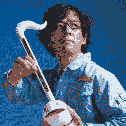

# Maywa Denki 的无意义机器

> 原文：<https://hackaday.com/2017/07/26/maywa-denkis-nonsense-machines/>

我们刚刚花了几个小时试图找出日本技术表演艺术玩具公司。作为自称的“平行世界电工”，这个小型艺术团体生产奇怪的机电仪器，创造风箱驱动的“唱歌”雕塑，举办音乐会/演示/讲座。如果你迫切需要一根鱼骨形状的延长线，[Maywa Denki]可以满足你。写艺术就像[在经济学上跳舞](http://quoteinvestigator.com/2010/11/08/writing-about-music/)，所以首先我们会放弃一些我们最喜欢的，让你来决定。

严肃艺术战线上的  是 [SeaMoonsII](https://www.youtube.com/watch?v=VTdrzHdDUj0) 和 [Wahha Go Go](http://www.maywadenki.com/products/voice/wahha-go-go-2/) 这样的“废话机器”。最具标志性的表演可能是 [Pachi-Moku](http://www.maywadenki.com/products/naki/pachi-moku/) ，一套安装在动漫风格翅膀上的手指按扣激活的木锣。此外还有“玩具”，如“震先生”和“奥塔马通”，这里的“T11”展示了一些 DEVO。

这里发生了很多事。装配线工人的蓝色西装，作为一个小型电子“公司”的背景故事，以及整个艺术作为商品的惯例，与疯狂的发明家 schtick 形成了鲜明的对比，无论是作为对墨守成规、社团主义的战后日本文化的反应，还是作为对现代艺术场景现实的后现代礼帽，都是有意义的。但最主要的是，给人的感觉是，[Maywa Denki]的“总统”[novichi Tosa]就是喜欢[制造疯狂的小发明](https://www.youtube.com/watch?v=Ve0Emb0_UzQ)。

你还能怎么解释这个气动的，嘴里塞满了刀的狮子狗脑袋？

这里有两个简短的纪录片，一个是英语的瑞士德语，另一个是日语的。当奇点出现时，你会自动翻译这些信息并直接输入你的大脑。在那之前，要么去上语言课，要么只是坐下来放松一下。反正都是光荣的废话。

 [https://www.youtube.com/embed/4e3UnyGf76I?version=3&rel=1&showsearch=0&showinfo=1&iv_load_policy=1&fs=1&hl=en-US&autohide=2&wmode=transparent](https://www.youtube.com/embed/4e3UnyGf76I?version=3&rel=1&showsearch=0&showinfo=1&iv_load_policy=1&fs=1&hl=en-US&autohide=2&wmode=transparent)

 [https://www.youtube.com/embed/vX-dEq4UDYI?version=3&rel=1&showsearch=0&showinfo=1&iv_load_policy=1&fs=1&hl=en-US&autohide=2&wmode=transparent](https://www.youtube.com/embed/vX-dEq4UDYI?version=3&rel=1&showsearch=0&showinfo=1&iv_load_policy=1&fs=1&hl=en-US&autohide=2&wmode=transparent)

谢谢你的提示。