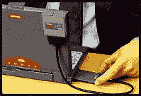
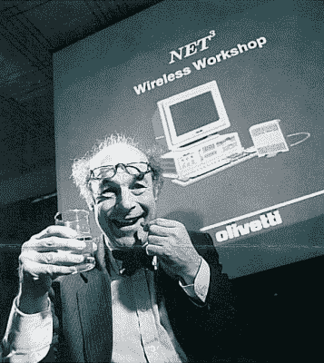

# 反向技术:Olivetti Net3

> 原文：<https://hackaday.com/2017/08/18/retrotechtacular-olivetti-net3/>

如果你报名参加一个欧洲黑客训练营，比如德国的 CCC 训练营或者荷兰的 SHA 训练营，你会在推荐的物品中看到一个 DECT 手机。DECT，即数字增强型无绳电信，指的是在欧洲和世界其他一些国家普遍使用的数字无绳电话背后的一套标准。这些标准不仅仅涵盖大多数欧洲人使用的通过基站的简单双向电话呼叫，它们还定义了一个功能齐全的多小区 3G 电话和数据网络系统。这意味着像 SHA Camp 这样的活动可以运行自己的数字电话网络，而不必实施蜂窝塔。

Olivetti promotional Net³ image

阅读 DECT 的历史，有一个有趣的片段，1993 年市场上的第一个 DECT 产品不是电话，而是网络设备，顺便说一下，是欧洲市场上的第一个无线局域网产品。Olivetti 的网络 ³ 通过以太网或令牌环接口向基站提供 512kB/s 的无线网络，以便连接到 LAN。在它的最初形式中，它是一个桌面 PC 的内部卡，连接到一个包含无线电电路和天线的大盒子上，但它后来的化身包括一个带有小得多的天线盒的 PCMCIA 卡。以今天的标准来看，半兆的速度似乎很小，但在 1993 年多媒体出现之前，对于 Novell Netware 文件服务器和 HP Laserjet 4 来说已经足够了。

[Heinz Wolff] swallows a condom in another Olivetti promotional image.

### 神秘技术

因此，DECT 是一项有趣的技术，它能做的不仅仅是简单的无绳电话，它的第一个产品出人意料地具有某种开创性。更有趣的是，我们发现网络几乎没有留下任何可以在网上找到的证据，要了解更多需要做一些调查工作。

维基百科的条目只有最基本的内容，但它充分说明了该产品的模糊本质，百科全书中唯一的图片是一个缩略图大小的 PCMCIA 变种的宣传图片，位于一台 20 世纪 90 年代中期的矮胖笔记本电脑中。进一步搜索发现[一份 1993 年的英国 Olivetti 员工通讯](http://olivettiuk.org/Newsletters/1993 September.pdf) (PDF)载有另一张桌面网 ³ 设备的宣传图片，展示了当时著名的电视名人和学者【Heinz Wolff】通过吞下一个包裹在避孕套里的 DECT 医疗仪器转发器来奇怪地演示这项技术。一些新闻稿仍然保留在 20 世纪 90 年代互联网的化石遗迹中，一个 net 设计团队成员的 LinkedIn 页面引导我们找到了覆盖该系统的专利，但仅此而已。我们甚至无法为我们的特色图像插槽找到足够高分辨率的网络 ³ 卡图像。

### 无线的东西在他们的时代之前

显然，在对无线局域网的需求存在之前，作为高端无线局域网的网络和 DECT 网络从未成功，但也许更有趣的是，它似乎没有为其他更普通的应用留下任何遗产。我们正处于围绕物联网的大肆宣传之中，新的短程无线网络技术似乎几乎每天都在出现，但这个世界似乎忽略了这种强大、低功耗、成熟的无线网络，它有自己的专用频率分配，我们许多人已经在家中拥有。似乎特别令人惊讶的是，在你当地消费电子商店出售的许多 DECT 基站中，没有一个可以连接互联网，而且使用 DECT 作为回程的物联网设备没有市场。

在开源社区中，已经有一些关于 DECT 的工作。例如， [OsmocomDECT 项目](http://dect.osmocom.org/)提供了一个 DECT 软件栈，[deDECTed.org](https://dedected.org/trac)宣称其目标是“更好地理解 DECT 及其安全性，并创建 DECT 标准的开源实现”。但是在我们的社区中似乎很少有关于标准的硬件工作，例如在 Hackaday.io 上没有 DECT 特有的项目

那时，网络是一个超前的产品，预示着即将到来的事情，从那个网络绝对是一个东西，但还没有成为世界通用的信息仓库的朦胧时期。公共无线网络仍然是几年以后的事情，所以对于经常出差的人来说，或者对于计算机制造商来说，没有必要为自己配备网卡，甚至 Olivetti 自己也没有必要！—整合技术。因此，它并没有风靡全球，而且对于这样一个开创性的计算机产品来说，除了欧洲人用于无绳电话的协议中一个很少使用的功能外，它几乎没有留下什么遗产。

你有网卡吗？你还有吗？请在评论中告诉我们。