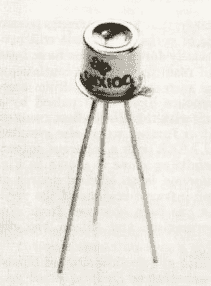
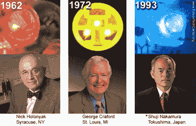
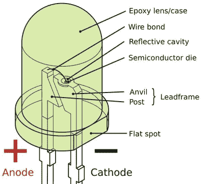
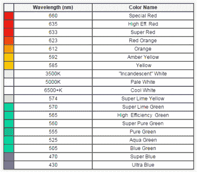
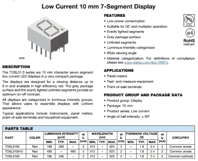
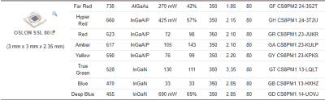

# 了解你的领导

> 原文：<https://hackaday.com/2017/08/08/know-thy-led/>

LED 的发明是我们这个时代最重要的发现之一。它们无处不在，从我们的手电筒到家庭照明和电视机。我们不需要告诉你，一个有更多 blinkies 的项目比一个有较少 blinkies 的项目更好。但是发光二极管不仅仅是发光二极管；LED 种类繁多，令人惊叹，因此在这篇文章中，我们将仔细看看如何为你的下一部杰作选择合适的 LED。

## LED 家族树

 俄罗斯发明家[奥列格·洛瑟夫](https://en.wikipedia.org/wiki/Oleg_Losev)于 1927 年发明了第一个正式的 LED，然而电致发光的发现却是在二十年前。英国马可尼实验室的实验学家 H. J .轮于 1907 年首先报道了这一现象。他发现当施加 10 伏特的电压时，碳化硅会发出黄色的光。这引发了多年来对碳化硅、砷化镓、锑化镓、磷化铟和硅锗等材料的实验，试图创造出一种实用的设备。

1955 年，Rubin Braunstein 报道了砷化镓的红外辐射，然而德州仪器的 James R. Biard 和 Gary Pittman 在 1961 年展示了第一个红外线灯 (PDF)，这是[第一个实用的 LED，并于同年 8 月获得专利](http://www.google.com/patents/US3293513)。因此，第一个商业 LED 是具有 890 nm 光输出的 IR LED，并被称为 SNX-100。

1962 年，在通用电气工作的小尼克·何伦亚克开创了可见光 LED 的时代。他发现了红色 LED，并于 1962 年 12 月 1 日在《应用物理快报》上发表了结果，目前他拥有大约 41 项专利。他被称为可见光 LED 之父，也是 CD 和 DVD 播放器中常用的激光二极管的发明者。十年后，乔治·克拉福德先生发现了黄色发光二极管，他恰好是霍伦亚克大学的前研究生。

## 获得诺贝尔奖的 LED

2014 年，赤崎勇、天野之弥和中村修二三位科学家因在 20 世纪 90 年代早期发明了蓝色 LED 而获得了诺贝尔奖。虽然没有“B”显然不可能有 RGB LEDs，但蓝色 LED 的发明具有超越颜色的重要意义。蓝色 LED 既明亮又高效，是生产照亮当今世界的白色 LED 的最后一块垫脚石。

有两种方法可以从 led 产生白光。显而易见的方法是将三原色以正确的比例混合，以产生白光照明。用于制造白色 LED 的第二种方法是磷光体法，其中蓝色 LED 照射到黄色磷光体涂层上。

在[这种方法](http://www.photonstartechnology.com/learn/how_leds_produce_white_light)中，蓝色 LED 与[黄色荧光粉涂层](http://www.lrc.rpi.edu/programs/nlpip/lightinganswers/led/whiteLight.asp)结合使用。这个想法是将一部分蓝光转换成黄光，并保留一部分原来的波长。当这两种光结合在一起时，它们会形成白色光束，比第一种方法产生的光束更有效、更纯净。

信不信由你，这个颜色组合的发现是由艾萨克·牛顿爵士在 18 世纪早期发现的。

## 在他们光辉的个性背后

不管什么颜色，led 都是电致发光的。电致发光是一种现象，其中当电流通过材料时，材料发出光。基本过程包括材料中电子和空穴的复合。查看此视频，快速总结和可视化。

 [https://www.youtube.com/embed/BH9LI973H8w?version=3&rel=1&showsearch=0&showinfo=1&iv_load_policy=1&fs=1&hl=en-US&autohide=2&wmode=transparent](https://www.youtube.com/embed/BH9LI973H8w?version=3&rel=1&showsearch=0&showinfo=1&iv_load_policy=1&fs=1&hl=en-US&autohide=2&wmode=transparent)

LED 就是二极管，或者 PN 结。结中使用的材料类型决定了发射光的颜色和强度。施加在结上的电压提供了将电子从母原子中挣脱出来的能量。自由价电子随后重组并以光子的形式释放能量。典型的 LED 结构如下所示。半导体芯片是发生复合和发射光子的地方。为了引导这种光，制作了一个反射锥形腔，顶部的环氧树脂透镜允许光的进一步准直或扩散。

如果你对 LED 的物理学感兴趣，我建议从第一个实用的 LED[*(PDF)开始阅读。*](http://edisontechcenter.org/lighting/LED/TheFirstPracticalLED.pdf)

模具制备中使用的不同材料如下。

*   铝砷化镓(AlGaAs)和砷化镓发光二极管发出红光和红外光
*   氮化镓发光二极管发出明亮的蓝光
*   铟镓氮化物(InGaN)发射蓝色、绿色和紫外高亮度光
*   铝镓氮化物(AlGaN)发光二极管发射紫外线
*   钇铝石榴石发光二极管发出白光
*   磷化镓(GaP)发光二极管发出红色、黄色和绿色
*   磷化铝镓铟(AlGaInP)生产黄色、橙色和红色高亮度 led
*   磷化铝镓(AlGaP)发光二极管发出绿光

[Image:[http://www . led supply . com/blog/what-you-need-know-about-LEDs/% 5D](http://www.ledsupply.com/blog/what-you-need-to-know-about-leds/%5D)

## 各种原因的 LED

除了不同的颜色，不同的 LED 材料适用于不同的应用。亮度较低的 led 通常用作设备指示器，例如路由器闪烁的灯。在典型的机架安装设备上可以有多达 100 个 led，这些 led 应该尽可能少耗电，但不需要太亮。七段显示器可以在 15 mA 下具有低至 260 ucd 的发光强度(LI)。

有一些更亮的 led 是为雾灯和交通灯设计的，在 350 mA (2.15V)下具有 34 cd 的 LI。它也不止于此。LED 种植灯专门针对园艺和室内农业。在那里，蓝光和红光的混合通常用于人工照明中的植物生长，尽管一些公司声称 730 纳米、660 纳米和 450 纳米的目标照明提供了生长和效率的最佳平衡。

就在你认为事情不可能变得更复杂的时候，我们有了白光 led 的例子。产生的光的颜色是用开尔文标度来衡量的，数字越小，光就越暖——数字越大，光就越白，(是的，最终会更蓝)。

## 说什么瓦特？

用于照明的 led，尤其是那些在易贝出售的 led，通常是根据它们消耗的瓦特数来确定的。例如，这个 LED 广告显示 12 V 和 20 W，根据欧姆定律，这意味着电流消耗为 1.66 A。瓦数是灯在特定供电电压下“应该”消耗的功率，但不是光输出的良好衡量标准，因此您应该关注李。

但是功率确实很重要。假设一个 LED 的效率大约是 50%，以 20 W 运行这个 LED 意味着大约 10 瓦的热量将被消耗掉。因为 LED 的效率随着其发热而变得更差，所以如果在高电流下运行，这种 LED 绝对需要散热器。我们将在以后关于驱动 led 的文章中详细讨论这个话题。

## LED 研究的未来

在 LED 制造领域以及基础材料科学领域有很多正在进行的研究。在制造方面，工作的重点是创造更小的 led，以便它们可以用于更高分辨率的显示器。每天都有像[高密度 LED 阵列基板上的微反射器](https://www.google.com/patents/US9478720)这样的专利申请。随着可穿戴设备变得越来越受欢迎，最近一项关于[柔性 LED 基板设备](https://www.google.com/patents/US20160281974)的专利证明我们正走在柔性电子产品的道路上。

还有更高效率 LED 设计以及具有更好热管理的 LED 的空间。UV LED 设计仍在发展，还有改进的空间。[公布的结果](https://www.led-professional.com/resources-1/white-papers/WHITE_PAPER_High_Intensity_UV_LED_Sources_Enabled_by_Next_Generation_Substrates)表明高达 75 瓦的紫外线 LED 即将问世。

未来真的很光明，而且有望提高效率。